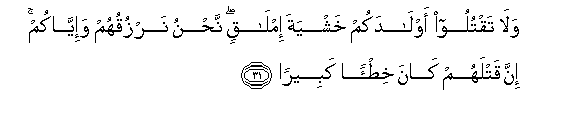
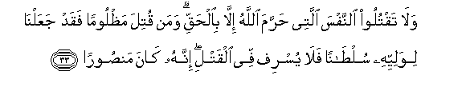
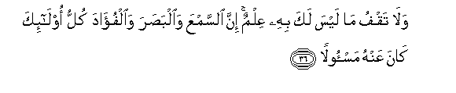
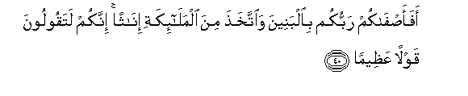

  
[Intangible Textual Heritage](../../index)  [Islam](../index.md) 
[Index](index.md)   
[Hypertext Qur'an](../htq/index)  [Unicode](../uq/017.htm#017_031.md) 
[Palmer](../sbe09/017)  [Pickthall](../pick/017.htm#017_031.md)  [Yusuf Ali
English](../yaq/yaq017)  [Rodwell](../qr/017.md)   
  
[Sūra XVII.: Banī Isrā-īl, or the Children of Israel, Index](017.md)  
  [Previous](01703)  [Next](01705.md) 

------------------------------------------------------------------------

  
*The Holy Quran*, tr. by Yusuf Ali, \[1934\], at Intangible Textual
Heritage

------------------------------------------------------------------------

# Sūra XVII.: Banī Isrā-īl, or the Children of Israel,

### Section 4

------------------------------------------------------------------------

31. Wal<u>a</u> taqtuloo awl<u>a</u>dakum khashyata iml<u>a</u>qin
na<u>h</u>nu narzuquhum wa-iyy<u>a</u>kum inna qatlahum k<u>a</u>na
khi<u>t</u>-an kabeer<u>a</u>**n**

31\. Kill not your children  
For fear of want: We shall  
Provide sustenance for them  
As well as for you.  
Verily the killing of them  
Is a great sin.

------------------------------------------------------------------------

32. Wal<u>a</u> taqraboo a**l**zzin<u>a</u> innahu k<u>a</u>na
f<u>ah</u>ishatan was<u>a</u>a sabeel<u>a</u>**n**

32\. Nor come nigh to adultery:  
For it is a shameful (deed)  
And an evil, opening the road  
(To other evils).

------------------------------------------------------------------------

33. Wal<u>a</u> taqtuloo a**l**nnafsa allatee <u>h</u>arrama
All<u>a</u>hu ill<u>a</u> bi**a**l<u>h</u>aqqi waman qutila
ma*<u>th</u>*looman faqad jaAAaln<u>a</u> liwaliyyihi sul<u>ta</u>nan
fal<u>a</u> yusrif fee alqatli innahu k<u>a</u>na
man<u>s</u>oor<u>a</u>**n**

33\. Nor take life—which God  
Has made sacred—except  
For just cause. And if  
Anyone is slain wrongfully,  
We have given his heir  
Authority (to demand Qiṣāṣ  
Or to forgive): but let him  
Not exceed bounds in the matter  
Of taking life; for he  
Is helped (by the Law).

------------------------------------------------------------------------

34. Wal<u>a</u> taqraboo m<u>a</u>la alyateemi ill<u>a</u> bi**a**llatee
hiya a<u>h</u>sanu <u>h</u>att<u>a</u> yablugha ashuddahu waawfoo
bi**a**lAAahdi inna alAAahda k<u>a</u>na mas-ool<u>a</u>**n**

34\. Come not nigh  
To the orphan's property  
Except to improve it,  
Until he attains the age  
Of full strength; and fulfil  
(Every) engagement,  
For (every) engagement  
Will be enquired into  
(On the Day of Reckoning).

------------------------------------------------------------------------

35. Waawfoo alkayla i<u>tha</u> kiltum wazinoo bi**a**lqis<u>ta</u>si
almustaqeemi <u>tha</u>lika khayrun waa<u>h</u>sanu ta/weel<u>a</u>**n**

35\. Give full measure when ye  
Measure, and weigh  
With a balance that is straight:  
That is the most fitting  
And the most advantageous  
In the final determination:

------------------------------------------------------------------------

36. Wal<u>a</u> taqfu m<u>a</u> laysa laka bihi AAilmun inna
a**l**ssamAAa wa**a**lba<u>s</u>ara wa**a**lfu-<u>a</u>da kullu
ol<u>a</u>-ika k<u>a</u>na AAanhu mas-ool<u>a</u>**n**

36\. And pursue not that  
Of which thou hast  
No knowledge; for  
Every act of hearing,  
Or of seeing  
Or of (feeling in) the heart  
Will be enquired into  
(On the Day of Reckoning).

------------------------------------------------------------------------

37. Wal<u>a</u> tamshi fee al-ar<u>d</u>i mara<u>h</u>an innaka lan
takhriqa al-ar<u>d</u>a walan tablugha aljib<u>a</u>la
<u>t</u>ool<u>a</u>**n**

37\. Nor walk on the earth  
With insolence: for thou  
Canst not rend the earth  
Asunder, nor reach  
The mountains in height.

------------------------------------------------------------------------

38. Kullu <u>tha</u>lika k<u>a</u>na sayyi-ohu AAinda rabbika
makrooh<u>a</u>**n**

38\. Of all such things  
The evil is hateful  
In the sight of thy Lord.

------------------------------------------------------------------------

39. <u>Tha</u>lika mimm<u>a</u> aw<u>ha</u> ilayka rabbuka mina
al<u>h</u>ikmati wal<u>a</u> tajAAal maAAa All<u>a</u>hi il<u>a</u>han
<u>a</u>khara fatulq<u>a</u> fee jahannama malooman
mad<u>h</u>oor<u>a</u>**n**

39\. These are among the (precepts  
Of) wisdom, which thy Lord  
Has revealed to thee.  
Take not, with God,  
Another object of worship,  
Lest thou shouldst be thrown  
Into Hell, blameworthy and rejected.

------------------------------------------------------------------------

40. Afaa<u>s</u>f<u>a</u>kum rabbukum bi**a**lbaneena
wa**i**ttakha<u>th</u>a mina almal<u>a</u>-ikati in<u>a</u>than innakum
lataqooloona qawlan AAa*<u>th</u>*eem<u>a</u>**n**

40\. Has then your Lord,  
(O Pagans!) preferred for you  
Sons, and taken for Himself  
Daughters among the angels?  
Truly ye utter  
A most dreadful saying!

------------------------------------------------------------------------

[Next: Section 5 (41-52)](01705.md)

