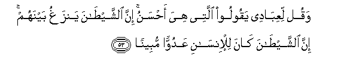

  
[Intangible Textual Heritage](../../index)  [Islam](../index.md) 
[Index](index.md)   
[Hypertext Qur'an](../htq/index)  [Unicode](../uq/017.htm#017_053.md) 
[Palmer](../sbe09/017)  [Pickthall](../pick/017.htm#017_053.md)  [Yusuf Ali
English](../yaq/yaq017)  [Rodwell](../qr/017.md)   
  
[Sūra XVII.: Banī Isrā-īl, or the Children of Israel, Index](017.md)  
  [Previous](01705)  [Next](01707.md) 

------------------------------------------------------------------------

  
*The Holy Quran*, tr. by Yusuf Ali, \[1934\], at Intangible Textual
Heritage

------------------------------------------------------------------------

# Sūra XVII.: Banī Isrā-īl, or the Children of Israel,

### Section 6

------------------------------------------------------------------------

53. Waqul liAAib<u>a</u>dee yaqooloo allatee hiya a<u>h</u>sanu inna
a**l**shshay<u>ta</u>na yanzaghu baynahum inna a**l**shshay<u>ta</u>na
k<u>a</u>na lil-ins<u>a</u>ni AAaduwwan mubeen<u>a</u>**n**

53\. Say to My servants  
That they should (only) say  
Those things that are best:  
For Satan doth sow  
Dissensions among them:  
For Satan is to man  
An avowed enemy.

------------------------------------------------------------------------

54. Rabbukum aAAlamu bikum in yasha/ yar<u>h</u>amkum aw in yasha/
yuAAa<u>thth</u>ibkum wam<u>a</u> arsaln<u>a</u>ka AAalayhim
wakeel<u>a</u>**n**

54\. It is your Lord  
That knoweth you best:  
If He please, He granteth  
You mercy, or if He please,  
Punishment: We have not sent  
Thee to be a disposer  
Of their affairs for them.

------------------------------------------------------------------------

55. Warabbuka aAAlamu biman fee a**l**ssam<u>a</u>w<u>a</u>ti
wa**a**l-ar<u>d</u>i walaqad fa<u>dd</u>aln<u>a</u> baAA<u>d</u>a
a**l**nnabiyyeena AAal<u>a</u> baAA<u>d</u>in wa<u>a</u>tayn<u>a</u>
d<u>a</u>wooda zaboor<u>a</u>**n**

55\. And it is your Lord  
That knoweth best all beings  
That are in the heavens  
And on earth: We  
Did bestow on some Prophets  
More (and other) gifts  
Than on others: and We gave  
To David (the gift  
Of) the Psalms.

------------------------------------------------------------------------

56. Quli odAAu alla<u>th</u>eena zaAAamtum min doonihi fal<u>a</u>
yamlikoona kashfa a**l**<u>dd</u>urri AAankum wal<u>a</u>
ta<u>h</u>weel<u>a</u>**n**

56\. Say: "Call on those—  
Besides Him—whom ye fancy:  
They have neither the power  
To remove your troubles  
From you nor to change them."

------------------------------------------------------------------------

57. Ol<u>a</u>-ika alla<u>th</u>eena yadAAoona yabtaghoona il<u>a</u>
rabbihimu alwaseelata ayyuhum aqrabu wayarjoona ra<u>h</u>matahu
wayakh<u>a</u>foona AAa<u>tha</u>bahu inna AAa<u>tha</u>ba rabbika
k<u>a</u>na ma<u>hth</u>oor<u>a</u>**n**

57\. Those whom they call upon  
Do desire (for themselves) means  
Of access to their Lord,—  
Even those who are nearest:  
They hope for His Mercy  
And fear His Wrath:  
For the Wrath of thy Lord  
Is something to take heed of

------------------------------------------------------------------------

58. Wa-in min qaryatin ill<u>a</u> na<u>h</u>nu muhlikooh<u>a</u> qabla
yawmi alqiy<u>a</u>mati aw muAAa<u>thth</u>ibooh<u>a</u>
AAa<u>tha</u>ban shadeedan k<u>a</u>na <u>tha</u>lika fee
alkit<u>a</u>bi mas<u>t</u>oor<u>a</u>**n**

58\. There is not a population  
But We shall destroy it  
Before the Day of Judgment  
Or punish it with  
A dreadful Penalty:  
That is written  
In the (eternal) Record.

------------------------------------------------------------------------

59. Wam<u>a</u> manaAAan<u>a</u> an nursila bi**a**l-<u>a</u>y<u>a</u>ti
ill<u>a</u> an ka<u>thth</u>aba bih<u>a</u> al-awwaloona
wa<u>a</u>tayn<u>a</u> thamooda a**l**nn<u>a</u>qata mub<u>s</u>iratan
fa*<u>th</u>*alamoo bih<u>a</u> wam<u>a</u> nursilu
bi**a**l-<u>a</u>y<u>a</u>ti ill<u>a</u> takhweef<u>a</u>**n**

59\. And We refrain from sending  
The Signs, only because  
The men of former generations  
Treated them as false:  
We sent the She-camel  
To the <u>Th</u>amūd to open  
Their eyes, but they  
Treated her wrongfully:  
We only send the Signs  
By way of terror  
(And warning from evil).

------------------------------------------------------------------------

60. Wa-i<u>th</u> quln<u>a</u> laka inna rabbaka a<u>hat</u>a
bi**al**nn<u>a</u>si wam<u>a</u> jaAAaln<u>a</u> a**l**rru/y<u>a</u>
allatee arayn<u>a</u>ka ill<u>a</u> fitnatan li**l**nn<u>a</u>si
wa**al**shshajarata almalAAoonata fee alqur-<u>a</u>ni wanukhawwifuhum
fam<u>a</u> yazeeduhum ill<u>a</u> <u>t</u>ughy<u>a</u>nan
kabeer<u>a</u>**n**

60\. Behold! We told thee  
That thy Lord doth encompass  
Mankind round about:  
We granted the Vision  
Which We showed thee,  
But as a trial for men,—  
As also the Cursed Tree  
(Mentioned) in the Qur-ān:  
We put terror (and warning)  
Into them, but it only  
Increases their inordinate  
transgression!

------------------------------------------------------------------------

[Next: Section 7 (61-70)](01707.md)

