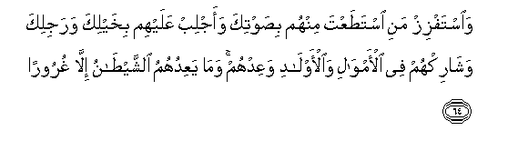
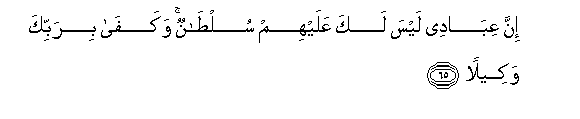
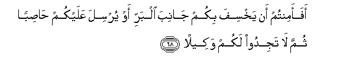
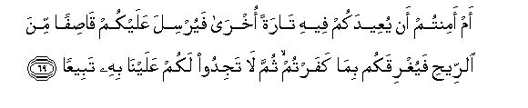
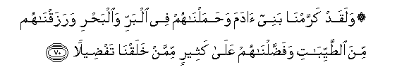

  
[Intangible Textual Heritage](../../index)  [Islam](../index.md) 
[Index](index.md)   
[Hypertext Qur'an](../htq/index)  [Unicode](../uq/017.htm#017_061.md) 
[Palmer](../sbe09/017)  [Pickthall](../pick/017.htm#017_061.md)  [Yusuf Ali
English](../yaq/yaq017)  [Rodwell](../qr/017.md)   
  
[Sūra XVII.: Banī Isrā-īl, or the Children of Israel, Index](017.md)  
  [Previous](01706)  [Next](01708.md) 

------------------------------------------------------------------------

  
*The Holy Quran*, tr. by Yusuf Ali, \[1934\], at Intangible Textual
Heritage

------------------------------------------------------------------------

# Sūra XVII.: Banī Isrā-īl, or the Children of Israel,

### Section 7

------------------------------------------------------------------------

61. Wa-i<u>th</u> quln<u>a</u> lilmal<u>a</u>-ikati osjudoo
li-<u>a</u>dama fasajadoo ill<u>a</u> ibleesa q<u>a</u>la aasjudu liman
khalaqta <u>t</u>een<u>a</u>**n**

61\. Behold! We said to the angels:  
"Bow down unto Adam":  
They bowed down except Iblīs  
He said, "Shall I bow down  
To one whom Thou didst create  
From clay?"

------------------------------------------------------------------------

62. Q<u>a</u>la araaytaka h<u>atha</u> alla<u>th</u>ee karramta AAalayya
la-in akhkhartani il<u>a</u> yawmi alqiy<u>a</u>mati
laa<u>h</u>tanikanna <u>th</u>urriyyatahu ill<u>a</u>
qaleel<u>a</u>**n**

62\. He said, "Seest Thou? This is  
The one whom Thou hast honoured  
Above me! If Thou wilt but  
Respite me to the Day  
Of Judgment, I will surely  
Bring his descendants  
Under my sway  
All but a few!"

------------------------------------------------------------------------

63. Q<u>a</u>la i<u>th</u>hab faman tabiAAaka minhum fa-inna jahannama
jaz<u>a</u>okum jaz<u>a</u>an mawfoor<u>a</u>**n**

63\. (God) said: "Go thy way;  
If any of them follow thee,  
Verily Hell will be  
The recompense of you (all)—  
An ample recompense.

------------------------------------------------------------------------

64. Wa**i**stafziz mani ista<u>t</u>aAAta minhum bi<u>s</u>awtika
waajlib AAalayhim bikhaylika warajlika wash<u>a</u>rik-hum fee
al-amw<u>a</u>li wa**a**l-awl<u>a</u>di waAAidhum wam<u>a</u>
yaAAiduhumu a**l**shshay<u>ta</u>nu ill<u>a</u> ghuroor<u>a</u>**n**

64\. "Lead to destruction those  
Whom thou canst among them,  
With thy (seductive) voice;  
Make assaults on them  
With thy cavalry and thy  
Infantry; mutually share  
With them wealth and children;  
And make promises to them."  
But Satan promises them  
Nothing but deceit.

------------------------------------------------------------------------

65. Inna AAib<u>a</u>dee laysa laka AAalayhim sul<u>ta</u>nun
wakaf<u>a</u> birabbika wakeel<u>a</u>**n**

65\. "As for My servants,  
No authority shalt thou  
Have over them:"  
Enough is thy Lord  
For a Disposer of affairs.

------------------------------------------------------------------------

66. Rabbukumu alla<u>th</u>ee yuzjee lakumu alfulka fee alba<u>h</u>ri
litabtaghoo min fa<u>d</u>lihi innahu k<u>a</u>na bikum
ra<u>h</u>eem<u>a</u>**n**

66\. Your Lord is He  
That maketh the Ship  
Go smoothly for you  
Through the sea, in order that  
Ye may seek of His Bounty.  
For He is unto you  
Most Merciful.

------------------------------------------------------------------------

67. Wa-i<u>tha</u> massakumu a**l**<u>dd</u>urru fee alba<u>h</u>ri
<u>d</u>alla man tadAAoona ill<u>a</u> iyy<u>a</u>hu falamm<u>a</u>
najj<u>a</u>kum il<u>a</u> albarri aAAra<u>d</u>tum wak<u>a</u>na
al-ins<u>a</u>nu kafoor<u>a</u>**n**

67\. When distress seizes you  
At sea, those that ye  
Call upon—besides Himself—  
Leave you in the lurch!  
But when He brings you back  
Safe to land, ye turn  
Away (from Him). Most ungrateful  
Is man!

------------------------------------------------------------------------

68. Afaamintum an yakhsifa bikum j<u>a</u>niba albarri aw yursila
AAalaykum <u>has</u>iban thumma l<u>a</u> tajidoo lakum
wakeel<u>a</u>**n**

68\. Do ye then feel secure  
That He will not cause you  
To be swallowed up  
Beneath the earth  
When ye are on land,  
Or that He will not send  
Against you a violent tornado  
(With showers of stones)  
So that ye shall find  
No one to carry out  
Your affairs for you?

------------------------------------------------------------------------

69. Am amintum an yuAAeedakum feehi t<u>a</u>ratan okhr<u>a</u>
fayursila AAalaykum q<u>as</u>ifan mina a**l**rree<u>h</u>i
fayughriqakum bim<u>a</u> kafartum thumma l<u>a</u> tajidoo lakum
AAalayn<u>a</u> bihi tabeeAA<u>a</u>**n**

69\. Or do ye feel secure  
That He will not send you  
Back a second time  
To sea and send against you  
A heavy gale to drown you  
Because of your ingratitude,  
So that ye find no helper  
Therein against Us?

------------------------------------------------------------------------

70. Walaqad karramn<u>a</u> banee <u>a</u>dama
wa<u>h</u>amaln<u>a</u>hum fee albarri wa**a**lba<u>h</u>ri
warazaqn<u>a</u>hum mina a**l**<u>tt</u>ayyib<u>a</u>ti
wafa<u>dd</u>aln<u>a</u>hum AAal<u>a</u> katheerin mimman
khalaqn<u>a</u> taf<u>d</u>eel<u>a</u>**n**

70\. We have honoured the sons  
Of Adam; provided them  
With transport on land and sea;  
Given them for sustenance things  
Good and pure; and conferred  
On them special favours,  
Above a great part  
Of Our Creation.

------------------------------------------------------------------------

[Next: Section 8 (71-77)](01708.md)

