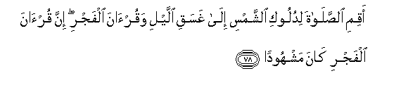
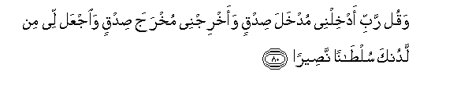
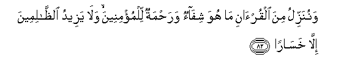

  
[Intangible Textual Heritage](../../index)  [Islam](../index) 
[Index](index)   
[Hypertext Qur'an](../htq/index)  [Unicode](../uq/017.htm#017_078) 
[Palmer](../sbe09/017)  [Pickthall](../pick/017.htm#017_078)  [Yusuf Ali
English](../yaq/yaq017)  [Rodwell](../qr/017)   
  
[Sūra XVII.: Banī Isrā-īl, or the Children of Israel, Index](017)  
  [Previous](01708)  [Next](01710) 

------------------------------------------------------------------------

  
*The Holy Quran*, tr. by Yusuf Ali, \[1934\], at Intangible Textual
Heritage

------------------------------------------------------------------------

# Sūra XVII.: Banī Isrā-īl, or the Children of Israel,

### Section 9

------------------------------------------------------------------------

78. Aqimi a**l**<u>ss</u>al<u>a</u>ta lidulooki a**l**shshamsi
il<u>a</u> ghasaqi allayli waqur-<u>a</u>na alfajri inna qur-<u>a</u>na
alfajri k<u>a</u>na mashhood<u>a</u>**n**

78\. Establish regular prayers—  
At the sun's decline  
Till the darkness of the night,  
And the morning prayer  
And reading: for the prayer  
And reading in the morning  
Carry their testimony.

------------------------------------------------------------------------

79. Wamina allayli fatahajjad bihi n<u>a</u>filatan laka AAas<u>a</u> an
yabAAathaka rabbuka maq<u>a</u>man ma<u>h</u>mood<u>a</u>**n**

79\. And pray in the small watches  
Of the morning: (it would be)  
An additional prayer  
(Or spiritual profit)  
For thee: soon will thy Lord  
Raise thee to a Station  
Of Praise and Glory!

------------------------------------------------------------------------

80. Waqul rabbi adkhilnee mudkhala <u>s</u>idqin waakhrijnee mukhraja
<u>s</u>idqin wa**i**jAAal lee min ladunka sul<u>ta</u>nan
na<u>s</u>eer<u>a</u>**n**

80\. Say: "O my Lord!  
Let my entry be  
By the Gate of Truth  
And Honour, and likewise  
My exit by the Gate  
Of Truth and Honour;  
And grant me  
From Thy Presence  
An authority to aid (me).

------------------------------------------------------------------------

81. Waqul j<u>a</u>a al<u>h</u>aqqu wazahaqa alb<u>at</u>ilu inna
alb<u>at</u>ila k<u>a</u>na zahooq<u>a</u>**n**

81\. And say: "Truth has (now)  
Arrived, and Falsehood perished:  
For Falsehood is (by its nature)  
Bound to perish."

------------------------------------------------------------------------

82. Wanunazzilu mina alqur-<u>a</u>ni m<u>a</u> huwa shif<u>a</u>on
wara<u>h</u>matun lilmu/mineena wal<u>a</u> yazeedu
a**l***<u>thth</u>*<u>a</u>limeena ill<u>a</u>
khas<u>a</u>r<u>a</u>**n**

82\. We send down (stage by stage)  
In the Qur-ān that which  
Is a healing and a mercy  
To those who believe:  
To the unjust it causes  
Nothing but loss after loss.

------------------------------------------------------------------------

83. Wa-i<u>tha</u> anAAamn<u>a</u> AAal<u>a</u> al-ins<u>a</u>ni
aAAra<u>d</u>a wana<u>a</u> bij<u>a</u>nibihi wa-i<u>tha</u> massahu
a**l**shsharru k<u>a</u>na yaoos<u>a</u>**n**

83\. Yet when We bestow  
Our favours on man,  
He turns away and becomes  
Remote on his side (instead  
Of coming to Us), and when  
Evil seizes him he  
Gives himself up to despair!

------------------------------------------------------------------------

84. Qul kullun yaAAmalu AAal<u>a</u> sh<u>a</u>kilatihi farabbukum
aAAlamu biman huwa ahd<u>a</u> sabeel<u>a</u>**n**

84\. Say: "Everyone acts  
According to his own disposition:  
But your Lord knows best  
Who it is that is  
Best guided on the Way."

------------------------------------------------------------------------

[Next: Section 10 (85-93)](01710)

