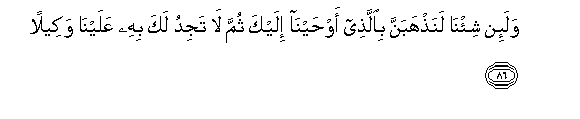
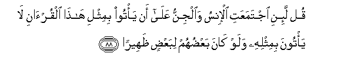
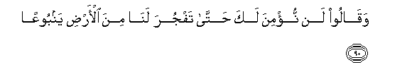
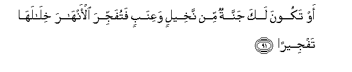
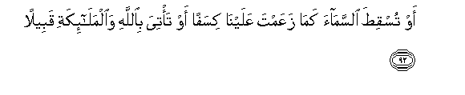
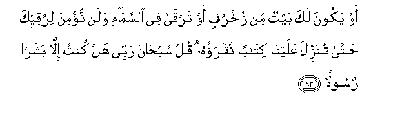

  
[Intangible Textual Heritage](../../index)  [Islam](../index.md) 
[Index](index.md)   
[Hypertext Qur'an](../htq/index)  [Unicode](../uq/017.htm#017_085.md) 
[Palmer](../sbe09/017)  [Pickthall](../pick/017.htm#017_085.md)  [Yusuf Ali
English](../yaq/yaq017)  [Rodwell](../qr/017.md)   
  
[Sūra XVII.: Banī Isrā-īl, or the Children of Israel, Index](017.md)  
  [Previous](01709)  [Next](01711.md) 

------------------------------------------------------------------------

  
*The Holy Quran*, tr. by Yusuf Ali, \[1934\], at Intangible Textual
Heritage

------------------------------------------------------------------------

# Sūra XVII.: Banī Isrā-īl, or the Children of Israel,

### Section 10

------------------------------------------------------------------------

85. Wayas-aloonaka AAani a**l**rroo<u>h</u>i quli a**l**rroo<u>h</u>u
min amri rabbee wam<u>a</u> ooteetum mina alAAilmi ill<u>a</u>
qaleel<u>a</u>**n**

85\. They ask thee concerning  
The Spirit (of inspiration).  
Say: "The Spirit (cometh)  
By command of my Lord:  
Of knowledge it is only  
A little that is communicated  
To you, (O men!)"

------------------------------------------------------------------------

86. Wala-in shi/n<u>a</u> lana<u>th</u>habanna bi**a**lla<u>th</u>ee
aw<u>h</u>ayn<u>a</u> ilayka thumma l<u>a</u> tajidu laka bihi
AAalayn<u>a</u> wakeel<u>a</u>**n**

86\. If it were Our Will,  
We could take away  
That which We have  
Sent thee by inspiration  
Then wouldst thou find  
None to plead thy affair  
In that matter as against Us,—

------------------------------------------------------------------------

87. Ill<u>a</u> ra<u>h</u>matan min rabbika inna fa<u>d</u>lahu
k<u>a</u>na AAalayka kabeer<u>a</u>**n**

87\. Except for Mercy from thy Lord:  
For His Bounty is  
To thee (indeed) great.

------------------------------------------------------------------------

88. Qul la-ini ijtamaAAati al-insu wa**a**ljinnu AAal<u>a</u> an ya/too
bimithli h<u>atha</u> alqur-<u>a</u>ni l<u>a</u> ya/toona bimithlihi
walaw k<u>a</u>na baAA<u>d</u>uhum libaAA<u>d</u>in
*<u>th</u>*aheer<u>a</u>**n**

88\. Say: "If the whole  
Of mankind and Jinns  
Were to gather together  
To produce the like  
Of this Qur-ān, they  
Could not produce  
The like thereof, even if  
They backed up each other  
With help and support.

------------------------------------------------------------------------

89. Walaqad <u>s</u>arrafn<u>a</u> li**l**nn<u>a</u>si fee h<u>atha</u>
alqur-<u>a</u>ni min kulli mathalin faab<u>a</u> aktharu
a**l**nn<u>a</u>si ill<u>a</u> kufoor<u>a</u>**n**

89\. And We have explained  
To man, in this Qur-ān,  
Every kind of similitude:  
Yet the greater part of men  
Refuse (to receive it)  
Except with ingratitude!

------------------------------------------------------------------------

90. Waq<u>a</u>loo lan nu/mina laka <u>h</u>att<u>a</u> tafjura
lan<u>a</u> mina al-ar<u>d</u>i yanbooAA<u>a</u>**n**

90\. They say: "We shall not  
Believe in thee, until thou  
Cause a spring to gush  
Forth for us from the earth,

------------------------------------------------------------------------

91. Aw takoona laka jannatun min nakheelin waAAinabin fatufajjira
al-anh<u>a</u>ra khil<u>a</u>lah<u>a</u> tafjeer<u>a</u>**n**

91\. "Or (until) thou have  
A garden of date trees  
And vines, and cause rivers  
To gush forth in their midst,  
Carrying abundant water;

------------------------------------------------------------------------

92. Aw tusqi<u>t</u>a a**l**ssam<u>a</u>a kam<u>a</u> zaAAamta
AAalayn<u>a</u> kisafan aw ta/tiya bi**A**ll<u>a</u>hi
wa**a**lmal<u>a</u>-ikati qabeel<u>a</u>**n**

92\. "Or thou cause the sky  
To fall in pieces, as thou  
Sayest (will happen), against us;  
Or thou bring God  
And the angels before (us)  
Face to face;

------------------------------------------------------------------------

93. Aw yakoona laka baytun min zukhrufin aw tarq<u>a</u> fee
a**l**ssam<u>a</u>-i walan nu/mina liruqiyyika <u>h</u>att<u>a</u>
tunazzila AAalayn<u>a</u> kit<u>a</u>ban naqraohu qul sub<u>ha</u>na
rabbee hal kuntu ill<u>a</u> basharan rasool<u>a</u>**n**

93\. "Or thou have a house  
Adorned with gold,  
Or thou mount a ladder  
Right into the skies.  
No, we shall not even believe  
In thy mounting until thou  
Send down to us a book  
That we could read."  
Say: "Glory to my Lord!  
Am I aught but a man,—  
An apostle?"

------------------------------------------------------------------------

[Next: Section 11 (94-100)](01711.md)

