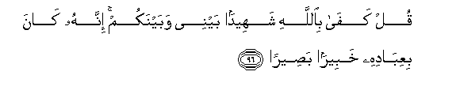
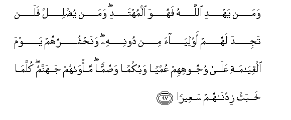
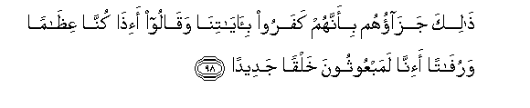
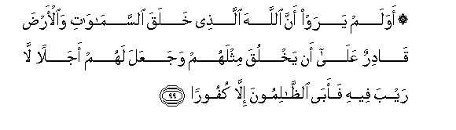

  
[Intangible Textual Heritage](../../index)  [Islam](../index) 
[Index](index)   
[Hypertext Qur'an](../htq/index)  [Unicode](../uq/017.htm#017_094) 
[Palmer](../sbe09/017)  [Pickthall](../pick/017.htm#017_094)  [Yusuf Ali
English](../yaq/yaq017)  [Rodwell](../qr/017)   
  
[Sūra XVII.: Banī Isrā-īl, or the Children of Israel, Index](017)  
  [Previous](01710)  [Next](01712) 

------------------------------------------------------------------------

  
*The Holy Quran*, tr. by Yusuf Ali, \[1934\], at Intangible Textual
Heritage

------------------------------------------------------------------------

# Sūra XVII.: Banī Isrā-īl, or the Children of Israel,

### Section 11

------------------------------------------------------------------------

94. Wam<u>a</u> manaAAa a**l**nn<u>a</u>sa an yu/minoo i<u>th</u>
j<u>a</u>ahumu alhud<u>a</u> ill<u>a</u> an q<u>a</u>loo abaAAatha
All<u>a</u>hu basharan rasool<u>a</u>**n**

94\. What kept men back  
From Belief when Guidance  
Came to them, was nothing  
But this: they said,  
"Has God sent a man  
(Like us) to be (His) Apostle?"

------------------------------------------------------------------------

95. Qul law k<u>a</u>na fee al-ar<u>d</u>i mal<u>a</u>-ikatun yamshoona
mu<u>t</u>ma-inneena lanazzaln<u>a</u> AAalayhim mina
a**l**ssam<u>a</u>-i malakan rasool<u>a</u>**n**

95\. Say, "If there were settled,  
On earth, angels walking about  
In peace and quiet, We should  
Certainly have sent them  
Down from the heavens  
An angel for an apostle."

------------------------------------------------------------------------

96. Qul kaf<u>a</u> bi**A**ll<u>a</u>hi shaheedan baynee wabaynakum
innahu k<u>a</u>na biAAib<u>a</u>dihi khabeeran
ba<u>s</u>eer<u>a</u>**n**

96\. Say: "Enough is God  
For a witness between me  
And you: for He is  
Well acquainted with His servants,  
And He sees (all things).

------------------------------------------------------------------------

97. Waman yahdi All<u>a</u>hu fahuwa almuhtadi waman yu<u>d</u>lil falan
tajida lahum awliy<u>a</u>a min doonihi wana<u>h</u>shuruhum yawma
alqiy<u>a</u>mati AAal<u>a</u> wujoohihim AAumyan wabukman
wa<u>s</u>umman ma/w<u>a</u>hum jahannamu kullam<u>a</u> khabat
zidn<u>a</u>hum saAAeer<u>a</u>**n**

97\. It is he whom God guides,  
That is on true guidance;  
But he whom He leaves  
Astray—for such wilt thou  
Find no protector besides Him.  
On the Day of Judgment  
We shall gather them together,  
Prone on their faces,  
Blind, dumb, and deaf:  
Their abode will be Hell:  
Every time it shows abatement,  
We shall increase for them  
The fierceness of the Fire.

------------------------------------------------------------------------

98. <u>Tha</u>lika jaz<u>a</u>ohum bi-annahum kafaroo
bi-<u>a</u>y<u>a</u>tin<u>a</u> waq<u>a</u>loo a-i<u>tha</u>
kunn<u>a</u> AAi*<u>th</u>*<u>a</u>man waruf<u>a</u>tan a-inn<u>a</u>
lamabAAoothoona khalqan jadeed<u>a</u>**n**

98\. That is their recompense,  
Because they rejected Our Signs,  
And said, "When we are reduced  
To bones and broken dust,  
Should we really be raised up  
(To be) a new Creation?"

------------------------------------------------------------------------

99. Awa lam yaraw anna All<u>a</u>ha alla<u>th</u>ee khalaqa
a**l**ssam<u>a</u>w<u>a</u>ti wa**a**l-ar<u>d</u>a q<u>a</u>dirun
AAal<u>a</u> an yakhluqa mithlahum wajaAAala lahum ajalan l<u>a</u>
rayba feehi faab<u>a</u> a**l***<u>thth</u>*<u>a</u>limoona ill<u>a</u>
kufoor<u>a</u>**n**

99\. See they not that God,  
Who created the heavens  
And the earth, has power  
To create the like of them  
(Anew)? Only He has  
Decreed a term appointed,  
Of which there is no doubt.  
But the unjust refuse  
(To receive it) except  
With ingratitude.

------------------------------------------------------------------------

100. Qul law antum tamlikoona khaz<u>a</u>-ina ra<u>h</u>mati rabbee
i<u>th</u>an laamsaktum khashyata al-inf<u>a</u>qi wak<u>a</u>na
al-ins<u>a</u>nu qatoor<u>a</u>**n**

100\. Say: "If ye had  
Control of the Treasures  
Of the Mercy of my Lord,  
Behold, ye would keep them  
Back, for fear of spending  
Them: for man  
Is (ever) niggardly!"

------------------------------------------------------------------------

[Next: Section 12 (101-111)](01712)

