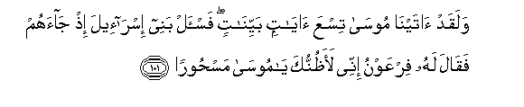
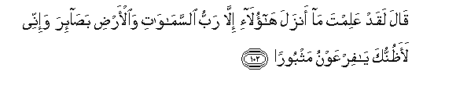
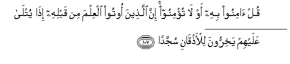
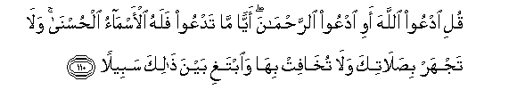

  
[Intangible Textual Heritage](../../index)  [Islam](../index) 
[Index](index)   
[Hypertext Qur'an](../htq/index)  [Unicode](../uq/017.htm#017_101) 
[Palmer](../sbe09/017)  [Pickthall](../pick/017.htm#017_101)  [Yusuf Ali
English](../yaq/yaq017)  [Rodwell](../qr/017)   
  
[Sūra XVII.: Banī Isrā-īl, or the Children of Israel, Index](017)  
  [Previous](01711)  [Next](01801) 

------------------------------------------------------------------------

  
*The Holy Quran*, tr. by Yusuf Ali, \[1934\], at Intangible Textual
Heritage

------------------------------------------------------------------------

# Sūra XVII.: Banī Isrā-īl, or the Children of Israel,

### Section 12

------------------------------------------------------------------------

101. Walaqad <u>a</u>tayn<u>a</u> moos<u>a</u> tisAAa
<u>a</u>y<u>a</u>tin bayyin<u>a</u>tin fa**i**s-al banee
isr<u>a</u>-eela i<u>th</u> j<u>a</u>ahum faq<u>a</u>la lahu firAAawnu
innee laa*<u>th</u>*unnuka y<u>a</u> moos<u>a</u>
mas<u>h</u>oor<u>a</u>**n**

101\. To Moses We did give  
Nine Clear Signs:  
Ask the Children of Israel:  
When he came to them,  
Pharaoh said to him:  
"O Moses! I consider thee,  
Indeed, to have been  
Worked upon by sorcery!

------------------------------------------------------------------------

102. Q<u>a</u>la laqad AAalimta m<u>a</u> anzala h<u>a</u>ol<u>a</u>-i
ill<u>a</u> rabbu a**l**ssam<u>a</u>w<u>a</u>ti wa**a**l-ar<u>d</u>i
ba<u>sa</u>-ira wa-innee laa*<u>th</u>*unnuka y<u>a</u> firAAawnu
mathboor<u>a</u>**n**

102\. Moses said, "Thou knowest  
Well that these things  
Have been sent down by none  
But the Lord of the heavens  
And the earth as eye-opening  
Evidence: and I consider thee  
Indeed, O Pharaoh, to be  
One doomed to destruction!"

------------------------------------------------------------------------

103. Faar<u>a</u>da an yastafizzahum mina al-ar<u>d</u>i
faaghraqn<u>a</u>hu waman maAAahu jameeAA<u>a</u>**n**

103\. So he resolved to remove them  
From the face of the earth:  
But We did drown him  
And all who were with him.

------------------------------------------------------------------------

104. Waquln<u>a</u> min baAAdihi libanee isr<u>a</u>-eela oskunoo
al-ar<u>d</u>a fa-i<u>tha</u> j<u>a</u>a waAAdu al-<u>a</u>khirati
ji/n<u>a</u> bikum lafeef<u>a</u>**n**

104\. And We said thereafter  
To the Children of Israel,  
"Dwell securely in the land  
(Of promise)": but when  
The second of the warnings came  
To pass, We gathered you  
Together in a mingled crowd

------------------------------------------------------------------------

105. Wabi**a**l<u>h</u>aqqi anzaln<u>a</u>hu wabi**a**l<u>h</u>aqqi
nazala wam<u>a</u> arsaln<u>a</u>ka ill<u>a</u> mubashshiran
wana<u>th</u>eer<u>a</u>**n**

105\. We sent down the (Qur-ān)  
In Truth, and in Truth  
Has it descended: and We sent  
Thee but to give Glad  
Tidings and to warn (sinners).

------------------------------------------------------------------------

106. Waqur-<u>a</u>nan faraqn<u>a</u>hu litaqraahu AAal<u>a</u>
a**l**nn<u>a</u>si AAal<u>a</u> mukthin wanazzaln<u>a</u>hu
tanzeel<u>a</u>**n**

106\. (It is) a Qur-ān  
Which We have divided  
(Into parts from time to time),  
In order that thou mightest  
Recite it to men  
At intervals: We have  
Revealed it by stages.

------------------------------------------------------------------------

107. Qul <u>a</u>minoo bihi aw l<u>a</u> tu/minoo inna alla<u>th</u>eena
ootoo alAAilma min qablihi i<u>tha</u> yutl<u>a</u> AAalayhim
yakhirroona lil-a<u>th</u>q<u>a</u>ni sujjad<u>a</u>**n**

107\. Say: "Whether ye believe  
In it or not, it is true  
That those who were given  
Knowledge beforehand, when  
It it recited to them,  
Fall down on their faces  
In humble prostration,

------------------------------------------------------------------------

108. Wayaqooloona sub<u>ha</u>na rabbin<u>a</u> in k<u>a</u>na waAAdu
rabbin<u>a</u> lamafAAool<u>a</u>**n**

108\. "And they say, "Glory  
To our Lord! Truly  
Has the promise of our Lord  
Been fulfilled!"

------------------------------------------------------------------------

109. Wayakhirroona lil-a<u>th</u>q<u>a</u>ni yabkoona wayazeeduhum
khushooAA<u>a</u>**n**

109\. They fall down on their faces  
In tears, and it increases  
Their (earnest) humility!

------------------------------------------------------------------------

110. Quli odAAoo All<u>a</u>ha awi odAAoo a**l**rra<u>h</u>m<u>a</u>na
ayyan m<u>a</u> tadAAoo falahu al-asm<u>a</u>o al<u>h</u>usn<u>a</u>
wal<u>a</u> tajhar bi<u>s</u>al<u>a</u>tika wal<u>a</u> tukh<u>a</u>fit
bih<u>a</u> wa**i**btaghi bayna <u>tha</u>lika sabeel<u>a</u>**n**

110\. Say: "Call upon God, or  
Call upon Raḥmān:  
By whatever name ye call  
Upon Him, (it is well):  
For to Him belong  
The Most Beautiful Names.  
Neither speak thy Prayer aloud,  
Nor speak it in a low tone,  
But seek a middle course  
Between."

------------------------------------------------------------------------

111. Waquli al<u>h</u>amdu lill<u>a</u>hi alla<u>th</u>ee lam
yattakhi<u>th</u> waladan walam yakun lahu shareekun fee almulki walam
yakun lahu waliyyun mina a**l**<u>thth</u>ulli wakabbirhu
takbeer<u>a</u>**n**

111\. Say: "Praise be to God,  
Who begets no son,  
And has no partner  
In (His) dominion:  
Nor (needs) He any  
To protect Him from  
humiliation:  
Yea, magnify Him  
For His greatness and glory!"

------------------------------------------------------------------------

[Next: Section 1 (1-12)](01801)

