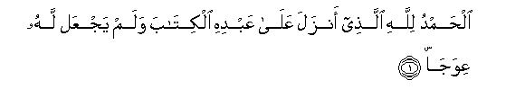
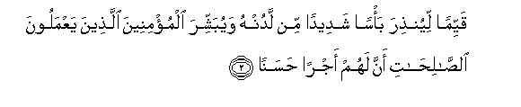
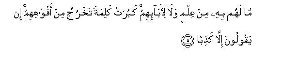
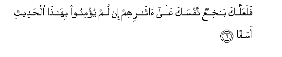
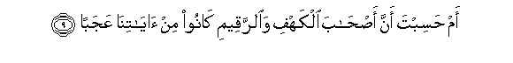
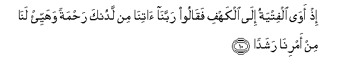
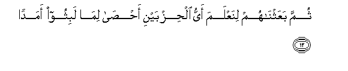

  
[Intangible Textual Heritage](../../index)  [Islam](../index) 
[Index](index)   
[Hypertext Qur'an](../htq/index)  [Unicode](../uq/018.htm#018_001) 
[Palmer](../sbe09/018)  [Pickthall](../pick/018.htm#018_001)  [Yusuf Ali
English](../yaq/yaq018)  [Rodwell](../qr/018)   
  
[Sūra XVIII.: Kahf, or the Cave. Index](018)  
  [Previous](01712)  [Next](01802) 

------------------------------------------------------------------------

  
*The Holy Quran*, tr. by Yusuf Ali, \[1934\], at Intangible Textual
Heritage

------------------------------------------------------------------------

# Sūra XVIII.: Kahf, or the Cave.

### Section 1

1. Al<u>h</u>amdu lill<u>a</u>hi alla<u>th</u>ee anzala AAal<u>a</u>
AAabdihi alkit<u>a</u>ba walam yajAAal lahu AAiwaj<u>a</u>**n**

1\. Praise be to God,  
Who hath sent to His Servant  
The Book, and hath allowed  
Therein no Crookedness:

------------------------------------------------------------------------

2. Qayyiman liyun<u>th</u>ira ba/san shadeedan min ladunhu wayubashshira
almu/mineena alla<u>th</u>eena yaAAmaloona a**l**<u>ssa</u>li<u>ha</u>ti
anna lahum ajran <u>h</u>asan<u>a</u>**n**

2\. (He hath made it) Straight  
(And Clear) in order that  
He may warn (the godless)  
Of a terrible Punishment  
From Him, and that He  
May give Glad Tidings  
To the Believers who work  
Righteous deeds, that they  
Shall have a goodly Reward,

------------------------------------------------------------------------

3. M<u>a</u>kitheena feehi abad<u>a</u>**n**

3\. Wherein they shall  
Remain for ever:

------------------------------------------------------------------------

4. Wayun<u>th</u>ira alla<u>th</u>eena q<u>a</u>loo ittakha<u>th</u>a
All<u>a</u>hu walad<u>a</u>**n**

4\. Further; that He may warn  
Those (also) who say,  
"God hath begotten a son"

------------------------------------------------------------------------

5. M<u>a</u> lahum bihi min AAilmin wal<u>a</u>
li-<u>a</u>b<u>a</u>-ihim kaburat kalimatan takhruju min
afw<u>a</u>hihim in yaqooloona ill<u>a</u> ka<u>th</u>ib<u>a</u>**n**

5\. No knowledge have they  
Of such a thing, nor  
Had their fathers. It is  
A grievous thing that issues  
From their mouths as a saying.  
What they say is nothing  
But falsehood!

------------------------------------------------------------------------

6. FalaAAallaka b<u>a</u>khiAAun nafsaka AAal<u>a</u>
<u>a</u>th<u>a</u>rihim in lam yu/minoo bih<u>atha</u> al<u>h</u>adeethi
asaf<u>a</u>**n**

6\. Thou wouldst only, perchance,  
Fret thyself to death,  
Following after them, in grief,  
If they believe not  
In this Message.

------------------------------------------------------------------------

7. Inn<u>a</u> jaAAaln<u>a</u> m<u>a</u> AAal<u>a</u> al-ar<u>d</u>i
zeenatan lah<u>a</u> linabluwahum ayyuhum a<u>h</u>sanu
AAamal<u>a</u>**n**

7\. That which is on earth  
We have made but as  
A glittering show for the earth,  
In order that We may test  
Them—as to which of them  
Are best in conduct.

------------------------------------------------------------------------

8. Wa-inn<u>a</u> laj<u>a</u>AAiloona m<u>a</u> AAalayh<u>a</u>
<u>s</u>aAAeedan juruz<u>a</u>**n**

8\. Verily what is on earth  
We shall make but as  
Dust and dry soil  
(Without growth or herbage).

------------------------------------------------------------------------

9. Am <u>h</u>asibta anna a<u>s</u>-<u>ha</u>ba alkahfi wa**al**rraqeemi
k<u>a</u>noo min <u>a</u>y<u>a</u>tin<u>a</u> AAajab<u>a</u>**n**

9\. Or dost thou reflect  
That the Companions of the Cave  
And of the Inscription  
Were wonders among Our Signs?

------------------------------------------------------------------------

10. I<u>th</u> aw<u>a</u> alfityatu il<u>a</u> alkahfi faq<u>a</u>loo
rabban<u>a</u> <u>a</u>tin<u>a</u> min ladunka ra<u>h</u>matan wahayyi/
lan<u>a</u> min amrin<u>a</u> rashad<u>a</u>**n**

10\. Behold, the youths betook themselves  
To the Cave: they said,  
"Our Lord! bestow on us  
Mercy from Thyself,  
And dispose of our affair  
For us in the right way!"

------------------------------------------------------------------------

11. Fa<u>d</u>arabn<u>a</u> AAal<u>a</u> <u>atha</u>nihim fee alkahfi
sineena AAadad<u>a</u>**n**

11\. Then We draw (a veil)  
Over their ears, for a number  
Of years, in the Cave,  
(So that they heard not):

------------------------------------------------------------------------

12. Thumma baAAathn<u>a</u>hum linaAAlama ayyu al<u>h</u>izbayni
a<u>hsa</u> lim<u>a</u> labithoo amad<u>a</u>**n**

12\. Then We roused them,  
In order to test which  
Of the two parties was best  
At calculating the term  
Of years they had tarried!

------------------------------------------------------------------------

[Next: Section 2 (13-17)](01802)

