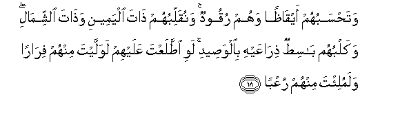
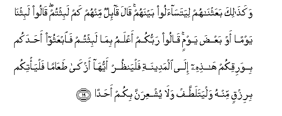
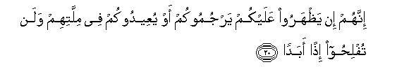
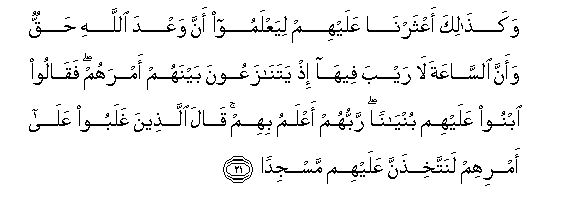
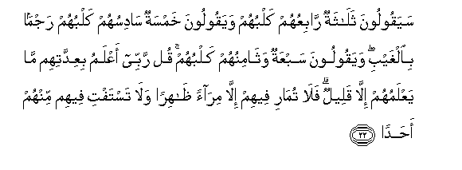

  
[Intangible Textual Heritage](../../index)  [Islam](../index) 
[Index](index)   
[Hypertext Qur'an](../htq/index)  [Unicode](../uq/018.htm#018_018) 
[Palmer](../sbe09/018)  [Pickthall](../pick/018.htm#018_018)  [Yusuf Ali
English](../yaq/yaq018)  [Rodwell](../qr/018)   
  
[Sūra XVIII.: Kahf, or the Cave. Index](018)  
  [Previous](01802)  [Next](01804) 

------------------------------------------------------------------------

  
*The Holy Quran*, tr. by Yusuf Ali, \[1934\], at Intangible Textual
Heritage

------------------------------------------------------------------------

# Sūra XVIII.: Kahf, or the Cave.

### Section 3

------------------------------------------------------------------------

18. Wata<u>h</u>sabuhum ayq<u>a</u>*<u>th</u>*an wahum ruqoodun
wanuqallibuhum <u>tha</u>ta alyameeni wa<u>tha</u>ta
a**l**shshim<u>a</u>li wakalbuhum b<u>a</u>si<u>t</u>un
<u>th</u>ir<u>a</u>AAayhi bi**a**lwa<u>s</u>eedi lawi i<u>tt</u>alaAAta
AAalayhim lawallayta minhum fir<u>a</u>ran walamuli/ta minhum
ruAAb<u>a</u>**n**

18\. Thou wouldst have deemed them  
Awake, whilst they were asleep,  
And We turned them  
On their right and on  
Their left sides: their dog  
Stretching forth his two fore-legs  
On the threshold: if thou  
Hadst come up on to them,  
Thou wouldst have certainly  
Turned back from them in flight,  
And wouldst certainly have been  
Filled with terror of them.

------------------------------------------------------------------------

19. Waka<u>tha</u>lika baAAathn<u>a</u>hum liyatas<u>a</u>aloo baynahum
q<u>a</u>la q<u>a</u>-ilun minhum kam labithtum q<u>a</u>loo
labithn<u>a</u> yawman aw baAA<u>d</u>a yawmin q<u>a</u>loo rabbukum
aAAlamu bim<u>a</u> labithtum fa**i**bAAathoo a<u>h</u>adakum
biwariqikum h<u>ath</u>ihi il<u>a</u> almadeenati falyan*<u>th</u>*ur
ayyuh<u>a</u> azk<u>a</u> <u>t</u>aAA<u>a</u>man falya/tikum birizqin
minhu walyatala<u>tt</u>af wal<u>a</u> yushAAiranna bikum
a<u>h</u>ad<u>a</u>**n**

19\. Such (being their state),  
We raised them up (from sleep),  
That they might question  
Each other. Said one of them,  
"How long have ye stayed (here)?"  
They said, "We have stayed  
(Perhaps) a day, or part  
Of a day." (At length)  
They (all) said, "God (alone)  
Knows best how long  
Ye have stayed here…  
Now send ye then one of you  
With this money of yours  
To the town: let him  
Find out which is the best  
Food (to be had) and bring some  
To you, that (ye may)  
Satisfy your hunger therewith:  
And let him behave  
With care and courtesy,  
And let him not inform  
Any one about you.

------------------------------------------------------------------------

20. Innahum in ya*<u>th</u>*haroo AAalaykum yarjumookum aw yuAAeedookum
fee millatihim walan tufli<u>h</u>oo i<u>th</u>an abad<u>a</u>**n**

20\. "For if they should  
Come upon you, they would  
Stone you or force you  
To return to their cult,  
And in that case ye would  
Never attain prosperity."

------------------------------------------------------------------------

21. Waka<u>tha</u>lika aAAtharn<u>a</u> AAalayhim liyaAAlamoo anna
waAAda All<u>a</u>hi <u>h</u>aqqun waanna a**l**s<u>a</u>AAata l<u>a</u>
rayba feeh<u>a</u> i<u>th</u> yatan<u>a</u>zaAAoona baynahum amrahum
faq<u>a</u>loo ibnoo AAalayhim buny<u>a</u>nan rabbuhum aAAlamu bihim
q<u>a</u>la alla<u>th</u>eena ghalaboo AAal<u>a</u> amrihim
lanattakhi<u>th</u>anna AAalayhim masjid<u>a</u>**n**

21\. Thus did We make  
Their case known to the people,  
That they might know  
That the promise of God  
Is true, and that there can  
Be no doubt about the Hour  
Of Judgment. Behold,  
They dispute among themselves  
As to their affair. (Some) said,  
"Construct a building over them":  
Their Lord knows best  
About them: those who prevailed  
Over their affair said,  
"Let us surely build a place  
Of worship over them."

------------------------------------------------------------------------

22. Sayaqooloona thal<u>a</u>thatun r<u>a</u>biAAuhum kalbuhum
wayaqooloona khamsatun s<u>a</u>disuhum kalbuhum rajman bi**a**lghaybi
wayaqooloona sabAAatun wath<u>a</u>minuhum kalbuhum qul rabbee aAAlamu
biAAiddatihim m<u>a</u> yaAAlamuhum ill<u>a</u> qaleelun fal<u>a</u>
tum<u>a</u>ri feehim ill<u>a</u> mir<u>a</u>an *<u>th</u>*<u>a</u>hiran
wal<u>a</u> tastafti feehim minhum a<u>h</u>ad<u>a</u>**n**

22\. (Some) say they were three,  
The dog being the fourth  
Among them; (others) say  
They were five, the dog  
Being the sixth,—doubtfully  
Guessing at the unknown;  
(Yet others) say they were  
Seven, the dog being the eighth.  
Say thou: "My Lord  
Knoweth best their number;  
It is but few that know  
Their (real case)." Enter not,  
Therefore, into controversies  
Concerning them, except  
On a matter that is clear,  
Nor consult any of them  
About (the affair of) the Sleepers.

------------------------------------------------------------------------

[Next: Section 4 (23-31)](01804)

