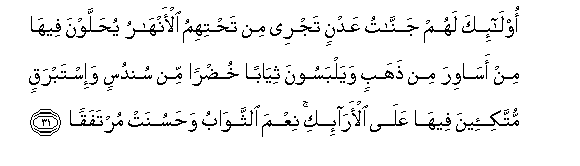

  
[Intangible Textual Heritage](../../index)  [Islam](../index) 
[Index](index)   
[Hypertext Qur'an](../htq/index)  [Unicode](../uq/018.htm#018_023) 
[Palmer](../sbe09/018)  [Pickthall](../pick/018.htm#018_023)  [Yusuf Ali
English](../yaq/yaq018)  [Rodwell](../qr/018)   
  
[Sūra XVIII.: Kahf, or the Cave. Index](018)  
  [Previous](01803)  [Next](01805) 

------------------------------------------------------------------------

  
*The Holy Quran*, tr. by Yusuf Ali, \[1934\], at Intangible Textual
Heritage

------------------------------------------------------------------------

# Sūra XVIII.: Kahf, or the Cave.

### Section 4

------------------------------------------------------------------------

23. Wal<u>a</u> taqoolanna lishay-in innee f<u>a</u>AAilun
<u>tha</u>lika ghad<u>a</u>**n**

23\. Nor say of anything,  
"I shall be sure to do  
So and so to-morrow"—

------------------------------------------------------------------------

24. Ill<u>a</u> an yash<u>a</u>a All<u>a</u>hu wa**o**<u>th</u>kur
rabbaka i<u>tha</u> naseeta waqul AAas<u>a</u> an yahdiyani rabbee
li-aqraba min h<u>atha</u> rashad<u>a</u>**n**

24\. Without adding, "So please God!"  
And call thy Lord to mind  
When thou forgettest, and say,  
"I hope that my Lord  
Will guide me ever closer  
(Even) than this  
To the right road."

------------------------------------------------------------------------

25. Walabithoo fee kahfihim thal<u>a</u>tha mi-atin sineena
wa**i**zd<u>a</u>doo tisAA<u>a</u>**n**

25\. So they stayed in their Cave  
Three hundred years, and (some)  
Add nine (more)

------------------------------------------------------------------------

26. Quli All<u>a</u>hu aAAlamu bim<u>a</u> labithoo lahu ghaybu
a**l**ssam<u>a</u>w<u>a</u>ti wa**a**l-ar<u>d</u>i ab<u>s</u>ir bihi
waasmiAA m<u>a</u> lahum min doonihi min waliyyin wal<u>a</u> yushriku
fee <u>h</u>ukmihi a<u>h</u>ad<u>a</u>**n**

26\. Say: "God knows best  
How long they stayed:  
With Him is (the knowledge  
Of) the secrets of the heavens  
And the earth: how clearly  
He sees, how finely He hears  
(Everything)! They have no protector  
Other than Him; nor does  
He share His Command  
With any person whatsoever.

------------------------------------------------------------------------

27. Wa**o**tlu m<u>a</u> oo<u>h</u>iya ilayka min kit<u>a</u>bi rabbika
l<u>a</u> mubaddila likalim<u>a</u>tihi walan tajida min doonihi
multa<u>h</u>ad<u>a</u>**n**

27\. And recite (and teach)  
What has been revealed  
To thee of the Book  
Of thy Lord: none  
Can change His Words,  
And none wilt thou find  
As a refuge other than Him.

------------------------------------------------------------------------

28. Wa**i**<u>s</u>bir nafsaka maAAa alla<u>th</u>eena yadAAoona
rabbahum bi**a**lghad<u>a</u>ti wa**a**lAAashiyyi yureedoona wajhahu
wal<u>a</u> taAAdu AAayn<u>a</u>ka AAanhum tureedu zeenata
al<u>h</u>ay<u>a</u>ti a**l**dduny<u>a</u> wal<u>a</u> tu<u>t</u>iAA man
aghfaln<u>a</u> qalbahu AAan <u>th</u>ikrin<u>a</u> wa**i**ttabaAAa
haw<u>a</u>hu wak<u>a</u>na amruhu furu<u>ta</u>**n**

28\. And keep thy soul content  
With those who call  
On their Lord morning  
And evening, seeking  
His Face; and let not  
Thine eyes pass beyond them,  
Seeking the pomp and glitter  
Of this Life; nor obey  
Any whose heart We  
Have permitted to neglect  
The remembrance of Us,  
One who follows his own  
Desires, whose case has  
Gone beyond all bounds.

------------------------------------------------------------------------

29. Waquli al<u>h</u>aqqu min rabbikum faman sh<u>a</u>a falyu/min waman
sh<u>a</u>a falyakfur inn<u>a</u> aAAtadn<u>a</u>
li**l***<u>thth</u>*<u>a</u>limeena n<u>a</u>ran a<u>hat</u>a bihim
sur<u>a</u>diquh<u>a</u> wa-in yastagheethoo yugh<u>a</u>thoo
bim<u>a</u>-in ka**a**lmuhli yashwee alwujooha bi/sa
a**l**shshar<u>a</u>bu was<u>a</u>at murtafaq<u>a</u>**n**

29\. Say, "The Truth is  
From your Lord":  
Let him who will,  
Believe, and let him  
Who will, reject (it):  
For the wrong-doers We  
Have prepared a Fire  
Whose (smoke and flames),  
Like the walls and roof  
Of a tent, will hem  
Them in: if they implore  
Relief they will be granted  
Water like melted brass,  
That will scald their faces.  
How dreadful the drink!  
How uncomfortable a couch  
To recline on!

------------------------------------------------------------------------

30. Inna alla<u>th</u>eena <u>a</u>manoo waAAamiloo
a**l**<u>ssa</u>li<u>ha</u>ti inn<u>a</u> l<u>a</u> nu<u>d</u>eeAAu ajra
man a<u>h</u>sana AAamal<u>a</u>**n**

30\. As to those who believe  
And work righteousness,  
Verily We shall not suffer  
To perish the reward  
Of any who do  
A (single) righteous deed.

------------------------------------------------------------------------

31. Ol<u>a</u>-ika lahum jann<u>a</u>tu AAadnin tajree min
ta<u>h</u>tihimu al-anh<u>a</u>ru yu<u>h</u>allawna feeh<u>a</u> min
as<u>a</u>wira min <u>th</u>ahabin way**a**lbasoona thiy<u>a</u>ban
khu<u>d</u>ran min sundusin wa-istabraqin muttaki-eena feeh<u>a</u>
AAal<u>a</u> al-ar<u>a</u>-iki niAAma a**l**ththaw<u>a</u>bu
wa<u>h</u>asunat murtafaq<u>a</u>**n**

31\. For them will be Gardens  
Of Eternity; beneath them  
Rivers will flow: they will  
Be adorned therein  
With bracelets of gold,  
And they will wear  
Green garments of fine silk  
And heavy brocade;  
They will recline therein  
On raised thrones.  
How good the recompense!  
How beautiful a couch  
To recline on!

------------------------------------------------------------------------

[Next: Section 5 (32-44)](01805)

