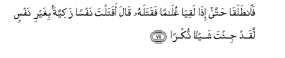
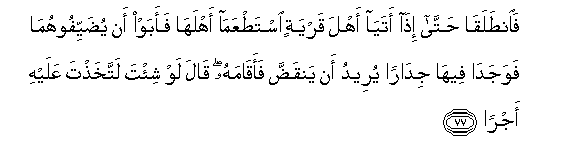
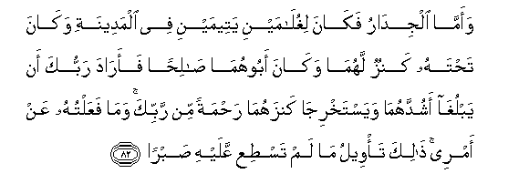

  
[Intangible Textual Heritage](../../index)  [Islam](../index) 
[Index](index)   
[Hypertext Qur'an](../htq/index)  [Unicode](../uq/018.htm#018_071) 
[Palmer](../sbe09/018)  [Pickthall](../pick/018.htm#018_071)  [Yusuf Ali
English](../yaq/yaq018)  [Rodwell](../qr/018)   
  
[Sūra XVIII.: Kahf, or the Cave. Index](018)  
  [Previous](01809)  [Next](01811) 

------------------------------------------------------------------------

  
*The Holy Quran*, tr. by Yusuf Ali, \[1934\], at Intangible Textual
Heritage

------------------------------------------------------------------------

# Sūra XVIII.: Kahf, or the Cave.

### Section 10

------------------------------------------------------------------------

71. Fa**i**n<u>t</u>alaq<u>a</u> <u>h</u>att<u>a</u> i<u>tha</u>
rakib<u>a</u> fee a**l**ssafeenati kharaqah<u>a</u> q<u>a</u>la
akharaqtah<u>a</u> litughriqa ahlah<u>a</u> laqad ji/ta shay-an
imr<u>a</u>**n**

71\. So they both proceeded:  
Until, when they were  
In the boat, he scuttled it.  
Said Moses: "Hast thou  
Scuttled it in order  
To drown those in it?  
Truly a strange thing  
Hast thou done!"

------------------------------------------------------------------------

72. Q<u>a</u>la alam aqul innaka lan tasta<u>t</u>eeAAa maAAiya
<u>s</u>abr<u>a</u>**n**

72\. He answered: "Did I not  
Tell thee that thou canst  
Have no patience with me?"

------------------------------------------------------------------------

73. Q<u>a</u>la l<u>a</u> tu-<u>a</u>khi<u>th</u>nee bim<u>a</u> naseetu
wal<u>a</u> turhiqnee min amree AAusr<u>a</u>**n**

73\. Moses said: "Rebuke me not  
For forgetting, nor grieve me  
By raising difficulties  
In my case."

------------------------------------------------------------------------

74. Fa**i**n<u>t</u>alaq<u>a</u> <u>h</u>att<u>a</u> i<u>tha</u>
laqiy<u>a</u> ghul<u>a</u>man faqatalahu q<u>a</u>la aqatalta nafsan
zakiyyatan bighayri nafsin laqad ji/ta shay-an nukr<u>a</u>**n**

74\. Then they proceeded:  
Until, when they met  
A young man, he slew him.  
Moses said: "Hast thou  
Slain an innocent person  
Who had slain none?  
Truly a foul (unheard-of) thing  
Hast thou done!"

------------------------------------------------------------------------

75. Q<u>a</u>la alam aqul laka innaka lan tasta<u>t</u>eeAAa maAAiya
<u>s</u>abr<u>a</u>**n**

75\. He answered, "Did I not  
Tell thee that thou canst  
Have no patience with me?"

------------------------------------------------------------------------

76. Q<u>a</u>la in saaltuka AAan shay-in baAAdah<u>a</u> fal<u>a</u>
tu<u>sah</u>ibnee qad balaghta min ladunnee AAu<u>th</u>r<u>a</u>**n**

76\. (Moses) said: "If ever I  
Ask thee about anything  
After this, keep me not  
In thy company: then wouldst  
Thou have received (full) excuse  
From my side.

------------------------------------------------------------------------

77. Fa**i**n<u>t</u>alaq<u>a</u> <u>h</u>att<u>a</u> i<u>tha</u>
atay<u>a</u> ahla qaryatin ista<u>t</u>AAam<u>a</u> ahlah<u>a</u> faabaw
an yu<u>d</u>ayyifoohum<u>a</u> fawajad<u>a</u> feeh<u>a</u>
jid<u>a</u>ran yureedu an yanqa<u>dd</u>a faaq<u>a</u>mahu q<u>a</u>la
law shi/ta la**i**ttakha<u>th</u>ta AAalayhi ajr<u>a</u>**n**

77\. Then they proceeded:  
Until, when they came  
To the inhabitants of a town,  
They asked them for food,  
But they refused them  
Hospitality. They found there  
A wall on the point of  
Falling down, but he  
Set it up straight.  
(Moses) said: "If thou  
Hadst wished, surely thou  
Couldst have exacted some  
Recompense for it!"

------------------------------------------------------------------------

78. Q<u>a</u>la h<u>atha</u> fir<u>a</u>qu baynee wabaynika saonabbi-oka
bita/weeli m<u>a</u> lam tasta<u>t</u>iAA AAalayhi
<u>s</u>abr<u>a</u>**n**

78\. He answered: "This is  
The parting between me  
And thee: now will I  
Tell thee the interpretation  
Of (those things) over which  
Thou wast unable  
To hold patience.

------------------------------------------------------------------------

79. Amm<u>a</u> a**l**ssafeenatu fak<u>a</u>nat limas<u>a</u>keena
yaAAmaloona fee alba<u>h</u>ri faaradtu an aAAeebah<u>a</u>
wak<u>a</u>na war<u>a</u>ahum malikun ya/khu<u>th</u>u kulla safeenatin
gha<u>s</u>b<u>a</u>**n**

79\. "As for the boat,  
It belonged to certain  
Men in dire want:  
They plied on the water:  
I but wished to render it  
Unserviceable, for there was  
After them a certain king  
Who seized on every boat  
By force.

------------------------------------------------------------------------

80. Waamm<u>a</u> alghul<u>a</u>mu fak<u>a</u>na abaw<u>a</u>hu
mu/minayni fakhasheen<u>a</u> an yurhiqahum<u>a</u>
<u>t</u>ughy<u>a</u>nan wakufr<u>a</u>**n**

80\. "As for the youth,  
His parents were people  
Of Faith, and we feared  
That he would grieve them  
By obstinate rebellion  
And ingratitude (to God and man).

------------------------------------------------------------------------

81. Faaradn<u>a</u> an yubdilahum<u>a</u> rabbuhum<u>a</u> khayran minhu
zak<u>a</u>tan waaqraba ru<u>h</u>m<u>a</u>**n**

81\. "So we desired that  
Their Lord would give them  
In exchange (a son)  
Better in purity (of conduct)  
And closer in affection.

------------------------------------------------------------------------

82. Waamm<u>a</u> aljid<u>a</u>ru fak<u>a</u>na lighul<u>a</u>mayni
yateemayni fee almadeenati wak<u>a</u>na ta<u>h</u>tahu kanzun
lahum<u>a</u> wak<u>a</u>na aboohum<u>a</u> <u>sa</u>li<u>h</u>an
faar<u>a</u>da rabbuka an yablugh<u>a</u> ashuddahum<u>a</u>
wayastakhrij<u>a</u> kanzahum<u>a</u> ra<u>h</u>matan min rabbika
wam<u>a</u> faAAaltuhu AAan amree <u>tha</u>lika ta/weelu m<u>a</u> lam
tas<u>t</u>iAA AAalayhi <u>s</u>abr<u>a</u>**n**

82\. "As for the wall,  
It belonged to two youths,  
Orphans, in the Town;  
There was, beneath it,  
A buried treasure, to which  
They were entitled; their father  
Had been a righteous man:  
So thy Lord desired that  
They should attain their age  
Of full strength and get out  
Their treasure—a mercy  
(And favour) from thy Lord.  
I did it not of my own  
Accord. Such is the interpretation  
Of (those things) over which  
Thou wast unable  
To hold patience."

------------------------------------------------------------------------

[Next: Section 11 (83-101)](01811)

