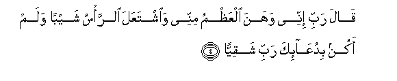
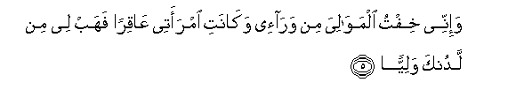

  
[Intangible Textual Heritage](../../index)  [Islam](../index) 
[Index](index)   
[Hypertext Qur'an](../htq/index)  [Unicode](../uq/019.htm#019_001) 
[Palmer](../sbe09/019)  [Pickthall](../pick/019.htm#019_001)  [Yusuf Ali
English](../yaq/yaq019)  [Rodwell](../qr/019)   
  
[Sūra XIX.: Maryam, or Mary. Index](019)  
  [Previous](01812)  [Next](01902) 

------------------------------------------------------------------------

  
*The Holy Quran*, tr. by Yusuf Ali, \[1934\], at Intangible Textual
Heritage

------------------------------------------------------------------------

# Sūra XIX.: Maryam, or Mary.

### Section 1

1. K<u>a</u>f-h<u>a</u>-y<u>a</u>-AAayn-<u>sa</u>d

1\. Kāf. Hā. Yā. ‘Ain Ṣād.

------------------------------------------------------------------------

2. <u>Th</u>ikru ra<u>h</u>mati rabbika AAabdahu zakariyy<u>a</u>

2\. (This is) a recital  
Of the Mercy of thy Lord  
To His servant Zakarīya.

------------------------------------------------------------------------

3. I<u>th</u> n<u>a</u>d<u>a</u> rabbahu nid<u>a</u>an
khafiyy<u>a</u>**n**

3\. Behold! he cried  
To his Lord in secret,

------------------------------------------------------------------------

4. Q<u>a</u>la rabbi innee wahana alAAa*<u>th</u>*mu minnee
wa**i**shtaAAala a**l**rra/su shayban walam akun biduAA<u>a</u>-ika
rabbi shaqiyy<u>a</u>**n**

4\. Praying: "O my Lord!  
Infirm indeed are my bones,  
And the hair of my head  
Doth glisten with grey:  
But never am I unblest,  
O my Lord, in my prayer  
To Thee!

------------------------------------------------------------------------

5. Wa-innee khiftu almaw<u>a</u>liya min war<u>a</u>-ee wak<u>a</u>nati
imraatee AA<u>a</u>qiran fahab lee min ladunka waliyy<u>a</u>**n**

5\. "Now I fear (what)  
My relatives (and colleagues)  
(Will do) after me:  
But my wife is barren:  
So give me an heir  
As from Thyself,—

------------------------------------------------------------------------

6. Yarithunee wayarithu min <u>a</u>li yaAAqooba wa**i**jAAalhu rabbi
ra<u>d</u>iyy<u>a</u>**n**

6\. "(One that) will (truly)  
"Represent me, and represent  
The posterity of Jacob;  
And make him, O my Lord!  
One with whom Thou art  
Well-pleased!"

------------------------------------------------------------------------

7. Y<u>a</u> zakariyy<u>a</u> inn<u>a</u> nubashshiruka
bighul<u>a</u>min ismuhu ya<u>h</u>y<u>a</u> lam najAAal lahu min qablu
samiyy<u>a</u>**n**

7\. (His prayer was answered):  
"O Zakarīya! We give thee  
Good news of a son:  
His name shall be Yaḥyā:  
On none by that name  
Have We conferred distinction before."

------------------------------------------------------------------------

8. Q<u>a</u>la rabbi ann<u>a</u> yakoonu lee ghul<u>a</u>mun
wak<u>a</u>nati imraatee AA<u>a</u>qiran waqad balaghtu mina alkibari
AAitiyy<u>a</u>**n**

8\. He said: "O my Lord!  
How shall I have a son,  
When my wife is barren  
And I have grown quite decrepit  
From old age?"

------------------------------------------------------------------------

9. Q<u>a</u>la ka<u>tha</u>lika q<u>a</u>la rabbuka huwa AAalayya
hayyinun waqad khalaqtuka min qablu walam taku shay-<u>a</u>**n**

9\. He said: "So (it will be):  
Thy Lord saith, "That is  
Easy for Me: I did  
Indeed create thee before,  
When thou hadst been nothing!"

------------------------------------------------------------------------

10. Q<u>a</u>la rabbi ijAAal lee <u>a</u>yatan q<u>a</u>la
<u>a</u>yatuka all<u>a</u> tukallima a**l**nn<u>a</u>sa thal<u>a</u>tha
lay<u>a</u>lin sawiyy<u>a</u>**n**

10\. (Zakarīya) said: "O my Lord!  
Give me a Sign."  
"Thy Sign," was the answer,  
"Shall be that thou  
Shalt speak to no man  
For three nights,  
Although thou art not dumb."

------------------------------------------------------------------------

11. Fakharaja AAal<u>a</u> qawmihi mina almi<u>h</u>r<u>a</u>bi
faaw<u>ha</u> ilayhim an sabbi<u>h</u>oo bukratan
waAAashiyy<u>a</u>**n**

11\. So Zakarīya came out  
To his people  
From his chamber:  
He told them by signs  
To celebrate God's praises  
In the morning  
And in the evening.

------------------------------------------------------------------------

12. Y<u>a</u> ya<u>h</u>y<u>a</u> khu<u>th</u>i alkit<u>a</u>ba
biquwwatin wa<u>a</u>tayn<u>a</u>hu al<u>h</u>ukma
<u>s</u>abiyy<u>a</u>**n**

12\. (To his son came the command):  
"O Yaḥyā! take hold  
Of the Book with might":  
And We gave him Wisdom  
Even as a youth,

------------------------------------------------------------------------

13. Wa<u>h</u>an<u>a</u>nan min ladunn<u>a</u> wazak<u>a</u>tan
wak<u>a</u>na taqiyy<u>a</u>**n**

13\. And pity (for all creatures)  
As from us, and purity:  
He was devout,

------------------------------------------------------------------------

14. Wabarran biw<u>a</u>lidayhi walam yakun jabb<u>a</u>ran
AAa<u>s</u>iyy<u>a</u>**n**

14\. And kind to his parents,  
And he was not overbearing  
Or rebellious.

------------------------------------------------------------------------

15. Wasal<u>a</u>mun AAalayhi yawma wulida wayawma yamootu wayawma
yubAAathu <u>h</u>ayy<u>a</u>**n**

15\. So Peace on him  
The day he was born,  
The day that he dies,  
And the day that he  
Will be raised up  
To life (again)

------------------------------------------------------------------------

[Next: Section 2 (16-40)](01902)

