

  
[Intangible Textual Heritage](../../index)  [Islam](../index.md) 
[Index](index.md)   
[Hypertext Qur'an](../htq/index)  [Unicode](../uq/019.htm#019_016.md) 
[Palmer](../sbe09/019)  [Pickthall](../pick/019.htm#019_016.md)  [Yusuf Ali
English](../yaq/yaq019)  [Rodwell](../qr/019.md)   
  
[Sūra XIX.: Maryam, or Mary. Index](019.md)  
  [Previous](01901)  [Next](01903.md) 

------------------------------------------------------------------------

  
*The Holy Quran*, tr. by Yusuf Ali, \[1934\], at Intangible Textual
Heritage

------------------------------------------------------------------------

# Sūra XIX.: Maryam, or Mary.

### Section 2

------------------------------------------------------------------------

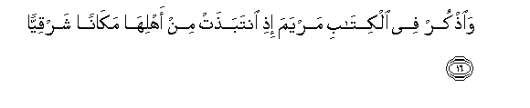

16. Wa**o**<u>th</u>kur fee alkit<u>a</u>bi maryama i<u>th</u>i
intaba<u>th</u>at min ahlih<u>a</u> mak<u>a</u>nan sharqiyy<u>a</u>**n**

16\. Relate in the Book  
(The story of) Mary,  
When she withdrew  
From her family  
To a place in the East.

------------------------------------------------------------------------

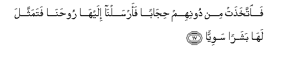

17. Fa**i**ttakha<u>th</u>at min doonihim <u>h</u>ij<u>a</u>ban
faarsaln<u>a</u> ilayh<u>a</u> roo<u>h</u>an<u>a</u> fatamaththala
lah<u>a</u> basharan sawiyy<u>a</u>**n**

17\. She placed a screen  
(To screen herself) from them;  
Then We sent to her  
Our angel, and he appeared  
Before her as a man  
In all respects.

------------------------------------------------------------------------

18. Q<u>a</u>lat innee aAAoo<u>th</u>u bi**al**rra<u>h</u>m<u>a</u>ni
minka in kunta taqiyy<u>a</u>**n**

18\. She said: "I seek refuge  
From thee to (God)  
Most Gracious: (come not near)  
If thou dost fear God."

------------------------------------------------------------------------

19. Q<u>a</u>la innam<u>a</u> an<u>a</u> rasoolu rabbiki li-ahaba laki
ghul<u>a</u>man zakiyy<u>a</u>**n**

19\. He said: "Nay, I am only  
A messenger from thy Lord,  
(To announce) to thee  
The gift of a holy son."

------------------------------------------------------------------------

20. Q<u>a</u>lat ann<u>a</u> yakoonu lee ghul<u>a</u>mun walam yamsasnee
basharun walam aku baghiyy<u>a</u>**n**

20\. She said: "How shall I  
Have a son, seeing that  
No man has touched me,  
And I am not unchaste?"

------------------------------------------------------------------------

21. Q<u>a</u>la ka<u>tha</u>liki q<u>a</u>la rabbuki huwa AAalayya
hayyinun walinajAAalahu <u>a</u>yatan li**l**nn<u>a</u>si
wara<u>h</u>matan minn<u>a</u> wak<u>a</u>na amran
maq<u>d</u>iyy<u>a</u>**n**

21\. He said: "So (it will be):  
Thy Lord saith, "That is  
Easy for Me: and (We  
Wish) to appoint him  
As a Sign unto men  
And a Mercy from Us":  
It is a matter  
(So) decreed."

------------------------------------------------------------------------

22. Fa<u>h</u>amalat-hu fa**i**ntaba<u>th</u>at bihi mak<u>a</u>nan
qa<u>s</u>iyy<u>a</u>**n**

22\. So she conceived him,  
And she retired with him  
To a remote place.

------------------------------------------------------------------------

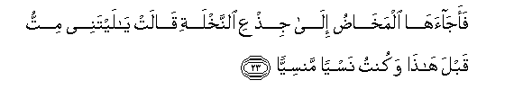

23. Faaj<u>a</u>ah<u>a</u> almakh<u>ad</u>u il<u>a</u> ji<u>th</u>AAi
a**l**nnakhlati q<u>a</u>lat y<u>a</u> laytanee mittu qabla h<u>atha</u>
wakuntu nasyan mansiyy<u>a</u>**n**

23\. And the pains of childbirth  
Drove her to the trunk  
Of a palm-tree:  
She cried (in her anguish):  
"Ah! would that I had  
Died before this! would that  
I had been a thing  
Forgotten and out of sight!"

------------------------------------------------------------------------

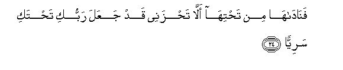

24. Fan<u>a</u>d<u>a</u>h<u>a</u> min ta<u>h</u>tih<u>a</u> all<u>a</u>
ta<u>h</u>zanee qad jaAAala rabbuki ta<u>h</u>taki sariyy<u>a</u>**n**

24\. But (a voice) cried to her  
From beneath the (palm-tree):  
"Grieve not! for thy Lord  
Hath provided a rivulet  
Beneath thee;

------------------------------------------------------------------------

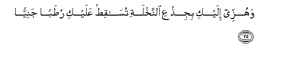

25. Wahuzzee ilayki biji<u>th</u>AAi a**l**nnakhlati
tus<u>a</u>qi<u>t</u> AAalayki ru<u>t</u>aban janiyy<u>a</u>**n**

25\. "And shake towards thyself  
The trunk of the palm-tree:  
It will let fall  
Fresh ripe dates upon thee

------------------------------------------------------------------------

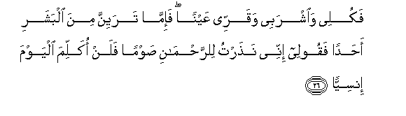

26. Fakulee wa**i**shrabee waqarree AAaynan fa-imm<u>a</u> tarayinna
mina albashari a<u>h</u>adan faqoolee innee na<u>th</u>artu
li**l**rra<u>h</u>m<u>a</u>ni <u>s</u>awman falan okallima alyawma
insiyy<u>a</u>**n**

26\. "So eat and drink  
And cool (thine) eye.  
And if thou dost see  
Any man, say, 'I have  
Vowed a fast to (God)  
Most Gracious, and this day  
Will I enter into no talk  
With any human being'"

------------------------------------------------------------------------

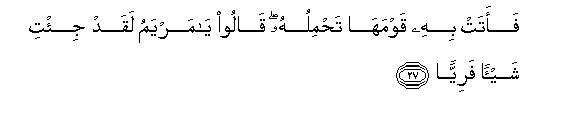

27. Faatat bihi qawmah<u>a</u> ta<u>h</u>miluhu q<u>a</u>loo y<u>a</u>
maryamu laqad ji/ti shay-an fariyy<u>a</u>**n**

27\. At length she brought  
The (babe) to her people,  
Carrying him (in her arms).  
They said: "O Mary!  
Truly an amazing thing  
Hast thou brought!

------------------------------------------------------------------------

28. Y<u>a</u> okhta h<u>a</u>roona m<u>a</u> k<u>a</u>na abooki imraa
saw-in wam<u>a</u> k<u>a</u>nat ommuki baghiyy<u>a</u>**n**

28\. "O sister of Aaron!  
Thy father was not  
A man of evil, nor thy  
Mother a woman unchaste!"

------------------------------------------------------------------------

29. Faash<u>a</u>rat ilayhi q<u>a</u>loo kayfa nukallimu man k<u>a</u>na
fee almahdi <u>s</u>abiyy<u>a</u>**n**

29\. But she pointed to the babe.  
They said: "How can we  
Talk to one who is  
A child in the cradle?"

------------------------------------------------------------------------

30. Q<u>a</u>la innee AAabdu All<u>a</u>hi <u>a</u>t<u>a</u>niya
alkit<u>a</u>ba wajaAAalanee nabiyy<u>a</u>**n**

30\. He said: "I am indeed  
A servant of God:  
He hath given me  
Revelation and made me  
A prophet;

------------------------------------------------------------------------

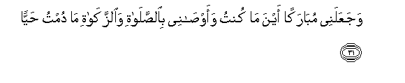

31. WajaAAalanee mub<u>a</u>rakan aynam<u>a</u> kuntu waaw<u>sa</u>nee
bi**al**<u>ss</u>al<u>a</u>ti wa**al**zzak<u>a</u>ti m<u>a</u> dumtu
<u>h</u>ayy<u>a</u>**n**

31\. "And He hath made me  
Blessed wheresoever I be,  
And hath enjoined on me  
Prayer and Charity as long  
As I live;

------------------------------------------------------------------------

32. Wabarran biw<u>a</u>lidatee walam yajAAalnee jabb<u>a</u>ran
shaqiyy<u>a</u>**n**

32\. "(He) hath made me kind  
To my mother, and not  
Overbearing or miserable;

------------------------------------------------------------------------

33. Wa**al**ssal<u>a</u>mu AAalayya yawma wulidtu wayawma amootu wayawma
obAAathu <u>h</u>ayy<u>a</u>**n**

33\. "So Peace is on me  
The day I was born,  
The day that I die,  
And the day that I  
Shall be raised up  
To life (again)"!

------------------------------------------------------------------------

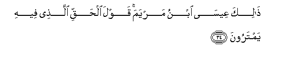

34. <u>Tha</u>lika AAees<u>a</u> ibnu maryama qawla al<u>h</u>aqqi
alla<u>th</u>ee feehi yamtaroon**a**

34\. Such (was) Jesus the son  
Of Mary: (it is) a statement  
Of truth, about which  
They (vainly) dispute.

------------------------------------------------------------------------

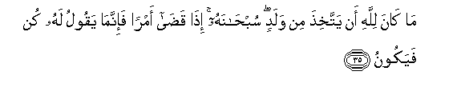

35. M<u>a</u> k<u>a</u>na lill<u>a</u>hi an yattakhi<u>th</u>a min
waladin sub<u>ha</u>nahu i<u>tha</u> qa<u>da</u> amran fa-innam<u>a</u>
yaqoolu lahu kun fayakoon**u**

35\. It is not befitting  
To (the majesty of) God  
That He should beget  
A son. Glory be to Him!  
When He determines  
A matter, He only says  
To it, "Be", and it is.

------------------------------------------------------------------------

36. Wa-inna All<u>a</u>ha rabbee warabbukum fa**o**AAbudoohu
h<u>atha</u> <u>s</u>ir<u>at</u>un mustaqeem**un**

36\. Verily God is my Lord  
And your Lord: Him  
Therefore serve ye: this is  
A Way that is straight.

------------------------------------------------------------------------

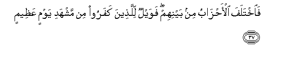

37. Fa**i**khtalafa al-a<u>h</u>z<u>a</u>bu min baynihim fawaylun
lilla<u>th</u>eena kafaroo min mashhadi yawmin AAa*<u>th</u>*eem**in**

37\. But the sects differ  
Among themselves: and woe  
To the Unbelievers because  
Of the (coming) Judgment  
Of a momentous Day!

------------------------------------------------------------------------

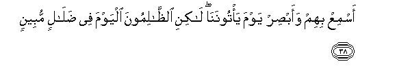

38. AsmiAA bihim waab<u>s</u>ir yawma ya/toonan<u>a</u> l<u>a</u>kini
a**l***<u>thth</u>*<u>a</u>limoona alyawma fee <u>d</u>al<u>a</u>lin
mubeen**in**

38\. How plainly will they see  
And hear, the Day that  
They will appear before Us!  
But the unjust to-day  
Are in error manifest!

------------------------------------------------------------------------

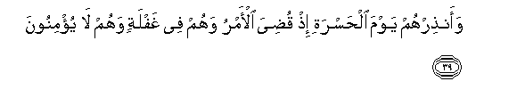

39. Waan<u>th</u>irhum yawma al<u>h</u>asrati i<u>th</u> qu<u>d</u>iya
al-amru wahum fee ghaflatin wahum l<u>a</u> yu/minoon**a**

39\. But warn them of the Day  
Of Distress, when  
The matter will be determined:  
For (behold,) they are negligent  
And they do not believe!

------------------------------------------------------------------------

40. Inn<u>a</u> na<u>h</u>nu narithu al-ar<u>d</u>a waman
AAalayh<u>a</u> wa-ilayn<u>a</u> yurjaAAoon**a**

40\. It is We Who will inherit  
The earth, and all beings  
Thereon: to Us will they  
All be returned.

------------------------------------------------------------------------

[Next: Section 3 (41-50)](01903.md)

