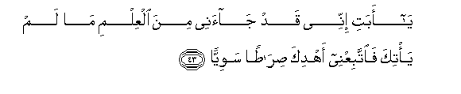
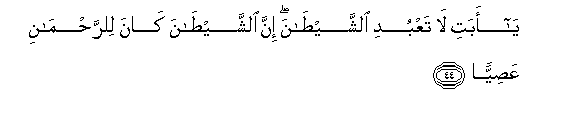
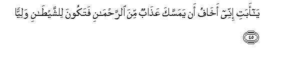
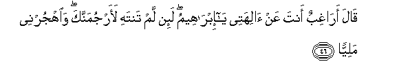
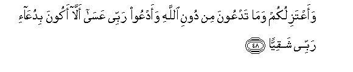
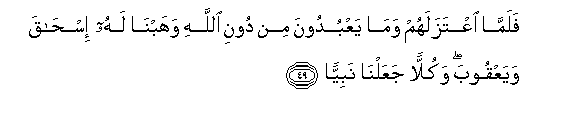

  
[Intangible Textual Heritage](../../index)  [Islam](../index.md) 
[Index](index.md)   
[Hypertext Qur'an](../htq/index)  [Unicode](../uq/019.htm#019_041.md) 
[Palmer](../sbe09/019)  [Pickthall](../pick/019.htm#019_041.md)  [Yusuf Ali
English](../yaq/yaq019)  [Rodwell](../qr/019.md)   
  
[Sūra XIX.: Maryam, or Mary. Index](019.md)  
  [Previous](01902)  [Next](01904.md) 

------------------------------------------------------------------------

  
*The Holy Quran*, tr. by Yusuf Ali, \[1934\], at Intangible Textual
Heritage

------------------------------------------------------------------------

# Sūra XIX.: Maryam, or Mary.

### Section 3

------------------------------------------------------------------------

41. Wa**o**<u>th</u>kur fee alkit<u>a</u>bi ibr<u>a</u>heema innahu
k<u>a</u>na <u>s</u>iddeeqan nabiyy<u>a</u>**n**

41\. (Also) mention in the Book  
(The story of) Abraham:  
He was a man of Truth,  
A prophet.

------------------------------------------------------------------------

42. I<u>th</u> q<u>a</u>la li-abeehi y<u>a</u> abati lima taAAbudu
m<u>a</u> l<u>a</u> yasmaAAu wal<u>a</u> yub<u>s</u>iru wal<u>a</u>
yughnee AAanka shay-<u>a</u>**n**

42\. Behold, he said to his father:  
"O my father! why  
Worship that which heareth not  
And seeth not, and can  
Profit thee nothing?

------------------------------------------------------------------------

43. Y<u>a</u> abati innee qad j<u>a</u>anee mina alAAilmi m<u>a</u> lam
ya/tika fa**i**ttabiAAnee ahdika <u>s</u>ir<u>at</u>an
sawiyy<u>a</u>**n**

43\. "O my father! to me  
Hath come knowledge which  
Hath not reached thee:  
So follow me: I will guide  
Thee to a Way that  
Is even and straight.

------------------------------------------------------------------------

44. Y<u>a</u> abati l<u>a</u> taAAbudi a**l**shshay<u>ta</u>na inna
a**l**shshay<u>ta</u>na k<u>a</u>na li**l**rra<u>h</u>m<u>a</u>ni
AAa<u>s</u>iyy<u>a</u>**n**

44\. "O my father! serve not  
Satan: for Satan is  
A rebel against (God)  
Most Gracious

------------------------------------------------------------------------

45. Y<u>a</u> abati innee akh<u>a</u>fu an yamassaka AAa<u>tha</u>bun
mina a**l**rra<u>h</u>m<u>a</u>ni fatakoona li**l**shshya<u>ta</u>ni
waliyy<u>a</u>**n**

45\. "O my father! I fear  
Lest a Penalty afflict thee  
From (God) Most Gracious,  
So that thou become  
To Satan a friend."

------------------------------------------------------------------------

46. Q<u>a</u>la ar<u>a</u>ghibun anta AAan <u>a</u>lihatee y<u>a</u>
ibr<u>a</u>heemu la-in lam tantahi laarjumannaka wa**o**hjurnee
maliyy<u>a</u>**n**

46\. (The father) replied: "Dost thou  
Hate my gods, O Abraham?  
If thou forbear not, I will  
Indeed stone thee:  
Now get away from me  
For a good long while!"

------------------------------------------------------------------------

47. Q<u>a</u>la sal<u>a</u>mun AAalayka saastaghfiru laka rabbee innahu
k<u>a</u>na bee <u>h</u>afiyy<u>a</u>**n**

47\. Abraham said: "Peace be  
On thee: I will pray  
To my Lord for thy  
forgiveness:  
For He is to me  
Most Gracious.

------------------------------------------------------------------------

48. WaaAAtazilukum wam<u>a</u> tadAAoona min dooni All<u>a</u>hi
waadAAoo rabbee AAas<u>a</u> all<u>a</u> akoona biduAA<u>a</u>-i rabbee
shaqiyy<u>a</u>**n**

48\. "And I will turn away  
From you (all) and from those  
Whom ye invoke besides God:  
I will call on my Lord:  
Perhaps, by my prayer to my Lord,  
I shall be not unblest."

------------------------------------------------------------------------

49. Falamm<u>a</u> iAAtazalahum wam<u>a</u> yaAAbudoona min dooni
All<u>a</u>hi wahabn<u>a</u> lahu is<u>ha</u>qa wayaAAqooba wakullan
jaAAaln<u>a</u> nabiyy<u>a</u>**n**

49\. When he had turned away  
From them and from those  
Whom they worshipped besides  
God, We bestowed on him  
Isaac and Jacob, and each one  
Of them We made a prophet.

------------------------------------------------------------------------

50. Wawahabn<u>a</u> lahum min ra<u>h</u>matin<u>a</u> wajaAAaln<u>a</u>
lahum lis<u>a</u>na <u>s</u>idqin AAaliyy<u>a</u>**n**

50\. And We bestowed  
Of Our Mercy on them,  
And We granted them  
Lofty honour on the tongue  
Of truth.

------------------------------------------------------------------------

[Next: Section 4 (51-65)](01904.md)

