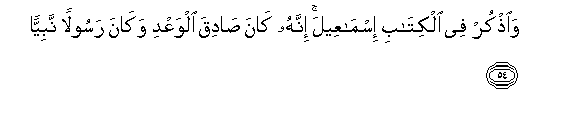
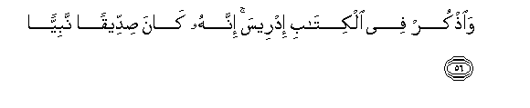
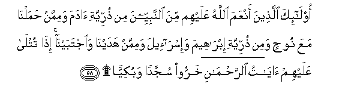
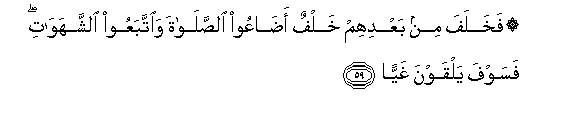
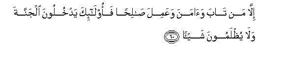
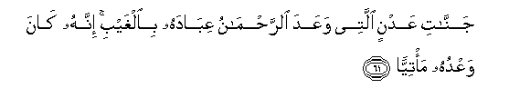
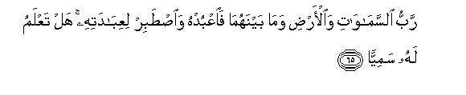

  
[Intangible Textual Heritage](../../index)  [Islam](../index) 
[Index](index)   
[Hypertext Qur'an](../htq/index)  [Unicode](../uq/019.htm#019_051) 
[Palmer](../sbe09/019)  [Pickthall](../pick/019.htm#019_051)  [Yusuf Ali
English](../yaq/yaq019)  [Rodwell](../qr/019)   
  
[Sūra XIX.: Maryam, or Mary. Index](019)  
  [Previous](01903)  [Next](01905) 

------------------------------------------------------------------------

  
*The Holy Quran*, tr. by Yusuf Ali, \[1934\], at Intangible Textual
Heritage

------------------------------------------------------------------------

# Sūra XIX.: Maryam, or Mary.

### Section 4

------------------------------------------------------------------------

51. Wa**o**<u>th</u>kur fee alkit<u>a</u>bi moos<u>a</u> innahu
k<u>a</u>na mukhla<u>s</u>an wak<u>a</u>na rasoolan nabiyy<u>a</u>**n**

51\. Also mention in the Book  
(The story of) Moses:  
For he was specially chosen,  
And he was an apostle  
(And) a prophet.

------------------------------------------------------------------------

52. Wan<u>a</u>dayn<u>a</u>hu min j<u>a</u>nibi a**l**<u>tt</u>oori
al-aymani waqarrabn<u>a</u>hu najiyy<u>a</u>**n**

52\. And We called him  
From the right side  
Of Mount (Sinai), and made  
Him draw near to Us,  
For mystic (converse).

------------------------------------------------------------------------

53. Wawahabn<u>a</u> lahu min ra<u>h</u>matin<u>a</u> akh<u>a</u>hu
h<u>a</u>roona nabiyy<u>a</u>**n**

53\. And, out of Our Mercy,  
We gave him his brother  
Aaron, (also.) a prophet.

------------------------------------------------------------------------

54. Wa**o**<u>th</u>kur fee alkit<u>a</u>bi ism<u>a</u>AAeela innahu
k<u>a</u>na <u>sa</u>diqa alwaAAdi wak<u>a</u>na rasoolan
nabiyy<u>a</u>**n**

54\. Also mention in the Book  
(The story of) Ismā‘īl  
He was (strictly) true  
To what he promised,  
And he was an apostle  
(And) a prophet.

------------------------------------------------------------------------

55. Wak<u>a</u>na ya/muru ahlahu bi**al**<u>ss</u>al<u>a</u>ti
wa**al**zzak<u>a</u>ti wak<u>a</u>na AAinda rabbihi
mar<u>d</u>iyy<u>a</u>**n**

55\. He used to enjoin  
On his people Prayer  
And Charity, and he was  
Most acceptable in the sight  
Of his Lord.

------------------------------------------------------------------------

56. Wa**o**<u>th</u>kur fee alkit<u>a</u>bi idreesa innahu k<u>a</u>na
<u>s</u>iddeeqan nabiyy<u>a</u>**n**

56\. Also mention in the Book  
The case of Idrīs  
He was a man of truth  
(And sincerity), (and) a prophet:

------------------------------------------------------------------------

57. WarafaAAn<u>a</u>hu mak<u>a</u>nan AAaliyy<u>a</u>**n**

57\. And We raised him  
To a lofty station.

------------------------------------------------------------------------

58. Ol<u>a</u>-ika alla<u>th</u>eena anAAama All<u>a</u>hu AAalayhim
mina a**l**nnabiyyeena min <u>th</u>urriyyati <u>a</u>dama wamimman
<u>h</u>amaln<u>a</u> maAAa noo<u>h</u>in wamin <u>th</u>urriyyati
ibr<u>a</u>heema wa-isr<u>a</u>-eela wamimman hadayn<u>a</u>
wa**i**jtabayn<u>a</u> i<u>tha</u> tutl<u>a</u> AAalayhim
<u>a</u>y<u>a</u>tu a**l**rra<u>h</u>m<u>a</u>ni kharroo sujjadan
wabukiyy<u>a</u>**n**

58\. Those were some  
Of the prophets on whom  
God did bestow His Grace,—  
Of the posterity of Adam,  
And of those whom We  
Carried (in the Ark)  
With Noah, and of  
The posterity of Abraham  
And Israel—of those  
Whom We guided and chose.  
Whenever the Signs  
Of (God) Most Gracious  
Were rehearsed to them,  
They would fall down  
In prostrate adoration  
And in tears.

------------------------------------------------------------------------

59. Fakhalafa min baAAdihim khalfun a<u>da</u>AAoo
a**l**<u>ss</u>al<u>a</u>ta wa**i**ttabaAAoo a**l**shshahaw<u>a</u>ti
fasawfa yalqawna ghayy<u>a</u>**n**

59\. But after them there followed  
A posterity who missed  
Prayers and followed after lusts  
Soon, then, will they  
Face Destruction,—

------------------------------------------------------------------------

60. Ill<u>a</u> man t<u>a</u>ba wa<u>a</u>mana waAAamila
<u>sa</u>li<u>h</u>an faol<u>a</u>-ika yadkhuloona aljannata wal<u>a</u>
yu*<u>th</u>*lamoona shay-<u>a</u>**n**

60\. Except those who repent  
And believe, and work  
Righteousness: for these  
Will enter the Garden  
And will not be wronged  
In the least,—

------------------------------------------------------------------------

61. Jann<u>a</u>ti AAadnin allatee waAAada a**l**rra<u>h</u>m<u>a</u>nu
AAib<u>a</u>dahu bi**al**ghaybi innahu k<u>a</u>na waAAduhu
ma/tiyy<u>a</u>**n**

61\. Gardens of Eternity, those  
Which (God) Most Gracious  
Has promised to His servants  
In the Unseen: for His promise  
Must (necessarily) come to pass.

------------------------------------------------------------------------

62. L<u>a</u> yasmaAAoona feeh<u>a</u> laghwan ill<u>a</u>
sal<u>a</u>man walahum rizquhum feeh<u>a</u> bukratan
waAAashiyy<u>a</u>**n**

62\. They will not there hear  
Any vain discourse, but  
Only salutations of Peace:  
And they will have therein  
Their sustenance, morning  
And evening.

------------------------------------------------------------------------

63. Tilka aljannatu allatee noorithu min AAib<u>a</u>din<u>a</u> man
k<u>a</u>na taqiyy<u>a</u>**n**

63\. Such is the Garden which  
We give as an inheritance  
To those of Our servants  
Who guard against evil.

------------------------------------------------------------------------

64. Wam<u>a</u> natanazzalu ill<u>a</u> bi-amri rabbika lahu m<u>a</u>
bayna aydeen<u>a</u> wam<u>a</u> khalfan<u>a</u> wam<u>a</u> bayna
<u>tha</u>lika wam<u>a</u> k<u>a</u>na rabbuka nasiyy<u>a</u>**n**

64\. (The angels say:)  
"We descend not but  
By command of thy Lord:  
To Him belongeth what is  
Before us and what is  
Behind us, and what is  
Between: and thy Lord  
Never doth forget,—

------------------------------------------------------------------------

65. Rabbu a**l**ssam<u>a</u>w<u>a</u>ti wa**a**l-ar<u>d</u>i wam<u>a</u>
baynahum<u>a</u> fa**o**AAbudhu wa**i**<u>st</u>abir
liAAib<u>a</u>datihi hal taAAlamu lahu samiyy<u>a</u>**n**

65\. "Lord of the heavens  
And of the earth,  
And of all that is  
Between them: so worship Him,  
And be constant and patient  
In His worship: knowest thou  
Of any who is worthy  
Of the same Name as He?"

------------------------------------------------------------------------

[Next: Section 5 (66-82)](01905)

