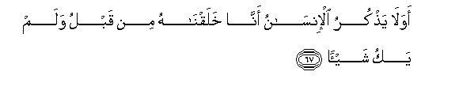
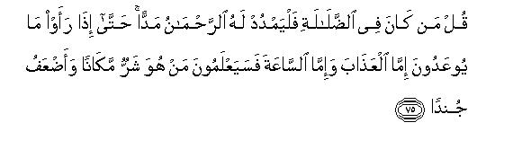
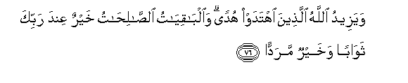

  
[Intangible Textual Heritage](../../index)  [Islam](../index.md) 
[Index](index.md)   
[Hypertext Qur'an](../htq/index)  [Unicode](../uq/019.htm#019_066.md) 
[Palmer](../sbe09/019)  [Pickthall](../pick/019.htm#019_066.md)  [Yusuf Ali
English](../yaq/yaq019)  [Rodwell](../qr/019.md)   
  
[Sūra XIX.: Maryam, or Mary. Index](019.md)  
  [Previous](01904)  [Next](01906.md) 

------------------------------------------------------------------------

  
*The Holy Quran*, tr. by Yusuf Ali, \[1934\], at Intangible Textual
Heritage

------------------------------------------------------------------------

# Sūra XIX.: Maryam, or Mary.

### Section 5

------------------------------------------------------------------------

66. Wayaqoolu al-ins<u>a</u>nu a-i<u>tha</u> m<u>a</u> mittu lasawfa
okhraju <u>h</u>ayy<u>a</u>**n**

66\. Man says: "What!  
When I am dead, shall I  
Then be raised up alive?"

------------------------------------------------------------------------

67. Awa l<u>a</u> ya<u>th</u>kuru al-ins<u>a</u>nu ann<u>a</u>
khalaqn<u>a</u>hu min qablu walam yaku shay-<u>a</u>**n**

67\. But does not man  
Call to mind that We  
Created him before  
Out of nothing?

------------------------------------------------------------------------

68. Fawarabbika lana<u>h</u>shurannahum wa**al**shshay<u>at</u>eena
thumma lanu<u>hd</u>irannahum <u>h</u>awla jahannama
jithiyy<u>a</u>**n**

68\. So, by thy Lord,  
Without doubt, We shall gather  
Them together, and (also)  
The Evil Ones (with them);  
Then shall We bring them  
Forth on their knees  
Round about Hell;

------------------------------------------------------------------------

69. Thumma lananziAAanna min kulli sheeAAatin ayyuhum ashaddu
AAal<u>a</u> a**l**rra<u>h</u>m<u>a</u>ni AAitiyy<u>a</u>**n**

69\. Then shall We certainly  
Drag out from every sect  
All those who were worst  
In obstinate rebellion  
Against (God) Most Gracious.

------------------------------------------------------------------------

70. Thumma lana<u>h</u>nu aAAlamu bi**a**lla<u>th</u>eena hum
awl<u>a</u> bih<u>a</u> <u>s</u>iliyy<u>a</u>**n**

70\. And certainly We know best  
Those who are most worthy  
Of being burned therein.

------------------------------------------------------------------------

71. Wa-in minkum ill<u>a</u> w<u>a</u>riduh<u>a</u> k<u>a</u>na
AAal<u>a</u> rabbika <u>h</u>atman maq<u>d</u>iyy<u>a</u>**n**

71\. Not one of you but will  
Pass over it: this is,  
With thy Lord, a Decree  
Which must be accomplished.

------------------------------------------------------------------------

72. Thumma nunajjee alla<u>th</u>eena ittaqaw wana<u>th</u>aru
a**l***<u>thth</u>*<u>a</u>limeena feeh<u>a</u> jithiyy<u>a</u>**n**

72\. But We shall save those  
Who guarded against evil,  
And We shall leave  
The wrong-doers therein,  
(Humbled) to their knees.

------------------------------------------------------------------------

73. Wa-i<u>tha</u> tutl<u>a</u> AAalayhim <u>a</u>y<u>a</u>tun<u>a</u>
bayyin<u>a</u>tin q<u>a</u>la alla<u>th</u>eena kafaroo
lilla<u>th</u>eena <u>a</u>manoo ayyu alfareeqayni khayrun
maq<u>a</u>man waa<u>h</u>sanu nadiyy<u>a</u>**n**

73\. When Our Clear Signs  
Are rehearsed to them,  
The Unbelievers say to those  
Who believe, "Which of the two  
Sides is best in point of  
Position? which makes the best  
Show in Council?"

------------------------------------------------------------------------

74. Wakam ahlakn<u>a</u> qablahum min qarnin hum a<u>h</u>sanu
ath<u>a</u>than wari/y<u>a</u>**n**

74\. But how many (countless)  
Generations before them  
Have We destroyed,  
Who were even better  
In equipment and in glitter  
To the eye?

------------------------------------------------------------------------

75. Qul man k<u>a</u>na fee a**l**<u>dd</u>al<u>a</u>lati falyamdud lahu
a**l**rra<u>h</u>m<u>a</u>nu maddan <u>h</u>att<u>a</u> i<u>tha</u> raaw
m<u>a</u> yooAAadoona imm<u>a</u> alAAa<u>tha</u>ba wa-imm<u>a</u>
a**l**ss<u>a</u>AAata fasayaAAlamoona man huwa sharrun mak<u>a</u>nan
waa<u>d</u>AAafu jund<u>a</u>**n**

75\. Say: "If any men go  
Astray, (God) Most Gracious  
Extends (the rope) to them,  
Until, when they see  
The warning of God (being  
Fulfilled)—either in punishment  
Or in (the approach of)  
The Hour,—they will  
At length realise who is  
Worst in position, and (who)  
Weakest in forces!

------------------------------------------------------------------------

76. Wayazeedu All<u>a</u>hu alla<u>th</u>eena ihtadaw hudan
wa**a**lb<u>a</u>qiy<u>a</u>tu a**l**<u>ssa</u>li<u>ha</u>tu khayrun
AAinda rabbika thaw<u>a</u>ban wakhayrun maradd<u>a</u>**n**

76\. "And God doth advance  
In guidance those who seek  
Guidance: and the things  
That endure, Good Deeds,  
Are best in the sight  
Of thy Lord, as rewards,  
And best in respect of  
(Their) eventual returns."

------------------------------------------------------------------------

77. Afaraayta alla<u>th</u>ee kafara bi-<u>a</u>y<u>a</u>tin<u>a</u>
waq<u>a</u>la laootayanna m<u>a</u>lan wawalad<u>a</u>**n**

77\. Hast thou then seen  
The (sort of) man who  
Rejects Our Signs, yet  
Says: "I shall certainly  
Be given wealth and children?"

------------------------------------------------------------------------

78. A<u>tt</u>alaAAa alghayba ami ittakha<u>th</u>a AAinda
a**l**rra<u>h</u>m<u>a</u>ni AAahd<u>a</u>**n**

78\. Has he penetrated to  
The Unseen, or has he  
Taken a contract with  
(God) Most Gracious?

------------------------------------------------------------------------

79. Kall<u>a</u> sanaktubu m<u>a</u> yaqoolu wanamuddu lahu mina
alAAa<u>tha</u>bi madd<u>a</u>**n**

79\. Nay! We shall record  
What he says, and We  
Shall add and add  
To his punishment.

------------------------------------------------------------------------

80. Wanarithuhu m<u>a</u> yaqoolu waya/teen<u>a</u> fard<u>a</u>**n**

80\. To Us shall return  
All that he talks of,  
And he shall appear  
Before Us bare and alone.

------------------------------------------------------------------------

81. Wa**i**ttakha<u>th</u>oo min dooni All<u>a</u>hi <u>a</u>lihatan
liyakoonoo lahum AAizz<u>a</u>**n**

81\. And they have taken  
(For worship) gods other than  
God, to give them  
Power and glory!

------------------------------------------------------------------------

82. Kall<u>a</u> sayakfuroona biAAib<u>a</u>datihim wayakoonoona
AAalayhim <u>d</u>idd<u>a</u>**n**

82\. Instead, they shall reject  
Their worship, and become  
Adversaries against them.

------------------------------------------------------------------------

[Next: Section 6 (83-98)](01906.md)

