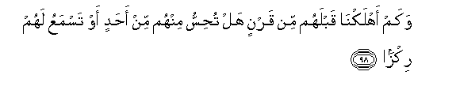

  
[Intangible Textual Heritage](../../index)  [Islam](../index.md) 
[Index](index.md)   
[Hypertext Qur'an](../htq/index)  [Unicode](../uq/019.htm#019_083.md) 
[Palmer](../sbe09/019)  [Pickthall](../pick/019.htm#019_083.md)  [Yusuf Ali
English](../yaq/yaq019)  [Rodwell](../qr/019.md)   
  
[Sūra XIX.: Maryam, or Mary. Index](019.md)  
  [Previous](01905)  [Next](02001.md) 

------------------------------------------------------------------------

  
*The Holy Quran*, tr. by Yusuf Ali, \[1934\], at Intangible Textual
Heritage

------------------------------------------------------------------------

# Sūra XIX.: Maryam, or Mary.

### Section 6

------------------------------------------------------------------------

83. Alam tara ann<u>a</u> arsaln<u>a</u> a**l**shshay<u>at</u>eena
AAal<u>a</u> alk<u>a</u>fireena taozzuhum azz<u>a</u>**n**

83\. Seest thou not that We  
Have set the Evil Ones on  
Against the Unbelievers,  
To incite them with fury?

------------------------------------------------------------------------

84. Fal<u>a</u> taAAjal AAalayhim innam<u>a</u> naAAuddu lahum
AAadd<u>a</u>**n**

84\. So make no haste  
Against them, for We  
But count out to them  
A (limited) number (of days).

------------------------------------------------------------------------

85. Yawma na<u>h</u>shuru almuttaqeena il<u>a</u>
a**l**rra<u>h</u>m<u>a</u>ni wafd<u>a</u>**n**

85\. The day We shall gather  
The righteous to (God)  
Most Gracious, like a hand  
Presented before a king for honours,

------------------------------------------------------------------------

86. Wanasooqu almujrimeena il<u>a</u> jahannama wird<u>a</u>**n**

86\. And We shall drive  
The sinners to hell,  
Like thirsty cattle  
Driven down to water,—

------------------------------------------------------------------------

87. L<u>a</u> yamlikoona a**l**shshaf<u>a</u>AAata ill<u>a</u> mani
ittakha<u>th</u>a AAinda a**l**rra<u>h</u>m<u>a</u>ni AAahd<u>a</u>**n**

87\. None shall have the power  
Of intercession, but such a one  
As has received permission (or promise)  
From (God) Most Gracious.

------------------------------------------------------------------------

88. Waq<u>a</u>loo ittakha<u>th</u>a a**l**rra<u>h</u>m<u>a</u>nu
walad<u>a</u>**n**

88\. They say: "(God) Most Gracious  
Has begotten a son!"

------------------------------------------------------------------------

89. Laqad ji/tum shay-an idd<u>a</u>**n**

89\. Indeed ye have put forth  
A thing most monstrous!

------------------------------------------------------------------------

90. Tak<u>a</u>du a**l**ssam<u>a</u>w<u>a</u>tu yatafa<u>tt</u>arna
minhu watanshaqqu al-ar<u>d</u>u watakhirru aljib<u>a</u>lu
hadd<u>a</u>**n**

90\. At it the skies are ready  
To burst, the earth  
To split asunder, and  
The mountains to fall down  
In utter ruin,

------------------------------------------------------------------------

91. An daAAaw li**l**rra<u>h</u>m<u>a</u>ni walad<u>a</u>**n**

91\. That they should invoke  
A son for (God) Most Gracious.

------------------------------------------------------------------------

92. Wam<u>a</u> yanbaghee li**l**rra<u>h</u>m<u>a</u>ni an
yattakhi<u>th</u>a walad<u>a</u>**n**

92\. For it is not consonant  
With the majesty of (God)  
Most Gracious that He  
Should beget a son.

------------------------------------------------------------------------

93. In kullu man fee a**l**ssam<u>a</u>w<u>a</u>ti wa**a**l-ar<u>d</u>i
ill<u>a</u> <u>a</u>tee a**l**rra<u>h</u>m<u>a</u>ni AAabd<u>a</u>**n**

93\. Not one of the beings  
In the heavens and the earth  
But must come to (God)  
Most Gracious as a servant.

------------------------------------------------------------------------

94. Laqad a<u>hsa</u>hum waAAaddahum AAadd<u>a</u>**n**

94\. He does take an account  
Of them (all), and hath  
Numbered them (all) exactly.

------------------------------------------------------------------------

95. Wakulluhum <u>a</u>teehi yawma alqiy<u>a</u>mati fard<u>a</u>**n**

95\. And everyone of them  
Will come to Him singly  
On the Day of Judgment.

------------------------------------------------------------------------

96. Inna alla<u>th</u>eena <u>a</u>manoo waAAamiloo
a**l**<u>ssa</u>li<u>ha</u>ti sayajAAalu lahumu
a**l**rra<u>h</u>m<u>a</u>nu wudd<u>a</u>**n**

96\. On those who believe  
And work deeds of righteousness,  
Will (God) Most Gracious  
Bestow Love.

------------------------------------------------------------------------

97. Fa-innam<u>a</u> yassarn<u>a</u>hu bilis<u>a</u>nika litubashshira
bihi almuttaqeena watun<u>th</u>ira bihi qawman ludd<u>a</u>**n**

97\. So have We made  
The (Qur-ān) easy  
In thine own tongue,  
That with it thou mayest give  
Glad tidings to the righteous,  
And warnings to people  
Given to contention.

------------------------------------------------------------------------

98. Wakam ahlakn<u>a</u> qablahum min qarnin hal tu<u>h</u>issu minhum
min a<u>h</u>adin aw tasmaAAu lahum rikz<u>a</u>**n**

98\. But how many (countless)  
Generations before them  
Have We destroyed? Canst thou  
Find a single one of them  
(Now) or hear. (so much  
As) a whisper of them?

------------------------------------------------------------------------

[Next: Section 1 (1-24)](02001.md)

