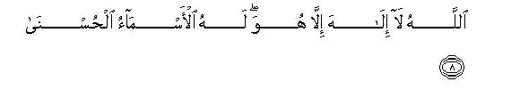
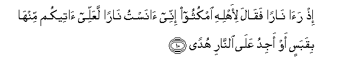
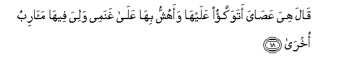

  
[Intangible Textual Heritage](../../index)  [Islam](../index.md) 
[Index](index.md)   
[Hypertext Qur'an](../htq/index)  [Unicode](../uq/020.htm#020_001.md) 
[Palmer](../sbe09/020)  [Pickthall](../pick/020.htm#020_001.md)  [Yusuf Ali
English](../yaq/yaq020)  [Rodwell](../qr/020.md)   
  
[Sūra XX.: Ṭā-Hā. (Mystic Letters, Ṭ. H.) Index](020.md)  
  [Previous](01906)  [Next](02002.md) 

------------------------------------------------------------------------

  
*The Holy Quran*, tr. by Yusuf Ali, \[1934\], at Intangible Textual
Heritage

------------------------------------------------------------------------

# Sūra XX.: Ṭā-Hā. (Mystic Letters, Ṭ. H.)

### Section 1

1. <u>Ta</u>-h<u>a</u>

1\. Tā-Hā.

------------------------------------------------------------------------

2. M<u>a</u> anzaln<u>a</u> AAalayka alqur-<u>a</u>na litashq<u>a</u>

2\. We have not sent down  
The Qur-ān to thee to be  
(An occasion) for thy distress,

------------------------------------------------------------------------

3. Ill<u>a</u> ta<u>th</u>kiratan liman yakhsh<u>a</u>

3\. But only as an admonition  
To those who fear (God),—

------------------------------------------------------------------------

4. Tanzeelan mimman khalaqa al-ar<u>d</u>a
wa**al**ssam<u>a</u>w<u>a</u>ti alAAul<u>a</u>

4\. A revelation from Him  
Who created the earth  
And the heavens on high.

------------------------------------------------------------------------

5. A**l**rra<u>h</u>m<u>a</u>nu AAal<u>a</u> alAAarshi istaw<u>a</u>

5\. (God) Most Gracious  
Is firmly established  
On the throne (of authority).

------------------------------------------------------------------------

6. Lahu m<u>a</u> fee a**l**ssam<u>a</u>w<u>a</u>ti wam<u>a</u> fee
al-ar<u>d</u>i wam<u>a</u> baynahum<u>a</u> wam<u>a</u> ta<u>h</u>ta
a**l**ththar<u>a</u>

6\. To Him belongs what is  
In the heavens and on earth,  
And all between them,  
And all beneath the soil.

------------------------------------------------------------------------

7. Wa-in tajhar bi**a**lqawli fa-innahu yaAAlamu a**l**ssirra
waakhf<u>a</u>

7\. If thou pronounce the word  
Aloud, (it is no matter):  
For verily He knoweth  
What is secret and what  
Is yet more hidden.

------------------------------------------------------------------------

8. All<u>a</u>hu l<u>a</u> il<u>a</u>ha ill<u>a</u> huwa lahu
al-asm<u>a</u>o al<u>h</u>usn<u>a</u>

8\. God! there is no god  
But He! To Him belong  
The Most Beautiful Names.

------------------------------------------------------------------------

9. Wahal at<u>a</u>ka <u>h</u>adeethu moos<u>a</u>

9\. Has the story of Moses  
Reached thee?

------------------------------------------------------------------------

10. I<u>th</u> ra<u>a</u> n<u>a</u>ran faq<u>a</u>la li-ahlihi omkuthoo
innee <u>a</u>nastu n<u>a</u>ran laAAallee <u>a</u>teekum minh<u>a</u>
biqabasin aw ajidu AAal<u>a</u> a**l**nn<u>a</u>ri hud<u>a</u>**n**

10\. Behold, he saw a fire:  
So he said to his family,  
"Tarry ye; I perceive  
A fire; perhaps I can  
Bring you some burning brand  
Therefrom, or find some guidance  
At the fire."

------------------------------------------------------------------------

11. Falamm<u>a</u> at<u>a</u>h<u>a</u> noodiya y<u>a</u> moos<u>a</u>

11\. But when he came  
To the fire, a voice  
Was heard: "O Moses!

------------------------------------------------------------------------

12. Innee an<u>a</u> rabbuka fa**i**khlaAA naAAlayka innaka
bi**a**lw<u>a</u>di almuqaddasi <u>t</u>uw<u>a</u>**n**

12\. "Verily I am thy Lord!  
Therefore (in My presence)  
Put off thy shoes: thou art  
In the sacred valley Ṭuwā

------------------------------------------------------------------------

13. Waan<u>a</u> ikhtartuka fa**i**stamiAA lim<u>a</u> yoo<u>ha</u>

13\. "I have chosen thee:  
Listen, then, to the inspiration  
(Sent to thee).

------------------------------------------------------------------------

14. Innanee an<u>a</u> All<u>a</u>hu l<u>a</u> il<u>a</u>ha ill<u>a</u>
an<u>a</u> fa**o**AAbudnee waaqimi a**l**<u>ss</u>al<u>a</u>ta
li<u>th</u>ikree

14\. "Verily, I am God:  
There is no god but I:  
So serve thou Me (only),  
And establish regular prayer  
For celebrating My praise.

------------------------------------------------------------------------

15. Inna a**l**ss<u>a</u>AAata <u>a</u>tiyatun ak<u>a</u>du
okhfeeh<u>a</u> litujz<u>a</u> kullu nafsin bim<u>a</u> tasAA<u>a</u>

15\. "Verily the Hour is coming—  
My design is to keep it  
Hidden—for every soul  
To receive its reward  
By the measure of  
Its Endeavour.

------------------------------------------------------------------------

16. Fal<u>a</u> ya<u>s</u>uddannaka AAanh<u>a</u> man l<u>a</u> yu/minu
bih<u>a</u> wa**i**ttabaAAa haw<u>a</u>hu fatard<u>a</u>

16\. "Therefore let not such as  
Believe not therein  
But follow their own  
Lusts, divert thee therefrom,  
Lest thou perish!"…

------------------------------------------------------------------------

17. Wam<u>a</u> tilka biyameenika y<u>a</u> moos<u>a</u>

17\. "And what is that  
In thy right hand,  
O Moses?"

------------------------------------------------------------------------

18. Q<u>a</u>la hiya AAa<u>sa</u>ya atawakkao AAalayh<u>a</u> waahushshu
bih<u>a</u> AAal<u>a</u> ghanamee waliya feeh<u>a</u> ma<u>a</u>ribu
okhr<u>a</u>

18\. He said, "It is  
My rod: on it  
I lean; with it  
I beat down fodder  
For my flocks; and  
In it I find  
Other uses."

------------------------------------------------------------------------

19. Q<u>a</u>la alqih<u>a</u> y<u>a</u> moos<u>a</u>

19\. (God) said, "Throw it,  
O Moses!"

------------------------------------------------------------------------

20. Faalq<u>a</u>h<u>a</u> fa-i<u>tha</u> hiya <u>h</u>ayyatun
tasAA<u>a</u>

20\. He threw it, and behold!  
It was a snake,  
Active in motion.

------------------------------------------------------------------------

21. Q<u>a</u>la khu<u>th</u>h<u>a</u> wal<u>a</u> takhaf
sanuAAeeduh<u>a</u> seeratah<u>a</u> al-ool<u>a</u>

21\. (God) said, "Seize it,  
And fear not: We  
Shall return it at once  
To its former condition"…

------------------------------------------------------------------------

22. Wa**o**<u>d</u>mum yadaka il<u>a</u> jan<u>ah</u>ika takhruj
bay<u>da</u>a min ghayri soo-in <u>a</u>yatan okhr<u>a</u>

22\. "Now draw thy hand  
Close to thy side:  
It shall come forth white  
(And shining), without harm  
(Or stain),—as another Sign,—

------------------------------------------------------------------------

23. Linuriyaka min <u>a</u>y<u>a</u>tin<u>a</u> alkubr<u>a</u>

23\. "In order that We  
May show thee  
(Two) of our Greater Signs.

------------------------------------------------------------------------

24. I<u>th</u>hab il<u>a</u> firAAawna innahu <u>t</u>agh<u>a</u>

24\. "Go thou to Pharaoh,  
For he has indeed  
Transgressed all bounds."

------------------------------------------------------------------------

[Next: Section 2 (25-54)](02002.md)

