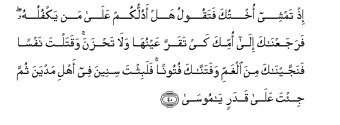

  
[Intangible Textual Heritage](../../index)  [Islam](../index) 
[Index](index)   
[Hypertext Qur'an](../htq/index)  [Unicode](../uq/020.htm#020_025) 
[Palmer](../sbe09/020)  [Pickthall](../pick/020.htm#020_025)  [Yusuf Ali
English](../yaq/yaq020)  [Rodwell](../qr/020)   
  
[Sūra XX.: Ṭā-Hā. (Mystic Letters, Ṭ. H.) Index](020)  
  [Previous](02001)  [Next](02003) 

------------------------------------------------------------------------

  
*The Holy Quran*, tr. by Yusuf Ali, \[1934\], at Intangible Textual
Heritage

------------------------------------------------------------------------

# Sūra XX.: Ṭā-Hā. (Mystic Letters, Ṭ. H.)

### Section 2

------------------------------------------------------------------------

25. Q<u>a</u>la rabbi ishra<u>h</u> lee <u>s</u>adree

25\. (Moses) said: "O my Lord!  
Expand me my breast;

------------------------------------------------------------------------

26. Wayassir lee amree

26\. "Ease my task for me;

------------------------------------------------------------------------

27. Wa**o**<u>h</u>lul AAuqdatan min lis<u>a</u>nee

27\. "And remove the impediment  
From my speech,

------------------------------------------------------------------------

28. Yafqahoo qawlee

28\. "So they may understand  
What I say:

------------------------------------------------------------------------

29. Wa**i**jAAal lee wazeeran min ahlee

29\. "And give me a Minister  
From my family,

------------------------------------------------------------------------

30. H<u>a</u>roona akhee

30\. "Aaron, my brother;

------------------------------------------------------------------------

31. Oshdud bihi azree

31\. "Add to my strength  
Through him,

------------------------------------------------------------------------

32. Waashrik-hu fee amree

32\. "And make him share  
My task:

------------------------------------------------------------------------

33. Kay nusabbi<u>h</u>aka katheer<u>a</u>**n**

33\. "That we may celebrate  
Thy praise without stint,

------------------------------------------------------------------------

34. Wana<u>th</u>kuraka katheer<u>a</u>**n**

34\. "And remember Thee  
Without stint:

------------------------------------------------------------------------

35. Innaka kunta bin<u>a</u> ba<u>s</u>eer<u>a</u>**n**

35\. "For Thou art He  
That (ever) regardeth us."

------------------------------------------------------------------------

36. Q<u>a</u>la qad ooteeta su/laka y<u>a</u> moos<u>a</u>

36\. (God) said: "Granted  
Is thy prayer, O Moses!"

------------------------------------------------------------------------

37. Walaqad manann<u>a</u> AAalayka marratan okhr<u>a</u>

37\. "And indeed We conferred  
A favour on thee  
Another time (before).

------------------------------------------------------------------------

38. I<u>th</u> aw<u>h</u>ayn<u>a</u> il<u>a</u> ommika m<u>a</u>
yoo<u>ha</u>

38\. "Behold! We sent  
To thy mother, by inspiration,  
The message:

------------------------------------------------------------------------

39. Ani iq<u>th</u>ifeehi fee a**l**tt<u>a</u>booti
fa**i**q<u>th</u>ifeehi fee alyammi falyulqihi alyammu
bi**al**ss<u>ah</u>ili ya/khu<u>th</u>hu AAaduwwun lee waAAaduwwun lahu
waalqaytu AAalayka ma<u>h</u>abbatan minnee walitu<u>s</u>naAAa
AAal<u>a</u> AAaynee

39\. "Throw (the child)  
Into the chest, and throw  
(The chest) into the river:  
The river will cast him  
Up on the bank, and he  
Will be taken up by one  
Who is an enemy to Me  
And an enemy to him  
But I cast (the garment  
Of) love over thee from Me  
And (this) in order that  
Thou mayest be reared  
Under Mine eye.

------------------------------------------------------------------------

40. I<u>th</u> tamshee okhtuka fataqoolu hal adullukum AAal<u>a</u> man
yakfuluhu farajaAAn<u>a</u>ka il<u>a</u> ommika kay taqarra
AAaynuh<u>a</u> wal<u>a</u> ta<u>h</u>zana waqatalta nafsan
fanajjayn<u>a</u>ka mina alghammi wafatann<u>a</u>ka futoonan falabithta
sineena fee ahli madyana thumma ji/ta AAal<u>a</u> qadarin y<u>a</u>
moos<u>a</u>

40\. "Behold! thy sister goeth forth  
And saith, "Shall I show you  
One who will nurse  
And rear the (child)?  
So We brought thee back  
To thy mother, that her eye  
Might be cooled and she  
Should not grieve.  
Then thou didst slay  
A man, but We saved thee  
From trouble, and We tried  
Thee in various ways.  
Then didst thou tarry  
A number of years  
With the people of Midian.  
Then didst thou come hither  
As ordained, O Moses!

------------------------------------------------------------------------

41. Wa**i**<u>st</u>anaAAtuka linafsee

41\. "And I have prepared thee  
For Myself (for service)"…

------------------------------------------------------------------------

42. I<u>th</u>hab anta waakhooka bi-<u>a</u>y<u>a</u>tee wal<u>a</u>
taniy<u>a</u> fee <u>th</u>ikree

42\. "Go, thou and thy brother,  
With My Signs,  
And slacken not,  
Either of you, in keeping  
Me in remembrance.

------------------------------------------------------------------------

43. I<u>th</u>hab<u>a</u> il<u>a</u> firAAawna innahu
<u>t</u>agh<u>a</u>

43\. "Go, both of you, to Pharaoh,  
For he has indeed  
Transgressed all bounds;

------------------------------------------------------------------------

44. Faqool<u>a</u> lahu qawlan layyinan laAAallahu yata<u>th</u>akkaru
aw yakhsh<u>a</u>

44\. "But speak to him mildly;  
Perchance he may take  
Warning or fear (God)."

------------------------------------------------------------------------

45. Q<u>a</u>l<u>a</u> rabban<u>a</u> innan<u>a</u> nakh<u>a</u>fu an
yafru<u>t</u>a AAalayn<u>a</u> aw an ya<u>t</u>gh<u>a</u>

45\. They (Moses and Aaron) said:  
"Our Lord! We fear lest  
He hasten with insolence  
Against us, or lest he  
Transgress all bounds."

------------------------------------------------------------------------

46. Q<u>a</u>la l<u>a</u> takh<u>a</u>f<u>a</u> innanee maAAakum<u>a</u>
asmaAAu waar<u>a</u>

46\. He said: "Fear not:  
For I am with you:  
I hear and see (everything).

------------------------------------------------------------------------

47. Fa/tiy<u>a</u>hu faqool<u>a</u> inn<u>a</u> rasool<u>a</u> rabbika
faarsil maAAan<u>a</u> banee isr<u>a</u>-eela wal<u>a</u>
tuAAa<u>thth</u>ibhum qad ji/n<u>a</u>ka bi-<u>a</u>yatin min rabbika
wa**al**ssal<u>a</u>mu AAal<u>a</u> mani ittabaAAa alhud<u>a</u>

47\. "So go ye both to him,  
And say, "Verily we are  
Apostles sent by thy Lord:  
Send forth, therefore, the Children  
Of Israel with us, and  
Afflict them not:  
With a Sign, indeed,  
Have we come from thy Lord!  
And Peace to all  
Who follow guidance!

------------------------------------------------------------------------

48. Inn<u>a</u> qad oo<u>h</u>iya ilayn<u>a</u> anna alAAa<u>tha</u>ba
AAal<u>a</u> man ka<u>thth</u>aba watawall<u>a</u>

48\. "Verily it has been revealed  
To us that the Penalty  
(Awaits) those who reject  
And turn away."

------------------------------------------------------------------------

49. Q<u>a</u>la faman rabbukum<u>a</u> y<u>a</u> moos<u>a</u>

49\. (When this message was delivered),  
(Pharaoh) said: "Who, then,  
O Moses, is the Lord  
Of you two?"

------------------------------------------------------------------------

50. Q<u>a</u>la rabbun<u>a</u> alla<u>th</u>ee aAA<u>ta</u> kulla
shay-in khalqahu thumma had<u>a</u>

50\. He said: "Our Lord is  
He Who gave to each  
(Created) thing its form  
And nature, and further,  
Gave (it) guidance."

------------------------------------------------------------------------

51. Q<u>a</u>la fam<u>a</u> b<u>a</u>lu alqurooni al-ool<u>a</u>

51\. (Pharaoh) said: "What then  
Is the condition  
Of previous generations?"

------------------------------------------------------------------------

52. Q<u>a</u>la AAilmuh<u>a</u> AAinda rabbee fee kit<u>a</u>bin
l<u>a</u> ya<u>d</u>illu rabbee wal<u>a</u> yans<u>a</u>

52\. He replied: "The knowledge  
Of that is with my Lord,  
Duly recorded: my Lord  
Never errs, nor forgets,—

------------------------------------------------------------------------

53. Alla<u>th</u>ee jaAAala lakumu al-ar<u>d</u>a mahdan wasalaka lakum
feeh<u>a</u> subulan waanzala mina a**l**ssam<u>a</u>-i m<u>a</u>an
faakhrajn<u>a</u> bihi azw<u>a</u>jan min nab<u>a</u>tin shatt<u>a</u>

53\. "He Who has made for you  
The earth like a carpet  
Spread out; has enabled you  
To go about therein by roads  
(And channels); and has sent  
Down water from the sky."  
With it have We produced  
Divers pairs of plants  
Each separate front the others.

------------------------------------------------------------------------

54. Kuloo wa**i**rAAaw anAA<u>a</u>makum inna fee <u>tha</u>lika
la<u>a</u>y<u>a</u>tin li-olee a**l**nnuh<u>a</u>

54\. Eat (for yourselves) and pasture  
Your cattle: verily, in this  
Are Signs for men  
Endued with understanding.

------------------------------------------------------------------------

[Next: Section 3 (55-76)](02003)

