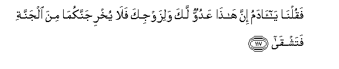
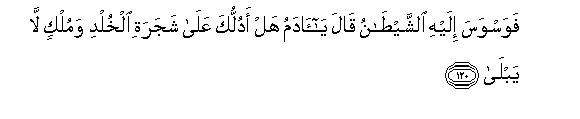
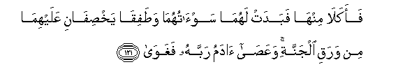
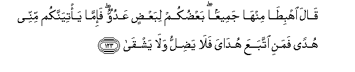
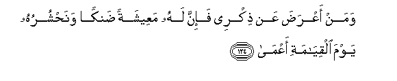
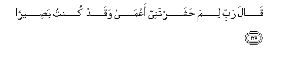
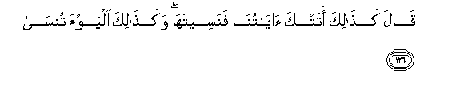
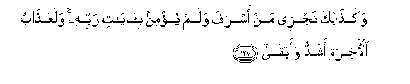
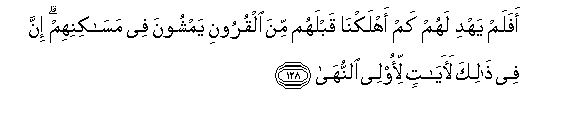

  
[Intangible Textual Heritage](../../index)  [Islam](../index) 
[Index](index)   
[Hypertext Qur'an](../htq/index)  [Unicode](../uq/020.htm#020_116) 
[Palmer](../sbe09/020)  [Pickthall](../pick/020.htm#020_116)  [Yusuf Ali
English](../yaq/yaq020)  [Rodwell](../qr/020)   
  
[Sūra XX.: Ṭā-Hā. (Mystic Letters, Ṭ. H.) Index](020)  
  [Previous](02006)  [Next](02008) 

------------------------------------------------------------------------

  
*The Holy Quran*, tr. by Yusuf Ali, \[1934\], at Intangible Textual
Heritage

------------------------------------------------------------------------

# Sūra XX.: Ṭā-Hā. (Mystic Letters, Ṭ. H.)

### Section 7

------------------------------------------------------------------------

116. Wa-i<u>th</u> quln<u>a</u> lilmal<u>a</u>-ikati osjudoo
li-<u>a</u>dama fasajadoo ill<u>a</u> ibleesa ab<u>a</u>

116\. When We said to the angels,  
"Prostrate yourselves to Adam",  
They prostrated themselves, but not  
Iblīs: he refused.

------------------------------------------------------------------------

117. Faquln<u>a</u> y<u>a</u> <u>a</u>damu inna h<u>atha</u> AAaduwwun
laka walizawjika fal<u>a</u> yukhrijannakum<u>a</u> mina aljannati
fatashq<u>a</u>

117\. Then We said: "O Adam!  
Verily, this is an enemy  
To thee and thy wife:  
So let him not get you  
Both out of the Garden,  
So that thou art landed  
In misery.''

------------------------------------------------------------------------

118. Inna laka all<u>a</u> tajooAAa feeh<u>a</u> wal<u>a</u>
taAAr<u>a</u>

118\. "There is therein (enough provision)  
For thee not to go hungry  
Nor to go naked,

------------------------------------------------------------------------

119. Waannaka l<u>a</u> ta*<u>th</u>*mao feeh<u>a</u> wal<u>a</u>
ta<u>dha</u>

119\. "Nor to suffer from thirst,  
Nor from the sun's heat."

------------------------------------------------------------------------

120. Fawaswasa ilayhi a**l**shshay<u>ta</u>nu q<u>a</u>la y<u>a</u>
<u>a</u>damu hal adulluka AAal<u>a</u> shajarati alkhuldi wamulkin
l<u>a</u> yabl<u>a</u>

120\. But Satan whispered evil  
To him: he said, "O Adam!  
Shall I lead thee to  
The Tree of Eternity  
And to a kingdom  
That never decays?"

------------------------------------------------------------------------

121. Faakal<u>a</u> minh<u>a</u> fabadat lahum<u>a</u>
saw-<u>a</u>tuhum<u>a</u> wa<u>t</u>afiq<u>a</u>
yakh<u>s</u>if<u>a</u>ni AAalayhim<u>a</u> min waraqi aljannati
waAAa<u>sa</u> <u>a</u>damu rabbahu faghaw<u>a</u>

121\. In the result, they both  
Ate of the tree, and so  
Their nakedness appeared  
To them: they began to sew  
Together, for their covering,  
Leaves from the Garden:  
Thus did Adam disobey  
His Lord, and allow himself  
To be seduced.

------------------------------------------------------------------------

122. Thumma ijtab<u>a</u>hu rabbuhu fat<u>a</u>ba AAalayhi wahad<u>a</u>

122\. But his Lord chose him  
(For His Grace): He turned  
To him, and gave him guidance.

------------------------------------------------------------------------

123. Q<u>a</u>la ihbi<u>ta</u> minh<u>a</u> jameeAAan baAA<u>d</u>ukum
libaAA<u>d</u>in AAaduwwun fa-imm<u>a</u> ya/tiyannakum minnee hudan
famani ittabaAAa hud<u>a</u>ya fal<u>a</u> ya<u>d</u>illu wal<u>a</u>
yashq<u>a</u>

123\. He said: "Get ye down,  
Both of you,—all together,  
From the Garden, with enmity  
One to another: but if,  
As is sure, there comes to you  
Guidance from Me, whosoever  
Follows My guidance, will not  
Lose his way, nor fall  
Into misery.

------------------------------------------------------------------------

124. Waman aAAra<u>d</u>a AAan <u>th</u>ikree fa-inna lahu maAAeeshatan
<u>d</u>ank<u>a</u>**n** wana<u>h</u>shuruhu yawma alqiy<u>a</u>mati
aAAm<u>a</u>**n**

124\. "But whosoever turns away  
From My Message, verily  
For him is a life narrowed  
Down, and We shall raise  
Him up blind on the Day  
Of Judgment."

------------------------------------------------------------------------

125. Q<u>a</u>la rabbi lima <u>h</u>ashartanee aAAm<u>a</u> waqad kuntu
ba<u>s</u>eer<u>a</u>**n**

125\. He will say: "O my Lord!  
Why hast thou raised me  
Up blind, while I had  
Sight (before)?"

------------------------------------------------------------------------

126. Q<u>a</u>la ka<u>tha</u>lika atatka <u>a</u>y<u>a</u>tun<u>a</u>
fanaseetah<u>a</u> waka<u>tha</u>lika alyawma tuns<u>a</u>

126\. (God) will say: "Thus  
Didst thou, when Our Signs  
Came unto thee, disregard  
Them: so wilt thou,  
This day, be disregarded."

------------------------------------------------------------------------

127. Waka<u>tha</u>lika najzee man asrafa walam yu/min
bi-<u>a</u>y<u>a</u>ti rabbihi walaAAa<u>tha</u>bu al-<u>a</u>khirati
ashaddu waabq<u>a</u>

127\. And thus do We recompense  
Him who transgresses beyond bounds  
And believes not in the Signs  
Of his Lord: and the Penalty  
Of the Hereafter is far more  
Grievous and more enduring.

------------------------------------------------------------------------

128. Afalam yahdi lahum kam ahlakn<u>a</u> qablahum mina alqurooni
yamshoona fee mas<u>a</u>kinihim inna fee <u>tha</u>lika
la<u>a</u>y<u>a</u>tin li-olee a**l**nnuh<u>a</u>

128\. Is it not a warning to such  
Men (to call to mind)  
How many generations before them  
We destroyed, in whose haunts  
They (now) move? Verily,  
In this are Signs for men  
Endued with understanding.

------------------------------------------------------------------------

[Next: Section 8 (129-135)](02008)

