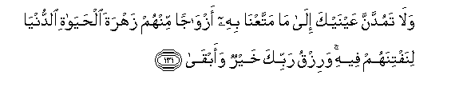
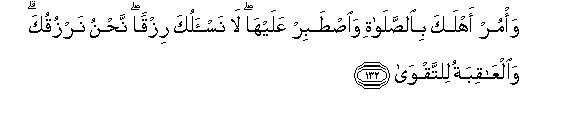

  
[Intangible Textual Heritage](../../index)  [Islam](../index.md) 
[Index](index.md)   
[Hypertext Qur'an](../htq/index)  [Unicode](../uq/020.htm#020_129.md) 
[Palmer](../sbe09/020)  [Pickthall](../pick/020.htm#020_129.md)  [Yusuf Ali
English](../yaq/yaq020)  [Rodwell](../qr/020.md)   
  
[Sūra XX.: Ṭā-Hā. (Mystic Letters, Ṭ. H.) Index](020.md)  
  [Previous](02007)  [Next](02101.md) 

------------------------------------------------------------------------

  
*The Holy Quran*, tr. by Yusuf Ali, \[1934\], at Intangible Textual
Heritage

------------------------------------------------------------------------

# Sūra XX.: Ṭā-Hā. (Mystic Letters, Ṭ. H.)

### Section 8

------------------------------------------------------------------------

129. Walawl<u>a</u> kalimatun sabaqat min rabbika lak<u>a</u>na
liz<u>a</u>man waajalun musamm<u>a</u>**n**

129\. Had it not been  
For a Word that went forth  
Before from thy Lord,  
(Their punishment) must necessarily  
Have come; but there is  
A term appointed (for respite).

------------------------------------------------------------------------

130. Fa**i**<u>s</u>bir AAal<u>a</u> m<u>a</u> yaqooloona
wasabbi<u>h</u> bi<u>h</u>amdi rabbika qabla <u>t</u>ulooAAi
a**l**shshamsi waqabla ghuroobih<u>a</u> wamin <u>a</u>n<u>a</u>-i
allayli fasabbi<u>h</u> waa<u>t</u>r<u>a</u>fa a**l**nnah<u>a</u>ri
laAAallaka tar<u>da</u>

130\. Therefore be patient with what  
They say, and celebrate (constantly)  
The praises of thy Lord,  
Before the rising of the sun,  
And before its setting;  
Yea, celebrate them  
For part of the hours  
Of the night, and at the sides  
Of the day: that thou  
Mayest have (spiritual) joy.

------------------------------------------------------------------------

131. Wal<u>a</u> tamuddanna AAaynayka il<u>a</u> m<u>a</u>
mattaAAn<u>a</u> bihi azw<u>a</u>jan minhum zahrata
al<u>h</u>ay<u>a</u>ti a**l**dduny<u>a</u> linaftinahum feehi warizqu
rabbika khayrun waabq<u>a</u>

131\. Nor strain thine eyes in longing  
For the things We have given  
For enjoyment to parties ,  
Of them, the splendour  
Of the life of this world,  
Through which We test them:  
But the provision of thy Lord  
Is better and more enduring.

------------------------------------------------------------------------

132. Wa/mur ahlaka bi**al**<u>ss</u>al<u>a</u>ti wa**i**<u>st</u>abir
AAalayh<u>a</u> l<u>a</u> nas-aluka rizqan na<u>h</u>nu narzuquka
wa**a**lAA<u>a</u>qibatu li**l**ttaqw<u>a</u>

132\. Enjoin prayer on thy people,  
And be constant therein.  
We ask thee not to provide  
Sustenance: We provide it  
For thee. But the (fruit of)  
The Hereafter is for Righteousness.

------------------------------------------------------------------------

133. Waq<u>a</u>loo lawl<u>a</u> ya/teen<u>a</u> bi-<u>a</u>yatin min
rabbihi awa lam ta/tihim bayyinatu m<u>a</u> fee
a**l**<u>ss</u>u<u>h</u>ufi al-ool<u>a</u>

133\. ''They say: "Why does he not  
Bring us a Sign from  
His Lord?" Has not  
A Clear Sign come to them  
Of all that was  
In the former Books  
Of revelation?

------------------------------------------------------------------------

134. Walaw ann<u>a</u> ahlakn<u>a</u>hum biAAa<u>tha</u>bin min qablihi
laq<u>a</u>loo rabban<u>a</u> lawl<u>a</u> arsalta ilayn<u>a</u>
rasoolan fanattabiAAa <u>a</u>y<u>a</u>tika min qabli an na<u>th</u>illa
wanakhz<u>a</u>

134\. And if We had inflicted  
On them a penalty before this,  
They would have said:  
"Our Lord! If only Thou  
Hadst sent us an apostle,  
We should certainly have followed  
Thy Signs before we were  
Humbled and put to shame."

------------------------------------------------------------------------

135. Qul kullun mutarabbi<u>s</u>un fatarabba<u>s</u>oo fasataAAlamoona
man a<u>s</u>-<u>ha</u>bu a**l**<u>ss</u>ir<u>at</u>i a**l**ssawiyyi
wamani ihtad<u>a</u>

135\. Say: "Each one (of us)  
Is waiting: wait ye, therefore,  
And soon shall ye know  
Who it is that is  
On the straight and even  
Way, and who it is  
That has received guidance."

------------------------------------------------------------------------

[Next: Section 1 (1-10)](02101.md)

