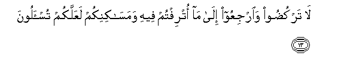
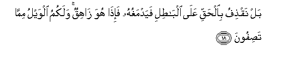
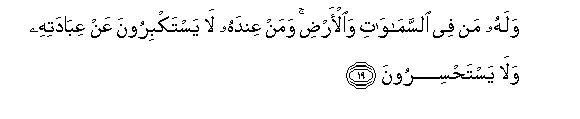
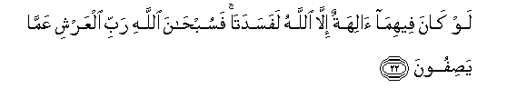
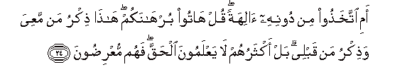
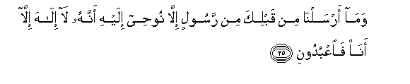
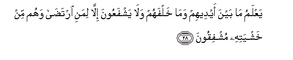
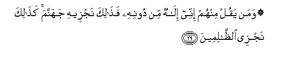

  
[Intangible Textual Heritage](../../index)  [Islam](../index.md) 
[Index](index.md)   
[Hypertext Qur'an](../htq/index)  [Unicode](../uq/021.htm#021_011.md) 
[Palmer](../sbe09/021)  [Pickthall](../pick/021.htm#021_011.md)  [Yusuf Ali
English](../yaq/yaq021)  [Rodwell](../qr/021.md)   
  
[Sūra XXI.: Anbiyāa, or The Prophets Index](021.md)  
  [Previous](02101)  [Next](02103.md) 

------------------------------------------------------------------------

  
*The Holy Quran*, tr. by Yusuf Ali, \[1934\], at Intangible Textual
Heritage

------------------------------------------------------------------------

# Sūra XXI.: Anbiyāa, or The Prophets

### Section 2

------------------------------------------------------------------------

11. Wakam qa<u>s</u>amn<u>a</u> min qaryatin k<u>a</u>nat
*<u>th</u>*<u>a</u>limatan waansha/n<u>a</u> baAAdah<u>a</u> qawman
<u>a</u>khareen**a**

11\. How many were the populations  
We utterly destroyed because  
Of their iniquities, setting up  
In their places other peoples?

------------------------------------------------------------------------

12. Falamm<u>a</u> a<u>h</u>assoo ba/san<u>a</u> i<u>tha</u> hum
minh<u>a</u> yarku<u>d</u>oon**a**

12\. Yet, when they felt  
Our Punishment (coming),  
Behold, they (tried to) flee  
From it.

------------------------------------------------------------------------

13. L<u>a</u> tarku<u>d</u>oo wa**i**rjiAAoo il<u>a</u> m<u>a</u>
otriftum feehi wamas<u>a</u>kinikum laAAallakum tus-aloon**a**

13\. Flee not, but return to  
The good things of this life  
Which were given you,  
And to your homes,  
In order that ye may  
Be called to account

------------------------------------------------------------------------

14. Q<u>a</u>loo y<u>a</u> waylan<u>a</u> inn<u>a</u> kunn<u>a</u>
*<u>th</u>*<u>a</u>limeen**a**

14\. They said: "Ah! woe to us!  
We were indeed wrong-doers!"

------------------------------------------------------------------------

15. Fam<u>a</u> z<u>a</u>lat tilka daAAw<u>a</u>hum <u>h</u>att<u>a</u>
jaAAaln<u>a</u>hum <u>h</u>a<u>s</u>eedan kh<u>a</u>mideen**a**

15\. And that cry of theirs  
Ceased not, till we made  
Them as a field  
That is mown, as ashes  
Silent and quenched.

------------------------------------------------------------------------

16. Wam<u>a</u> khalaqn<u>a</u> a**l**ssam<u>a</u>a wa**a**l-ar<u>d</u>a
wam<u>a</u> baynahum<u>a</u> l<u>a</u>AAibeen**a**

16\. Not for (idle) sport did We  
Create the heavens and the earth  
And all that is between!

------------------------------------------------------------------------

17. Law aradn<u>a</u> an nattakhi<u>th</u>a lahwan
la**i**ttakha<u>th</u>n<u>a</u>hu min ladunn<u>a</u> in kunn<u>a</u>
f<u>a</u>AAileen**a**

17\. If it had been Our wish  
To take (just) a pastime,  
We should surely have taken  
It from the things nearest  
To Us, if We would  
Do (such a thing)!

------------------------------------------------------------------------

18. Bal naq<u>th</u>ifu bi**a**l<u>h</u>aqqi AAal<u>a</u>
alb<u>at</u>ili fayadmaghuhu fa-i<u>tha</u> huwa z<u>a</u>hiqun walakumu
alwaylu mimm<u>a</u> ta<u>s</u>ifoon**a**

18\. Nay, We hurl the Truth  
Against falsehood, and it knocks  
Out its brain, and behold,  
Falsehood doth perish!  
Ah! woe be to you  
For the (false) things  
Ye ascribe (to Us).

------------------------------------------------------------------------

19. Walahu man fee a**l**ssam<u>a</u>w<u>a</u>ti wa**a**l-ar<u>d</u>i
waman AAindahu l<u>a</u> yastakbiroona AAan AAib<u>a</u>datihi
wal<u>a</u> yasta<u>h</u>siroon**a**

19\. To Him belong all (creatures)  
In the heavens and on earth:  
Even those who are in His  
(Very) Presence are not  
Too proud to serve Him,  
Nor are they (ever) weary  
(Of His service):

------------------------------------------------------------------------

20. Yusabbi<u>h</u>oona allayla wa**al**nnah<u>a</u>ra l<u>a</u>
yafturoon**a**

20\. They celebrate His praises  
Night and day, nor do they  
Ever flag or intermit.

------------------------------------------------------------------------

21. Ami ittakha<u>th</u>oo <u>a</u>lihatan mina al-ar<u>d</u>i hum
yunshiroon**a**

21\. Or have they taken  
(For worship) gods from the earth  
Who can raise (the dead)?

------------------------------------------------------------------------

22. Law k<u>a</u>na feehim<u>a</u> <u>a</u>lihatun ill<u>a</u>
All<u>a</u>hu lafasadat<u>a</u> fasub<u>ha</u>na All<u>a</u>hi rabbi
alAAarshi AAamm<u>a</u> ya<u>s</u>ifoon**a**

22\. If there were, in the heavens  
And the earth, other gods  
Besides God, there would  
Have been confusion in both!  
But glory to God,  
The Lord of the Throne:  
(High is He) above  
What they attribute to Him!

------------------------------------------------------------------------

23. L<u>a</u> yus-alu AAamm<u>a</u> yafAAalu wahum yus-aloon**a**

23\. He cannot be questioned  
For His acts, but they  
Will be questioned (for theirs).

------------------------------------------------------------------------

24. Ami ittakha<u>th</u>oo min doonihi <u>a</u>lihatan qul h<u>a</u>too
burh<u>a</u>nakum h<u>atha</u> <u>th</u>ikru man maAAiya wa<u>th</u>ikru
man qablee bal aktharuhum l<u>a</u> yaAAlamoona al<u>h</u>aqqa fahum
muAAri<u>d</u>oon**a**

24\. Or have they taken  
For worship (other) gods  
Besides him? Say, "Bring  
Your convincing proof: this  
Is the Message of those  
With me and the Message  
Of those before me."  
But most of them know not  
The Truth, and so turn away.

------------------------------------------------------------------------

25. Wam<u>a</u> arsaln<u>a</u> min qablika min rasoolin ill<u>a</u>
noo<u>h</u>ee ilayhi annahu l<u>a</u> il<u>a</u>ha ill<u>a</u>
an<u>a</u> fa**o**AAbudoon**i**

25\. Not an apostle did We  
Send before thee without  
This inspiration sent by Us  
To him: that there is  
No god but I; therefore  
Worship and serve Me.

------------------------------------------------------------------------

26. Waq<u>a</u>loo ittakha<u>th</u>a a**l**rra<u>h</u>m<u>a</u>nu
waladan sub<u>ha</u>nahu bal AAib<u>a</u>dun mukramoon**a**

26\. And they say: "(God)  
Most Gracious has begotten  
Offspring." Glory to Him!  
They are (but) servants raised  
To honour.

------------------------------------------------------------------------

27. L<u>a</u> yasbiqoonahu bi**a**lqawli wahum bi-amrihi yaAAmaloon**a**

27\. They speak not before  
He speaks, and they act  
(In all things) by His command.

------------------------------------------------------------------------

28. YaAAlamu m<u>a</u> bayna aydeehim wam<u>a</u> khalfahum wal<u>a</u>
yashfaAAoona ill<u>a</u> limani irta<u>da</u> wahum min khashyatihi
mushfiqoon**a**

28\. He knows what is before them,  
And what is behind them,  
And they offer no intercession  
Except for those who are  
Acceptable, and they stand  
In awe and reverence  
Of His (glory).

------------------------------------------------------------------------

29. Waman yaqul minhum innee il<u>a</u>hun min doonihi fa<u>tha</u>lika
najzeehi jahannama ka<u>tha</u>lika najzee
a**l***<u>thth</u>*<u>a</u>limeen**a**

29\. If any of them should say,  
"I am a god besides Him",  
Such a one We should  
Reward with Hell: thus  
Do We reward those  
Who do wrong.

------------------------------------------------------------------------

[Next: Section 3 (30-41)](02103.md)

