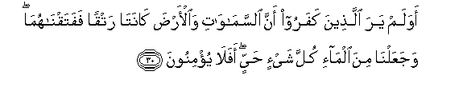
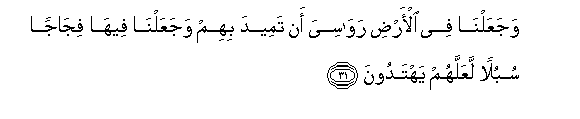
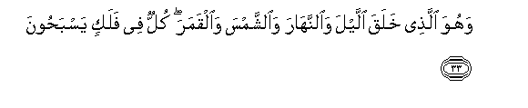
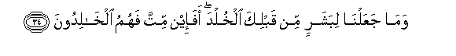
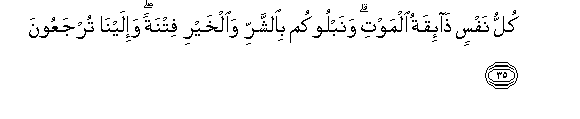
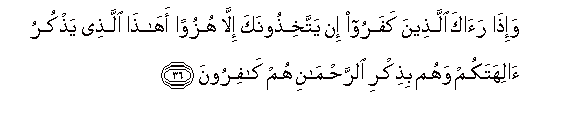
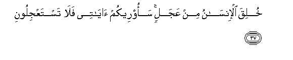
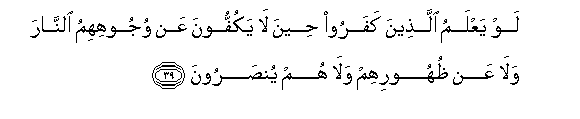
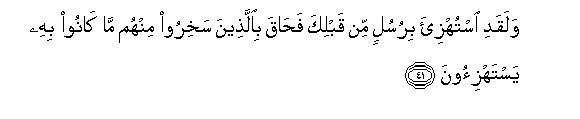

  
[Intangible Textual Heritage](../../index)  [Islam](../index.md) 
[Index](index.md)   
[Hypertext Qur'an](../htq/index)  [Unicode](../uq/021.htm#021_030.md) 
[Palmer](../sbe09/021)  [Pickthall](../pick/021.htm#021_030.md)  [Yusuf Ali
English](../yaq/yaq021)  [Rodwell](../qr/021.md)   
  
[Sūra XXI.: Anbiyāa, or The Prophets Index](021.md)  
  [Previous](02102)  [Next](02104.md) 

------------------------------------------------------------------------

  
*The Holy Quran*, tr. by Yusuf Ali, \[1934\], at Intangible Textual
Heritage

------------------------------------------------------------------------

# Sūra XXI.: Anbiyāa, or The Prophets

### Section 3

------------------------------------------------------------------------

30. Awa lam yar<u>a</u> alla<u>th</u>eena kafaroo anna
a**l**ssam<u>a</u>w<u>a</u>ti wa**a**l-ar<u>d</u>a k<u>a</u>nat<u>a</u>
ratqan fafataqn<u>a</u>hum<u>a</u> wajaAAaln<u>a</u> mina alm<u>a</u>-i
kulla shay-in <u>h</u>ayyin afal<u>a</u> yu/minoon**a**

30\. Do not the Unbelievers see  
That the heavens and the earth  
Were joined together (as one  
Unit of Creation), before  
We clove them asunder?  
We made from water  
Every living thing. Will they  
Not then believe?

------------------------------------------------------------------------

31. WajaAAaln<u>a</u> fee al-ar<u>d</u>i raw<u>a</u>siya an tameeda
bihim wajaAAaln<u>a</u> feeh<u>a</u> fij<u>a</u>jan subulan laAAallahum
yahtadoon**a**

31\. And We have set on the earth  
Mountains standing firm,  
Lest it should shake with them,  
And We have made therein  
Broad highways  
(between mountains)  
For them to pass through:  
That they may receive guidance.

------------------------------------------------------------------------

32. WajaAAaln<u>a</u> a**l**ssam<u>a</u>a saqfan
ma<u>h</u>foo*<u>th</u>*an wahum AAan <u>a</u>y<u>a</u>tih<u>a</u>
muAAri<u>d</u>oon**a**

32\. And We have made  
The heavens as a canopy  
Well guarded: yet do they  
Turn away from the Signs  
Which these things (point to)!

------------------------------------------------------------------------

33. Wahuwa alla<u>th</u>ee khalaqa allayla wa**al**nnah<u>a</u>ra
wa**al**shshamsa wa**a**lqamara kullun fee falakin yasba<u>h</u>oon**a**

33\. It is He Who created  
The Night and the Day,  
And the sun and the moon:  
All (the celestial bodies)  
Swim along, each in its  
Rounded course.

------------------------------------------------------------------------

34. Wam<u>a</u> jaAAaln<u>a</u> libasharin min qablika alkhulda afa-in
mitta fahumu alkh<u>a</u>lidoon**a**

34\. We granted not to any man  
Before thee permanent life  
(Here): If then thou shouldst die,  
Would they live permanently?

------------------------------------------------------------------------

35. Kullu nafsin <u>tha</u>-iqatu almawti wanablookum bi**al**shsharri
wa**a**lkhayri fitnatan wa-ilayn<u>a</u> turjaAAoon**a**

35\. Every soul shall have  
A taste of death:  
And We test you  
By evil and by good  
By way of trial.  
To Us must ye return.

------------------------------------------------------------------------

36. Wa-i<u>tha</u> ra<u>a</u>ka alla<u>th</u>eena kafaroo in
yattakhi<u>th</u>oonaka ill<u>a</u> huzuwan ah<u>atha</u>
alla<u>th</u>ee ya<u>th</u>kuru <u>a</u>lihatakum wahum bi<u>th</u>ikri
a**l**rra<u>h</u>m<u>a</u>ni hum k<u>a</u>firoon**a**

36\. When the Unbelievers see thee,  
They treat thee not except  
With ridicule. "Is this,"  
(They say), "the one who talks  
Of your gods?" And they  
Blaspheme at the mention  
Of (God) Most Gracious!

------------------------------------------------------------------------

37. Khuliqa al-ins<u>a</u>nu min AAajalin saoreekum <u>a</u>y<u>a</u>tee
fal<u>a</u> tastaAAjiloon**a**

37\. Man is a creature of haste:  
Soon (enough) will I show  
You My Signs; then  
Ye will not ask Me  
To hasten them!

------------------------------------------------------------------------

38. Wayaqooloona mat<u>a</u> h<u>atha</u> alwaAAdu in kuntum
<u>sa</u>diqeen**a**

38\. They say: "When will this  
Promise come to pass,  
If ye are telling the truth?"

------------------------------------------------------------------------

39. Law yaAAlamu alla<u>th</u>eena kafaroo <u>h</u>eena l<u>a</u>
yakuffoona AAan wujoohihimu a**l**nn<u>a</u>ra wal<u>a</u> AAan
*<u>th</u>*uhoorihim wal<u>a</u> hum yun<u>s</u>aroon**a**

39\. If only the Unbelievers  
Knew (the time) when they  
Will not be able  
To ward off the Fire  
From their faces, nor yet  
From their backs, and (when)  
No help can reach them!

------------------------------------------------------------------------

40. Bal ta/teehim baghtatan fatabhatuhum fal<u>a</u>
yasta<u>t</u>eeAAoona raddah<u>a</u> wal<u>a</u> hum
yun*<u>th</u>*aroon**a**

40\. Nay, it may come to them  
All of a sudden and confound  
Them: no power will they  
Have then to avert it,  
Nor will they (then)  
Get respite.

------------------------------------------------------------------------

41. Walaqadi istuhzi-a birusulin min qablika fa<u>ha</u>qa
bi**a**lla<u>th</u>eena sakhiroo minhum m<u>a</u> k<u>a</u>noo bihi
yastahzi-oon**a**

41\. Mocked were (many)  
Apostles before thee;  
But their scoffers  
Were hemmed in  
By the thing that they mocked.

------------------------------------------------------------------------

[Next: Section 4 (42-50)](02104.md)

