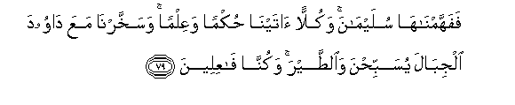
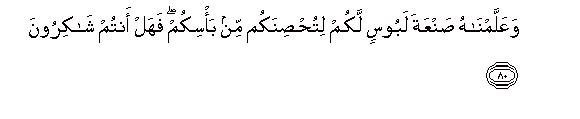
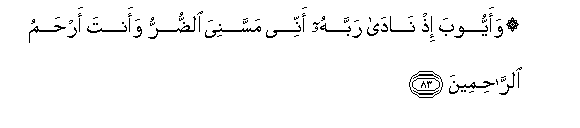
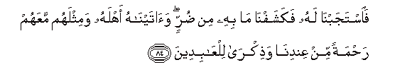
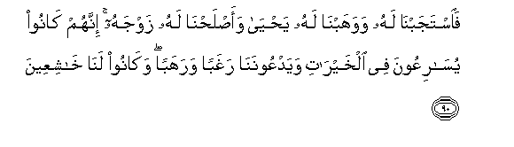

  
[Intangible Textual Heritage](../../index)  [Islam](../index.md) 
[Index](index.md)   
[Hypertext Qur'an](../htq/index)  [Unicode](../uq/021.htm#021_051.md) 
[Palmer](../sbe09/021)  [Pickthall](../pick/021.htm#021_051.md)  [Yusuf Ali
English](../yaq/yaq021)  [Rodwell](../qr/021.md)   
  
[Sūra XXI.: Anbiyāa, or The Prophets Index](021.md)  
  [Previous](02104)  [Next](02106.md) 

------------------------------------------------------------------------

  
*The Holy Quran*, tr. by Yusuf Ali, \[1934\], at Intangible Textual
Heritage

------------------------------------------------------------------------

# Sūra XXI.: Anbiyāa, or The Prophets

### Section 5

------------------------------------------------------------------------

76. Wanoo<u>h</u>an i<u>th</u> n<u>a</u>d<u>a</u> min qablu
fa**i**stajabn<u>a</u> lahu fanajjayn<u>a</u>hu waahlahu mina alkarbi
alAAa*<u>th</u>*eem**i**

76\. (Remember) Noah, when  
He cried (to Us) aforetime:  
We listened to his (prayer)  
And delivered him and his  
Family from great distress.

------------------------------------------------------------------------

77. Wana<u>s</u>arn<u>a</u>hu mina alqawmi alla<u>th</u>eena
ka<u>thth</u>aboo bi-<u>a</u>y<u>a</u>tin<u>a</u> innahum k<u>a</u>noo
qawma saw-in faaghraqn<u>a</u>hum ajmaAAeen**a**

77\. We helped him against  
People who rejected Our Signs:  
Truly they were a people  
Given to Evil: so We  
Drowned them (in the Flood)  
All together.

------------------------------------------------------------------------

78. Wad<u>a</u>wooda wasulaym<u>a</u>na i<u>th</u>
ya<u>h</u>kum<u>a</u>ni fee al<u>h</u>arthi i<u>th</u> nafashat feehi
ghanamu alqawmi wakunn<u>a</u> li<u>h</u>ukmihim sh<u>a</u>hideen**a**

78\. And remember David  
And Solomon, when they  
Gave judgment in the matter  
Of the field into which  
The sheep of certain people  
Had strayed by night:  
We did witness their judgment.

------------------------------------------------------------------------

79. Fafahhamn<u>a</u>h<u>a</u> sulaym<u>a</u>na wakullan
<u>a</u>tayn<u>a</u> <u>h</u>ukman waAAilman wasakhkharn<u>a</u> maAAa
d<u>a</u>wooda aljib<u>a</u>la yusabbi<u>h</u>na wa**al**<u>tt</u>ayra
wakunn<u>a</u> f<u>a</u>AAileen**a**

79\. To Solomon We inspired  
The (right) understanding  
Of the matter: to each  
(Of them) We gave Judgment  
And Knowledge; it was  
Our power that made  
The hills and the birds  
Celebrate Our praises,  
With David: it was We  
Who did (all these things).

------------------------------------------------------------------------

80. WaAAallamn<u>a</u>hu <u>s</u>anAAata laboosin lakum
litu<u>hs</u>inakum min ba/sikum fahal antum sh<u>a</u>kiroon**a**

80\. It was We Who taught him  
The making of coats of mail  
For your benefit, to guard  
You from each other's violence:  
Will ye then be grateful?

------------------------------------------------------------------------

81. Walisulaym<u>a</u>na a**l**rree<u>h</u>a AA<u>as</u>ifatan tajree
bi-amrihi il<u>a</u> al-ar<u>d</u>i allatee b<u>a</u>rakn<u>a</u>
feeh<u>a</u> wakunn<u>a</u> bikulli shay-in AA<u>a</u>limeen**a**

81\. (It was Our power that  
Made) the violent (unruly)  
Wind flow (tamely) for Solomon,  
To his order, to the land  
Which We had blessed:  
For We do know all things.

------------------------------------------------------------------------

82. Wamina a**l**shshay<u>at</u>eeni man yaghoo<u>s</u>oona lahu
wayaAAmaloona AAamalan doona <u>tha</u>lika wakunn<u>a</u> lahum
<u>ha</u>fi*<u>th</u>*een**a**

82\. And of the evil ones,  
Were some who dived  
For him, and did other work  
Besides; and it was We  
Who guarded them.

------------------------------------------------------------------------

83. Waayyooba i<u>th</u> n<u>a</u>d<u>a</u> rabbahu annee massaniya
a**l**<u>dd</u>urru waanta ar<u>h</u>amu a**l**rr<u>ah</u>imeen**a**

83\. And (remember) Job, when  
He cried to his Lord,  
"Truly distress has seized me,  
But Thou art the Most  
Merciful of those that are  
Merciful."

------------------------------------------------------------------------

84. Fa**i**stajabn<u>a</u> lahu fakashafn<u>a</u> m<u>a</u> bihi min
<u>d</u>urrin wa<u>a</u>tayn<u>a</u>hu ahlahu wamithlahum maAAahum
ra<u>h</u>matan min AAindin<u>a</u> wa<u>th</u>ikr<u>a</u>
lilAA<u>a</u>bideen**a**

84\. So We listened to him:  
We removed the distress  
That was on him,  
And We restored his people  
To him, and doubled  
Their number,—as a Grace  
From Ourselves, and a thing  
For commemoration, for all  
Who serve Us.

------------------------------------------------------------------------

85. Wa-ism<u>a</u>AAeela wa-idreesa wa<u>tha</u> alkifli kullun mina
a**l**<u>ssa</u>bireen**a**

85\. And (remember) Ismā‘īl,  
Idrīs, and Ẓul-kifl, all  
(Men) of constancy and patience;

------------------------------------------------------------------------

86. Waadkhaln<u>a</u>hum fee ra<u>h</u>matin<u>a</u> innahum mina
a**l**<u>ssa</u>li<u>h</u>een**a**

86\. We admitted them to  
Our Mercy: for they  
Were of the Righteous ones.

------------------------------------------------------------------------

87. Wa<u>tha</u> a**l**nnooni i<u>th</u> <u>th</u>ahaba
mugh<u>ad</u>iban fa*<u>th</u>*anna an lan naqdira AAalayhi
fan<u>a</u>d<u>a</u> fee a**l***<u>thth</u>*ulum<u>a</u>ti an l<u>a</u>
il<u>a</u>ha ill<u>a</u> anta sub<u>ha</u>naka innee kuntu mina
a**l***<u>thth</u>*<u>a</u>limeen**a**

87\. And remember Ẓun-nūn,  
When he departed in wrath:  
He imagined that We  
Had no power over him!  
But he cried through the depths  
Of darkness, "There is  
No god but Thou:  
Glory to Thee: I was  
Indeed wrong!"

------------------------------------------------------------------------

88. Fa**i**stajabn<u>a</u> lahu wanajjayn<u>a</u>hu mina alghammi
waka<u>tha</u>lika nunjee almu/mineen**a**

88\. So We listened to him:  
And delivered him from  
Distress: and thus do We  
Deliver those who have faith.

------------------------------------------------------------------------

89. Wazakariyy<u>a</u> i<u>th</u> n<u>a</u>d<u>a</u> rabbahu rabbi
l<u>a</u> ta<u>th</u>arnee fardan waanta khayru alw<u>a</u>ritheen**a**

89\. And (remember) Zakarīyā,  
When he cried to his Lord:  
"O my Lord! leave me not  
Without offspring, though Thou  
Art the best of inheritors."

------------------------------------------------------------------------

90. Fa**i**stajabn<u>a</u> lahu wawahabn<u>a</u> lahu
ya<u>h</u>y<u>a</u> waa<u>s</u>la<u>h</u>n<u>a</u> lahu zawjahu innahum
k<u>a</u>noo yus<u>a</u>riAAoona fee alkhayr<u>a</u>ti
wayadAAoonan<u>a</u> raghaban warahaban wak<u>a</u>noo lan<u>a</u>
kh<u>a</u>shiAAeen**a**

90\. So We listened to him:  
And We granted him  
Yabya: We cured his wife's  
(Barrenness) for him. These (three)  
Were ever quick in emulation  
In good works: they used  
To call on Us with love  
And reverence, and humble themselves  
Before Us.

------------------------------------------------------------------------

91. Wa**a**llatee a<u>hs</u>anat farjah<u>a</u> fanafakhn<u>a</u>
feeh<u>a</u> min roo<u>h</u>in<u>a</u> wajaAAaln<u>a</u>h<u>a</u>
wa**i**bnah<u>a</u> <u>a</u>yatan lilAA<u>a</u>lameen**a**

91\. And (remember) her who  
Guarded her chastity:  
We breathed into her  
Of Our Spirit, and We  
Made her and her son  
A Sign for all peoples.

------------------------------------------------------------------------

92. Inna h<u>ath</u>ihi ommatukum ommatan w<u>ah</u>idatan waan<u>a</u>
rabbukum faoAAbudoon**i**

92\. Verily, this Brotherhood  
Of yours is a single Brotherhood,  
And I am your Lord  
And Cherisher: therefore  
Serve Me (and no other).

------------------------------------------------------------------------

93. Wataqa<u>tt</u>aAAoo amrahum baynahum kullun ilayn<u>a</u>
r<u>a</u>jiAAoon**a**

93\. But (later generations) cut off  
Their affair (of unity),  
One from another: (yet)  
Will they all return to Us.

------------------------------------------------------------------------

[Next: Section 6 (76-93)](02106.md)

