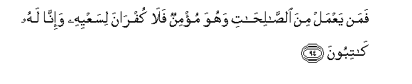
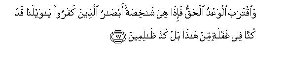
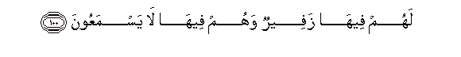
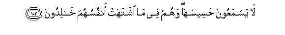
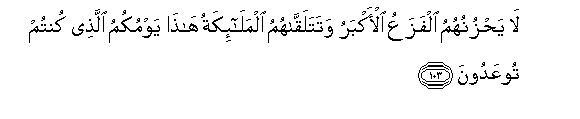
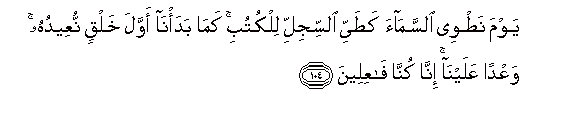
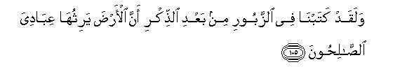
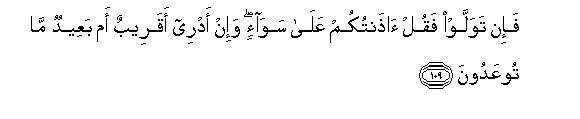

  
[Intangible Textual Heritage](../../index)  [Islam](../index.md) 
[Index](index.md)   
[Hypertext Qur'an](../htq/index)  [Unicode](../uq/021.htm#021_076.md) 
[Palmer](../sbe09/021)  [Pickthall](../pick/021.htm#021_076.md)  [Yusuf Ali
English](../yaq/yaq021)  [Rodwell](../qr/021.md)   
  
[Sūra XXI.: Anbiyāa, or The Prophets Index](021.md)  
  [Previous](02105)  [Next](02201.md) 

------------------------------------------------------------------------

  
*The Holy Quran*, tr. by Yusuf Ali, \[1934\], at Intangible Textual
Heritage

------------------------------------------------------------------------

# Sūra XXI.: Anbiyāa, or The Prophets

### Section 6

------------------------------------------------------------------------

94. Faman yaAAmal mina a**l**<u>ssa</u>li<u>ha</u>ti wahuwa mu/minun
fal<u>a</u> kufr<u>a</u>na lisaAAyihi wa-inn<u>a</u> lahu
k<u>a</u>tiboon**a**

94\. Whoever works any act  
Of Righteousness and has Faith,—  
His endeavour will not  
Be rejected: We shall  
Record it in his favour.

------------------------------------------------------------------------

95. Wa<u>h</u>ar<u>a</u>mun AAal<u>a</u> qaryatin
ahlakn<u>a</u>h<u>a</u> annahum l<u>a</u> yarjiAAoon**a**

95\. But there is a ban  
On any population which  
We have destroyed: that they  
Shall not return,

------------------------------------------------------------------------

96. <u>H</u>att<u>a</u> i<u>tha</u> futi<u>h</u>at ya/jooju wama/jooju
wahum min kulli <u>h</u>adabin yansiloon**a**

96\. Until the Gog and Magog (people)  
Are let through (their barrier),  
And they swiftly swarm  
From every hill.

------------------------------------------------------------------------

97. Wa**i**qtaraba alwaAAdu al<u>h</u>aqqu fa-i<u>tha</u> hiya
sh<u>a</u>khi<u>s</u>atun ab<u>sa</u>ru alla<u>th</u>eena kafaroo
y<u>a</u> waylan<u>a</u> qad kunn<u>a</u> fee ghaflatin min h<u>atha</u>
bal kunn<u>a</u> *<u>th</u>*<u>a</u>limeen**a**

97\. Then will the True Promise  
Draw nigh (of fulfilment):  
Then behold! the eyes  
Of the Unbelievers will  
Fixedly stare in horror: "Ah!  
Woe to us! we were indeed  
Heedless of this; nay, we  
Truly did wrong!"

------------------------------------------------------------------------

98. Innakum wam<u>a</u> taAAbudoona min dooni All<u>a</u>hi
<u>h</u>a<u>s</u>abu jahannama antum lah<u>a</u> w<u>a</u>ridoon**a**

98\. Verily ye, (Unbelievers),  
And the (false) gods that  
Ye worship besides God,  
Are (but) fuel for Hell!  
To it will ye (surely) come!

------------------------------------------------------------------------

99. Law k<u>a</u>na h<u>a</u>ol<u>a</u>-i <u>a</u>lihatan m<u>a</u>
waradooh<u>a</u> wakullun feeh<u>a</u> kh<u>a</u>lidoon**a**

99\. If these had been gods,  
They would not have got there!  
But each one will abide  
Therein.

------------------------------------------------------------------------

100. Lahum feeh<u>a</u> zafeerun wahum feeh<u>a</u> l<u>a</u>
yasmaAAoon**a**

100\. There, sobbing will be  
Their lot, nor will they  
There hear (aught else).

------------------------------------------------------------------------

101. Inna alla<u>th</u>eena sabaqat lahum minn<u>a</u>
al<u>h</u>usn<u>a</u> ol<u>a</u>-ika AAanh<u>a</u> mubAAadoon**a**

101\. Whose hose for whom  
The Good (Record) from Us  
Has gone before, will be  
Removed far therefrom.

------------------------------------------------------------------------

102. L<u>a</u> yasmaAAoona <u>h</u>aseesah<u>a</u> wahum fee m<u>a</u>
ishtahat anfusuhum kh<u>a</u>lidoon**a**

102\. Not the slightest sound  
Will they hear of Hell:  
What their souls desired,  
In that will they dwell.

------------------------------------------------------------------------

103. L<u>a</u> ya<u>h</u>zunuhumu alfazaAAu al-akbaru
watatalaqq<u>a</u>humu almal<u>a</u>-ikatu h<u>atha</u> yawmukumu
alla<u>th</u>ee kuntum tooAAadoon**a**

103\. The Great Terror will  
Bring them no grief:  
But the angels will meet them  
(With mutual greetings):  
"This is your Day,—  
(The Day) that ye were promised."

------------------------------------------------------------------------

104. Yawma na<u>t</u>wee a**l**ssam<u>a</u>a ka<u>t</u>ayyi
a**l**ssijlli lilkutubi kam<u>a</u> bada/n<u>a</u> awwala khalqin
nuAAeeduhu waAAdan AAalayn<u>a</u> inn<u>a</u> kunn<u>a</u>
f<u>a</u>AAileen**a**

104\. The Day that We roll up  
The heavens like a scroll  
Rolled up for books (completed),—  
Even as We produced  
The first Creation, so  
Shall We produce  
A new one: a promise  
We have undertaken:  
Truly shall We fulfil it.

------------------------------------------------------------------------

105. Walaqad katabn<u>a</u> fee a**l**zzaboori min baAAdi
a**l**<u>thth</u>ikri anna al-ar<u>d</u>a yarithuh<u>a</u>
AAib<u>a</u>diya a**l**<u>ssa</u>li<u>h</u>oon**a**

105\. Before this We wrote  
In the Psalms, after the Message  
(Given to Moses): "My servants,  
The righteous, shall inherit  
The earth."

------------------------------------------------------------------------

106. Inna fee h<u>atha</u> labal<u>a</u>ghan liqawmin
AA<u>a</u>bideen**a**

106\. Verily in this (Qur-ān)  
Is a Message for people  
Who would (truly) worship God.

------------------------------------------------------------------------

107. Wam<u>a</u> arsaln<u>a</u>ka ill<u>a</u> ra<u>h</u>matan
lilAA<u>a</u>lameen**a**

107\. We sent thee not, but  
As a Mercy for all creatures.

------------------------------------------------------------------------

108. Qul innam<u>a</u> yoo<u>ha</u> ilayya annam<u>a</u> il<u>a</u>hukum
il<u>a</u>hun w<u>ah</u>idun fahal antum muslimoon**a**

108\. Say: "What has come to me  
By inspiration is that  
Your God is One God:  
Will ye therefore bow  
To His Will (in Islām)?"

------------------------------------------------------------------------

109. Fa-in tawallaw faqul <u>ath</u>antukum AAal<u>a</u> saw<u>a</u>-in
wa-in adree aqareebun am baAAeedun m<u>a</u> tooAAadoon**a**

109\. But if they turn back,  
Say: "I have proclaimed  
The Message to you all alike  
And in truth; but I  
Know not whether that  
Which ye are promised  
Is near or far.

------------------------------------------------------------------------

110. Innahu yaAAlamu aljahra mina alqawli wayaAAlamu m<u>a</u>
taktumoon**a**

110\. "It is He Who knows  
What is open in speech  
And what ye hide  
(In your hearts).

------------------------------------------------------------------------

111. Wa-in adree laAAallahu fitnatun lakum wamat<u>a</u>AAun il<u>a</u>
<u>h</u>een**in**

111\. "I know not but that  
It may be a trial  
For you, and a grant  
Of (worldly) livelihood  
(To you) for a time."

------------------------------------------------------------------------

112. Q<u>a</u>la rabbi o<u>h</u>kum bi**a**l<u>h</u>aqqi
warabbun<u>a</u> a**l**rra<u>h</u>m<u>a</u>nu almustaAA<u>a</u>nu
AAal<u>a</u> m<u>a</u> ta<u>s</u>ifoon**a**

112\. Say: "O my Lord!  
Judge Thou in truth!  
"Our Lord Most Gracious  
Is the One Whose assistance  
Should be sought against  
The blasphemies ye utter!

------------------------------------------------------------------------

[Next: Section 1 (1-10)](02201.md)

