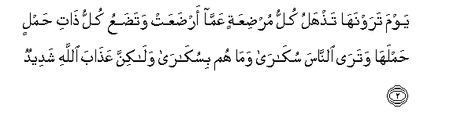
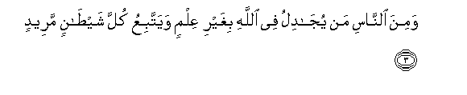
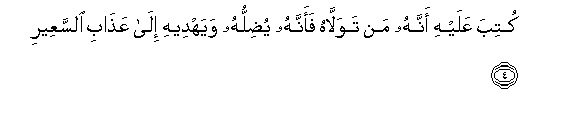
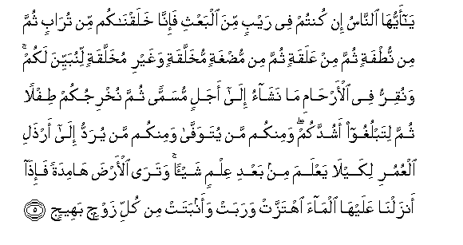
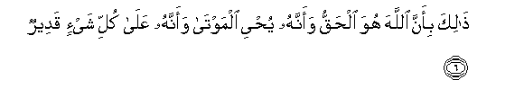
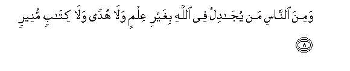
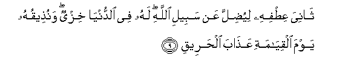
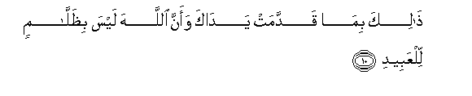

  
[Intangible Textual Heritage](../../index)  [Islam](../index.md) 
[Index](index.md)   
[Hypertext Qur'an](../htq/index)  [Unicode](../uq/022.htm#022_001.md) 
[Palmer](../sbe09/022)  [Pickthall](../pick/022.htm#022_001.md)  [Yusuf Ali
English](../yaq/yaq022)  [Rodwell](../qr/022.md)   
  
[Sūra XXII.: Ḥajj, or The Pilgrimage. Index](022.md)  
  [Previous](02106)  [Next](02202.md) 

------------------------------------------------------------------------

  
*The Holy Quran*, tr. by Yusuf Ali, \[1934\], at Intangible Textual
Heritage

------------------------------------------------------------------------

# Sūra XXII.: Ḥajj, or The Pilgrimage.

### Section 1

1. Y<u>a</u> ayyuh<u>a</u> a**l**nn<u>a</u>su ittaqoo rabbakum inna
zalzalata a**l**ss<u>a</u>AAati shay-on AAa*<u>th</u>*eem**un**

1\. O mankind! Fear your Lord!  
For the convulsion of the Hour  
(Of Judgment) will be  
A thing terrible!

------------------------------------------------------------------------

2. Yawma tarawnah<u>a</u> ta<u>th</u>halu kullu mur<u>d</u>iAAatin
AAamm<u>a</u> ar<u>d</u>aAAat wata<u>d</u>aAAu kullu <u>tha</u>ti
<u>h</u>amlin <u>h</u>amlah<u>a</u> watar<u>a</u> a**l**nn<u>a</u>sa
suk<u>a</u>r<u>a</u> wam<u>a</u> hum bisuk<u>a</u>r<u>a</u>
wal<u>a</u>kinna AAa<u>tha</u>ba All<u>a</u>hi shadeed**un**

2\. The Day ye shall see it,  
Every mother giving suck  
Shall forget her suckling-babe,  
And every pregnant female  
Shall drop her load (unformed):  
Thou shalt see mankind  
As in a drunken riot,  
Yet not drunk: but dreadful  
Will be the Wrath of God.

------------------------------------------------------------------------

3. Wamina a**l**nn<u>a</u>si man yuj<u>a</u>dilu fee All<u>a</u>hi
bighayri AAilmin wayattabiAAu kulla shay<u>ta</u>nin mareed**in**

3\. And yet among men  
There are such as dispute  
About God, without knowledge,  
And follow every evil one  
Obstinate in rebellion!

------------------------------------------------------------------------

4. Kutiba AAalayhi annahu man tawall<u>a</u>hu faannahu yu<u>d</u>illuhu
wayahdeehi il<u>a</u> AAa<u>tha</u>bi a**l**ssaAAeer**i**

4\. About the (Evil One)  
It is decreed that whoever  
Turns to him for friendship,  
Him will he lead astray,  
And he will guide him  
To the Penalty of the Fire.

------------------------------------------------------------------------

5. Y<u>a</u> ayyuh<u>a</u> a**l**nn<u>a</u>su in kuntum fee raybin mina
albaAAthi fa-inn<u>a</u> khalaqn<u>a</u>kum min tur<u>a</u>bin thumma
min nu<u>t</u>fatin thumma min AAalaqatin thumma min mu<u>d</u>ghatin
mukhallaqatin waghayri mukhallaqatin linubayyina lakum wanuqirru fee
al-ar<u>ha</u>mi m<u>a</u> nash<u>a</u>o il<u>a</u> ajalin musamman
thumma nukhrijukum <u>t</u>iflan thumma litablughoo ashuddakum waminkum
man yutawaff<u>a</u> waminkum man yuraddu il<u>a</u> ar<u>th</u>ali
alAAumuri likayl<u>a</u> yaAAlama min baAAdi AAilmin shay-an
watar<u>a</u> al-ar<u>d</u>a h<u>a</u>midatan fa-i<u>tha</u>
anzaln<u>a</u> AAalayh<u>a</u> alm<u>a</u>a ihtazzat warabat waanbatat
min kulli zawjin baheej**in**

5\. O mankind! if ye have  
A doubt about the Resurrection,  
(Consider) that We created you  
Out of dust, then out of  
Sperm, then out of a leech-like  
Clot, then out of a morsel  
Of flesh, partly formed  
And partly unformed, in order  
That We may manifest  
(Our power) to you;  
And We cause whom We will  
To rest in the wombs  
For an appointed term,  
Then do We bring you out  
As babes, then (foster you)  
That ye may reach your age  
Of full strength; and some  
Of you are called to die,  
And some are sent back  
To the feeblest old age,  
So that they know nothing  
After having known (much),  
And (further), thou seest  
The earth barren and lifeless,  
But when We pour down  
Rain on it, it is stirred  
(To life), it swells,  
And it puts forth every kind  
Of beautiful growth (in pairs).

------------------------------------------------------------------------

6. <u>Tha</u>lika bi-anna All<u>a</u>ha huwa al<u>h</u>aqqu waannahu
yu<u>h</u>yee almawt<u>a</u> waannahu AAal<u>a</u> kulli shay-in
qadeer**un**

6\. This is so, because God  
Is the Reality: it is He  
Who gives life to the dead,  
And it is He Who has  
Power over all things.

------------------------------------------------------------------------

7. Waanna a**l**ss<u>a</u>AAata <u>a</u>tiyatun l<u>a</u> rayba
feeh<u>a</u> waanna All<u>a</u>ha yabAAathu man fee alquboor**i**

7\. And verily the Hour will come:  
There can be no doubt  
About it, or about (the fact)  
That God will raise up  
All who are in the graves.

------------------------------------------------------------------------

8. Wamina a**l**nn<u>a</u>si man yuj<u>a</u>dilu fee All<u>a</u>hi
bighayri AAilmin wal<u>a</u> hudan wal<u>a</u> kit<u>a</u>bin
muneer**in**

8\. Yet there is among men  
Such a one as disputes  
About God, without knowledge,  
Without guidance, and without  
A Book of Enlightenment,—

------------------------------------------------------------------------

9. Th<u>a</u>niya AAi<u>t</u>fihi liyu<u>d</u>illa AAan sabeeli
All<u>a</u>hi lahu fee a**l**dduny<u>a</u> khizyun wanu<u>th</u>eequhu
yawma alqiy<u>a</u>mati AAa<u>tha</u>ba al<u>h</u>areeq**i**

9\. (Disdainfully) bending his side,  
In order to lead (men) astray  
From the Path of God:  
For him there is disgrace  
In this life, and on the Day  
Of Judgment We shall  
Make him taste the Penalty  
Of burning (Fire).

------------------------------------------------------------------------

10. <u>Tha</u>lika bim<u>a</u> qaddamat yad<u>a</u>ka waanna
All<u>a</u>ha laysa bi*<u>th</u>*all<u>a</u>min lilAAabeed**i**

10\. (It will be said): "This is  
Because of the deeds which  
Thy hands sent forth,  
For verily God is not  
Unjust to His servants."

------------------------------------------------------------------------

[Next: Section 2 (11-22)](02202.md)

