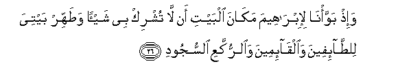
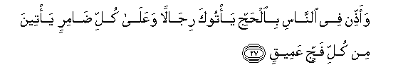
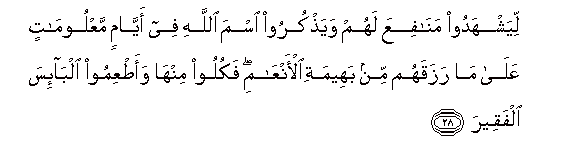
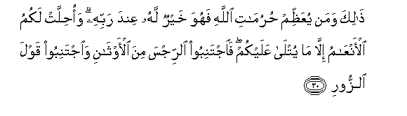
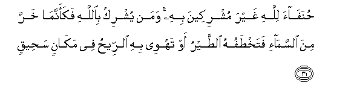
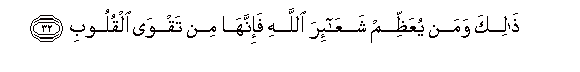

  
[Intangible Textual Heritage](../../index)  [Islam](../index.md) 
[Index](index.md)   
[Hypertext Qur'an](../htq/index)  [Unicode](../uq/022.htm#022_026.md) 
[Palmer](../sbe09/022)  [Pickthall](../pick/022.htm#022_026.md)  [Yusuf Ali
English](../yaq/yaq022)  [Rodwell](../qr/022.md)   
  
[Sūra XXII.: Ḥajj, or The Pilgrimage. Index](022.md)  
  [Previous](02203)  [Next](02205.md) 

------------------------------------------------------------------------

  
*The Holy Quran*, tr. by Yusuf Ali, \[1934\], at Intangible Textual
Heritage

------------------------------------------------------------------------

# Sūra XXII.: Ḥajj, or The Pilgrimage.

### Section 4

------------------------------------------------------------------------

26. Wa-i<u>th</u> bawwa/n<u>a</u> li-ibr<u>a</u>heema mak<u>a</u>na
albayti an l<u>a</u> tushrik bee shay-an wa<u>t</u>ahhir baytiya
li**l**<u>tta</u>-ifeena wa**a**lq<u>a</u>-imeena wa**al**rrukkaAAi
a**l**ssujood**i**

26\. Behold! We gave the site,  
To Abraham, of the (Sacred) House,  
(Saying): "Associate not anything  
(In worship) with Me;  
And sanctify My House  
For those who compass it round,  
Or stand up,  
Or bow, or prostrate themselves  
(Therein in prayer).

------------------------------------------------------------------------

27. Waa<u>thth</u>in fee a**l**nn<u>a</u>si bi**a**l<u>h</u>ajji
ya/tooka rij<u>a</u>lan waAAal<u>a</u> kulli <u>da</u>mirin ya/teena min
kulli fajjin AAameeq**in**

27\. "And proclaim the Pilgrimage  
Among men: they will come  
To thee on foot and (mounted)  
On every kind of camel,  
Lean on accout of journeys  
Through deep and distant  
Mountain highways;

------------------------------------------------------------------------

28. Liyashhadoo man<u>a</u>fiAAa lahum waya<u>th</u>kuroo isma
All<u>a</u>hi fee ayy<u>a</u>min maAAloom<u>a</u>tin AAal<u>a</u>
m<u>a</u> razaqahum min baheemati al-anAA<u>a</u>mi fakuloo minh<u>a</u>
waa<u>t</u>AAimoo alb<u>a</u>-isa alfaqeer**a**

28\. "That they may witness  
The benefits (provided) for them,  
And celebrate the name  
Of God, through the Days  
Appointed, over the cattle  
Which He has provided for them  
(For sacrifice): then eat ye  
Thereof and feed the distressed  
Ones in want.

------------------------------------------------------------------------

29. Thumma lyaq<u>d</u>oo tafathahum walyoofoo nu<u>th</u>oorahum
walya<u>tt</u>awwafoo bi**a**lbayti alAAateeq**i**

29\. "Then let them complete  
The rites prescribed  
For them, perform their vows,  
And (again) circumambulate  
The Ancient House."

------------------------------------------------------------------------

30. <u>Tha</u>lika waman yuAAa*<u>thth</u>*im <u>h</u>urum<u>a</u>ti
All<u>a</u>hi fahuwa khayrun lahu AAinda rabbihi wao<u>h</u>illat lakumu
al-anAA<u>a</u>mu ill<u>a</u> m<u>a</u> yutl<u>a</u> AAalaykum
fa**i**jtaniboo a**l**rrijsa mina al-awth<u>a</u>ni wa**i**jtaniboo
qawla a**l**zzoor**i**

30\. Such (is the Pilgrimage):  
Whoever honours the sacred  
Rites of God, for him  
It is good in the sight  
Of his Lord. Lawful to you  
(For food in Pilgrimage) are cattle,  
Except those mentioned to you  
(As exceptions): but shun  
The abomination of idols,  
And shun the word  
That is false,—

------------------------------------------------------------------------

31. <u>H</u>unaf<u>a</u>a lill<u>a</u>hi ghayra mushrikeena bihi waman
yushrik bi**A**ll<u>a</u>hi fakaannam<u>a</u> kharra mina
a**l**ssam<u>a</u>-i fatakh<u>t</u>afuhu a**l**<u>tt</u>ayru aw tahwee
bihi a**l**rree<u>h</u>u fee mak<u>a</u>nin sa<u>h</u>eeq**in**

31\. Being true in faith to God,  
And never assigning partners  
To Him: if anyone assigns  
Partners to God, he is  
As if he had fallen  
From heaven and been snatched up  
By birds, or the wind  
Had swooped (like a bird  
On its prey) and thrown him  
Into a far-distant place.

------------------------------------------------------------------------

32. <u>Tha</u>lika waman yuAAa*<u>thth</u>*im shaAA<u>a</u>-ira
All<u>a</u>hi fa-innah<u>a</u> min taqw<u>a</u> alquloob**i**

32\. Such (is his state): and  
Whoever holds in honour  
The Symbols of God,  
(In the sacrifice of animals),  
Such (honour) should come truly  
From piety of heart.

------------------------------------------------------------------------

33. Lakum feeh<u>a</u> man<u>a</u>fiAAu il<u>a</u> ajalin musamman
thumma ma<u>h</u>illuh<u>a</u> il<u>a</u> albayti alAAateeq**i**

33\. In them ye have benefits  
For a term appointed:  
In the end their place  
Of sacrifice is near  
The Ancient House.

------------------------------------------------------------------------

[Next: Section 5 (34-38)](02205.md)

