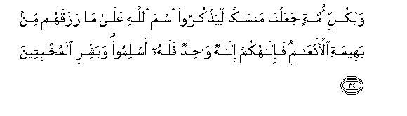
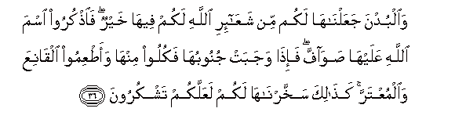
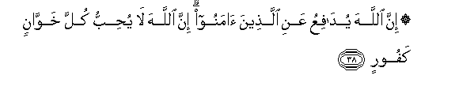

  
[Intangible Textual Heritage](../../index)  [Islam](../index.md) 
[Index](index.md)   
[Hypertext Qur'an](../htq/index)  [Unicode](../uq/022.htm#022_034.md) 
[Palmer](../sbe09/022)  [Pickthall](../pick/022.htm#022_034.md)  [Yusuf Ali
English](../yaq/yaq022)  [Rodwell](../qr/022.md)   
  
[Sūra XXII.: Ḥajj, or The Pilgrimage. Index](022.md)  
  [Previous](02204)  [Next](02206.md) 

------------------------------------------------------------------------

  
*The Holy Quran*, tr. by Yusuf Ali, \[1934\], at Intangible Textual
Heritage

------------------------------------------------------------------------

# Sūra XXII.: Ḥajj, or The Pilgrimage.

### Section 5

------------------------------------------------------------------------

34. Walikulli ommatin jaAAaln<u>a</u> mansakan liya<u>th</u>kuroo isma
All<u>a</u>hi AAal<u>a</u> m<u>a</u> razaqahum min baheemati
al-anAA<u>a</u>mi fa-il<u>a</u>hukum il<u>a</u>hun w<u>ah</u>idun falahu
aslimoo wabashshiri almukhbiteen**a**

34\. To every people did We  
Appoint rites (of sacrifice),  
That they might celebrate  
The name of God over  
The sustenance He gave them  
From animals (fit for food).  
But your god is One God:  
Submit then your wills to him  
(In Islām): and give thou  
The good news to those  
Who humble themselves,—

------------------------------------------------------------------------

35. Alla<u>th</u>eena i<u>tha</u> <u>th</u>ukira All<u>a</u>hu wajilat
quloobuhum wa**al**<u>ssa</u>bireena AAal<u>a</u> m<u>a</u>
a<u>sa</u>bahum wa**a**lmuqeemee a**l**<u>ss</u>al<u>a</u>ti
wamimm<u>a</u> razaqn<u>a</u>hum yunfiqoon**a**

35\. To those whose hearts,  
When God is mentioned,  
Are filled with fear,  
Who show patient perseverance  
Over their afflictions, keep up  
Regular prayer, and spend  
(In charity) out of what  
We have bestowed upon them.

------------------------------------------------------------------------

36. Wa**a**lbudna jaAAaln<u>a</u>h<u>a</u> lakum min shaAA<u>a</u>-iri
All<u>a</u>hi lakum feeh<u>a</u> khayrun fa**o**<u>th</u>kuroo isma
All<u>a</u>hi AAalayh<u>a</u> <u>s</u>aw<u>a</u>ffa fa-i<u>tha</u>
wajabat junoobuh<u>a</u> fakuloo minh<u>a</u> waa<u>t</u>AAimoo
alq<u>a</u>niAAa wa**a**lmuAAtarra ka<u>tha</u>lika
sakhkharn<u>a</u>h<u>a</u> lakum laAAallakum tashkuroon**a**

36\. The sacrificial camels  
We have made for you  
As among the symbols from  
God: in them is (much)  
Good for you: then pronounce  
The name of God over them  
As they line up (for sacrifice):  
When they are down  
On their sides (after slaughter),  
Eat ye thereof, and feed  
Such as (beg not but)  
Live in contentment,  
And such as beg  
With due humility: thus have  
We made animals subject  
To you, that ye  
May be grateful.

------------------------------------------------------------------------

37. Lan yan<u>a</u>la All<u>a</u>ha lu<u>h</u>oomuh<u>a</u> wal<u>a</u>
dim<u>a</u>oh<u>a</u> wal<u>a</u>kin yan<u>a</u>luhu a**l**ttaqw<u>a</u>
minkum ka<u>tha</u>lika sakhkharah<u>a</u> lakum litukabbiroo
All<u>a</u>ha AAal<u>a</u> m<u>a</u> had<u>a</u>kum wabashshiri
almu<u>h</u>sineen**a**

37\. It is not their meat  
Nor their blood, that reaches  
God: it is your piety  
That reaches Him: He  
Has thus made them subject  
To you, that ye may glorify  
God for his guidance to you:  
And proclaim the Good News  
To all who do right.

------------------------------------------------------------------------

38. Inna All<u>a</u>ha yud<u>a</u>fiAAu AAani alla<u>th</u>eena
<u>a</u>manoo inna All<u>a</u>ha l<u>a</u> yu<u>h</u>ibbu kulla
khaww<u>a</u>nin kafoor**in**

38\. Verily God will defend  
(From ill) those who believe:  
Verily, God loveth not  
Any that is a traitor  
To faith, or shows ingratitude.

------------------------------------------------------------------------

[Next: Section 6 (39-48)](02206.md)

