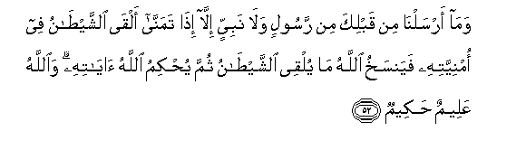
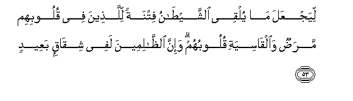
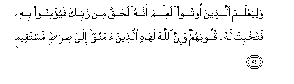
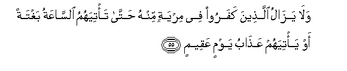
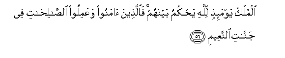

  
[Intangible Textual Heritage](../../index)  [Islam](../index.md) 
[Index](index.md)   
[Hypertext Qur'an](../htq/index)  [Unicode](../uq/022.htm#022_049.md) 
[Palmer](../sbe09/022)  [Pickthall](../pick/022.htm#022_049.md)  [Yusuf Ali
English](../yaq/yaq022)  [Rodwell](../qr/022.md)   
  
[Sūra XXII.: Ḥajj, or The Pilgrimage. Index](022.md)  
  [Previous](02206)  [Next](02208.md) 

------------------------------------------------------------------------

  
*The Holy Quran*, tr. by Yusuf Ali, \[1934\], at Intangible Textual
Heritage

------------------------------------------------------------------------

# Sūra XXII.: Ḥajj, or The Pilgrimage.

### Section 7

------------------------------------------------------------------------

49. Qul y<u>a</u> ayyuh<u>a</u> a**l**nn<u>a</u>su innam<u>a</u>
an<u>a</u> lakum na<u>th</u>eerun mubeen**un**

49\. Say: "O men! I am  
(Sent) to you only to give  
A clear warning:

------------------------------------------------------------------------

50. Fa**a**lla<u>th</u>eena <u>a</u>manoo waAAamiloo
a**l**<u>ssa</u>li<u>ha</u>ti lahum maghfiratun warizqun kareem**un**

50\. "Those who believe and work  
Righteousness, for them  
Is forgiveness and a sustenance  
Most generous.

------------------------------------------------------------------------

51. Wa**a**lla<u>th</u>eena saAAaw fee <u>a</u>y<u>a</u>tin<u>a</u>
muAA<u>a</u>jizeena ol<u>a</u>-ika a<u>s</u>-<u>ha</u>bu
alja<u>h</u>eem**i**

51\. "But those who strive  
Against Our Signs, to frustrate  
Them,—they will be  
Companions of the Fire."

------------------------------------------------------------------------

52. Wam<u>a</u> arsaln<u>a</u> min qablika min rasoolin wal<u>a</u>
nabiyyin ill<u>a</u> i<u>tha</u> tamann<u>a</u> alq<u>a</u>
a**l**shshay<u>ta</u>nu fee omniyyatihi fayansakhu All<u>a</u>hu
m<u>a</u> yulqee a**l**shshay<u>ta</u>nu thumma yu<u>h</u>kimu
All<u>a</u>hu <u>a</u>y<u>a</u>tihi wa**A**ll<u>a</u>hu AAaleemun
<u>h</u>akeem**un**

52\. Never did We send  
An apostle or a prophet  
Before thee, but, when he  
Framed a desire, Satan  
Threw some (vanity)  
Into his desire: but God  
Will cancel anything (vain)  
That Satan throws in,  
And God will confirm  
(And establish) His Signs:  
For God is full of knowledge  
And wisdom:

------------------------------------------------------------------------

53. LiyajAAala m<u>a</u> yulqee a**l**shshay<u>ta</u>nu fitnatan
lilla<u>th</u>eena fee quloobihim mara<u>d</u>un wa**a**lq<u>a</u>siyati
quloobuhum wa-inna a**l***<u>thth</u>*<u>a</u>limeena lafee
shiq<u>a</u>qin baAAeed**in**

53\. That He may make  
The suggestions thrown in  
By Satan, but a trial  
For those in whose hearts

------------------------------------------------------------------------

54. WaliyaAAlama alla<u>th</u>eena ootoo alAAilma annahu al<u>h</u>aqqu
min rabbika fayu/minoo bihi fatukhbita lahu quloobuhum wa-inna
All<u>a</u>ha lah<u>a</u>di alla<u>th</u>eena <u>a</u>manoo il<u>a</u>
<u>s</u>ir<u>at</u>in mustaqeem**in**

54\. And that those on whom  
Knowledge has been bestowed may learn  
That the (Qur-ān) is the Truth  
From thy Lord, and that they  
May believe therein, and their hearts  
May be made humbly (open)  
To it: for verily God is  
The Guide of those who believe,  
To the Straight Way.

------------------------------------------------------------------------

55. Wal<u>a</u> yaz<u>a</u>lu alla<u>th</u>eena kafaroo fee miryatin
minhu <u>h</u>att<u>a</u> ta/tiyahumu a**l**ss<u>a</u>AAatu baghtatan aw
ya/tiyahum AAa<u>tha</u>bu yawmin AAaqeem**in**

55\. Those who reject Faith  
Will not cease to be  
In doubt concerning (Revelation)  
Until the Hour (of Judgment)  
Comes suddenly upon them,  
Or there comes to them  
The Penalty of a Day of Disaster.

------------------------------------------------------------------------

56. Almulku yawma-i<u>th</u>in lill<u>a</u>hi ya<u>h</u>kumu baynahum
fa**a**lla<u>th</u>eena <u>a</u>manoo waAAamiloo
a**l**<u>ssa</u>li<u>ha</u>ti fee jann<u>a</u>ti a**l**nnaAAeem**i**

56\. On that Day the Dominion  
Will be that of God:  
He will judge between them:  
So those who believe  
And work righteous deeds will be  
In Gardens of Delight.

------------------------------------------------------------------------

57. Wa**a**lla<u>th</u>eena kafaroo waka<u>thth</u>aboo
bi-<u>a</u>y<u>a</u>tin<u>a</u> faol<u>a</u>-ika lahum AAa<u>tha</u>bun
muheen**un**

57\. And for those who reject Faith  
And deny Our Signs,  
There will be a humiliating  
Punishment.

------------------------------------------------------------------------

[Next: Section 8 (58-64)](02208.md)

