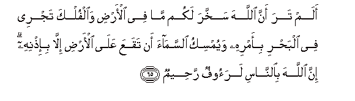
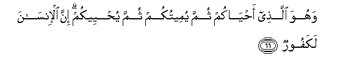
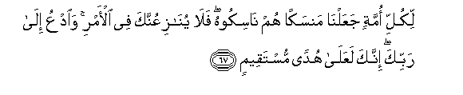
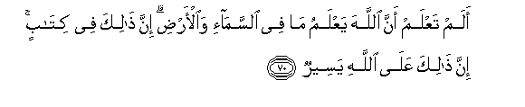

  
[Intangible Textual Heritage](../../index)  [Islam](../index) 
[Index](index)   
[Hypertext Qur'an](../htq/index)  [Unicode](../uq/022.htm#022_065) 
[Palmer](../sbe09/022)  [Pickthall](../pick/022.htm#022_065)  [Yusuf Ali
English](../yaq/yaq022)  [Rodwell](../qr/022)   
  
[Sūra XXII.: Ḥajj, or The Pilgrimage. Index](022)  
  [Previous](02208)  [Next](02210) 

------------------------------------------------------------------------

  
*The Holy Quran*, tr. by Yusuf Ali, \[1934\], at Intangible Textual
Heritage

------------------------------------------------------------------------

# Sūra XXII.: Ḥajj, or The Pilgrimage.

### Section 9

------------------------------------------------------------------------

65. Alam tara anna All<u>a</u>ha sakhkhara lakum m<u>a</u> fee
al-ar<u>d</u>i wa**a**lfulka tajree fee alba<u>h</u>ri bi-amrihi
wayumsiku a**l**ssam<u>a</u>a an taqaAAa AAal<u>a</u> al-ar<u>d</u>i
ill<u>a</u> bi-i<u>th</u>nihi inna All<u>a</u>ha bi**al**nn<u>a</u>si
laraoofun ra<u>h</u>eem**un**

65\. Seest thou not that God  
Has made subject to you (men)  
All that is on the earth,  
And the ships that sail  
Through the sea by His command?  
He withholds the sky (rain)  
From falling on the earth  
Except by His leave:  
For God is Most Kind  
And Most Merciful to man.

------------------------------------------------------------------------

66. Wahuwa alla<u>th</u>ee a<u>h</u>y<u>a</u>kum thumma yumeetukum
thumma yu<u>h</u>yeekum inna al-ins<u>a</u>na lakafoor**un**

66\. It is He Who gave you life,  
Will cause you to die,  
And will again give you  
Life: truly man is  
A most ungrateful creature!

------------------------------------------------------------------------

67. Likulli ommatin jaAAaln<u>a</u> mansakan hum n<u>a</u>sikoohu
fal<u>a</u> yun<u>a</u>ziAAunnaka fee al-amri wa**o**dAAu il<u>a</u>
rabbika innaka laAAal<u>a</u> hudan mustaqeem**in**

67\. To every People have We  
Appointed rites and ceremonies  
Which they must follow:  
Let them not then dispute  
With thee on the matter,  
But do thou invite (them)  
To thy Lord: for thou art  
Assuredly on the Right Way.

------------------------------------------------------------------------

68. Wa-in j<u>a</u>dalooka faquli All<u>a</u>hu aAAlamu bim<u>a</u>
taAAmaloon**a**

68\. If they do wrangle with thee,  
Say, "God knows best  
What it is ye are doing."

------------------------------------------------------------------------

69. All<u>a</u>hu ya<u>h</u>kumu baynakum yawma alqiy<u>a</u>mati
feem<u>a</u> kuntum feehi takhtalifoon**a**

69\. "God will judge between you  
On the Day of Judgment  
Concerning the matters in which  
Ye differ."

------------------------------------------------------------------------

70. Alam taAAlam anna All<u>a</u>ha yaAAlamu m<u>a</u> fee
a**l**ssam<u>a</u>-i wa**a**l-ar<u>d</u>i inna <u>tha</u>lika fee
kit<u>a</u>bin inna <u>tha</u>lika AAal<u>a</u> All<u>a</u>hi
yaseer**un**

70\. Knowest thou not that  
God knows all that is  
In heaven and on earth?  
Indeed it is all  
In a record, and that  
Is easy for God.

------------------------------------------------------------------------

71. WayaAAbudoona min dooni All<u>a</u>hi m<u>a</u> lam yunazzil bihi
sul<u>ta</u>nan wam<u>a</u> laysa lahum bihi AAilmun wam<u>a</u>
li**l***<u>thth</u>*<u>a</u>limeena min na<u>s</u>eer**in**

71\. Yet they worship, besides God,  
Things for which no authority  
Has been sent down to them,  
And of which they have  
(Really) no knowledge:  
For those that do wrong  
There is no helper.

------------------------------------------------------------------------

72. Wa-i<u>tha</u> tutl<u>a</u> AAalayhim <u>a</u>y<u>a</u>tun<u>a</u>
bayyin<u>a</u>tin taAArifu fee wujoohi alla<u>th</u>eena kafaroo
almunkara yak<u>a</u>doona yas<u>t</u>oona bi**a**lla<u>th</u>eena
yatloona AAalayhim <u>a</u>y<u>a</u>tin<u>a</u> qul afaonabbi-okum
bisharrin min <u>tha</u>likum a**l**nn<u>a</u>ru waAAadah<u>a</u>
All<u>a</u>hu alla<u>th</u>eena kafaroo wabi/sa alma<u>s</u>eer**u**

72\. When Our Clear Signs  
Are rehearsed to them,  
Thou wilt notice a denial  
On the faces of the Unbelievers!  
They nearly attack with violence  
Those who rehearse Our Signs  
To them. Say, "Shall I  
Tell you of something  
(Far) worse than these Signs?  
It is the Fire (of Hell)!  
God has promised it  
To the Unbelievers!  
And evil is that destination!"

------------------------------------------------------------------------

[Next: Section 10 (73-78)](02210)

