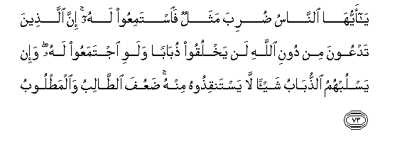
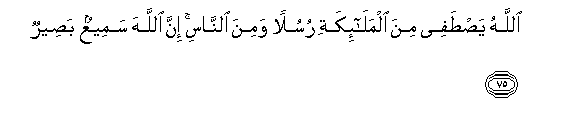
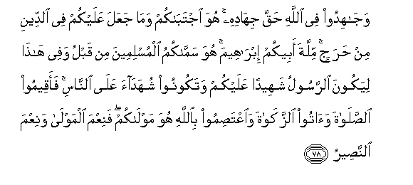

  
[Intangible Textual Heritage](../../index)  [Islam](../index) 
[Index](index)   
[Hypertext Qur'an](../htq/index)  [Unicode](../uq/022.htm#022_073) 
[Palmer](../sbe09/022)  [Pickthall](../pick/022.htm#022_073)  [Yusuf Ali
English](../yaq/yaq022)  [Rodwell](../qr/022)   
  
[Sūra XXII.: Ḥajj, or The Pilgrimage. Index](022)  
  [Previous](02209)  [Next](02301) 

------------------------------------------------------------------------

  
*The Holy Quran*, tr. by Yusuf Ali, \[1934\], at Intangible Textual
Heritage

------------------------------------------------------------------------

# Sūra XXII.: Ḥajj, or The Pilgrimage.

### Section 10

------------------------------------------------------------------------

73. Y<u>a</u> ayyuh<u>a</u> a**l**nn<u>a</u>su <u>d</u>uriba mathalun
fa**i**stamiAAoo lahu inna alla<u>th</u>eena tadAAoona min dooni
All<u>a</u>hi lan yakhluqoo <u>th</u>ub<u>a</u>ban walawi ijtamaAAoo
lahu wa-in yaslubuhumu a**l**<u>thth</u>ub<u>a</u>bu shay-an l<u>a</u>
yastanqi<u>th</u>oohu minhu <u>d</u>aAAufa a**l**<u>tta</u>libu
wa**a**lma<u>t</u>loob**u**

73\. O men! Here is  
A parable set forth!  
Listen to it! Those  
On whom, besides God,  
Ye call, cannot create  
(Even) a fly, if they all  
Met together for the purpose!  
And if the fly should snatch  
Away anything from them,  
They would have no power  
To release it from the fly.  
Feeble are those who petition  
And those whom they petition!

------------------------------------------------------------------------

74. M<u>a</u> qadaroo All<u>a</u>ha <u>h</u>aqqa qadrihi inna
All<u>a</u>ha laqawiyyun AAazeez**un**

74\. No just estimate have they  
Made of God: for God  
Is He Who is strong  
And able to carry out  
His Will.

------------------------------------------------------------------------

75. All<u>a</u>hu ya<u>st</u>afee mina almal<u>a</u>-ikati rusulan
wamina a**l**nn<u>a</u>si inna All<u>a</u>ha sameeAAun
ba<u>s</u>eer**un**

75\. God chooses Messengers  
From angels and from men  
For God is He Who hears  
And sees (all things).

------------------------------------------------------------------------

76. YaAAlamu m<u>a</u> bayna aydeehim wam<u>a</u> khalfahum
wa-il<u>a</u> All<u>a</u>hi turjaAAu al-omoor**u**

76\. He knows what is before them  
And what is behind them:  
And to God go back  
All questions (for decision).

------------------------------------------------------------------------

77. Y<u>a</u> ayyuh<u>a</u> alla<u>th</u>eena <u>a</u>manoo irkaAAoo
wa**o**sjudoo wa**o**AAbudoo rabbakum wa**i**fAAaloo alkhayra
laAAallakum tufli<u>h</u>oon**a**

77\. O ye who believe!  
Bow down, prostrate yourselves,  
And adore your Lord;  
And do good;  
That ye may prosper.

------------------------------------------------------------------------

78. Waj<u>a</u>hidoo fee All<u>a</u>hi <u>h</u>aqqa jih<u>a</u>dihi huwa
ijtab<u>a</u>kum wam<u>a</u> jaAAala AAalaykum fee a**l**ddeeni min
<u>h</u>arajin millata abeekum ibr<u>a</u>heema huwa samm<u>a</u>kumu
almuslimeena min qablu wafee h<u>atha</u> liyakoona a**l**rrasoolu
shaheedan AAalaykum watakoonoo shuhad<u>a</u>a AAal<u>a</u>
a**l**nn<u>a</u>si faaqeemoo a**l**<u>ss</u>al<u>a</u>ta wa<u>a</u>too
a**l**zzak<u>a</u>ta wa**i**AAta<u>s</u>imoo bi**A**ll<u>a</u>hi huwa
mawl<u>a</u>kum faniAAma almawl<u>a</u> waniAAma
a**l**nna<u>s</u>eer**u**

78\. And strive in His cause  
As ye ought to strive,  
(With sincerity and under discipline).  
He has chosen you, and has  
Imposed no difficulties on you  
In religion; it is the cult  
Of your father Abraham.  
It is He Who has named  
You Muslims, both before  
And in this (Revelation);  
That the Apostle may be  
A witness for you, and ye  
Be witnesses for mankind!  
So establish regular Prayer,  
Give regular Charity,  
And hold fast to God!  
He is your Protector—  
The best to protect  
And the Best to help!

------------------------------------------------------------------------

[Next: Section 1 (1-22)](02301)

