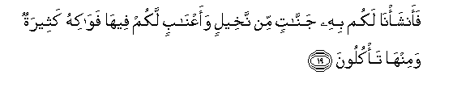

  
[Intangible Textual Heritage](../../index)  [Islam](../index) 
[Index](index)   
[Hypertext Qur'an](../htq/index)  [Unicode](../uq/023.htm#023_001) 
[Palmer](../sbe09/023)  [Pickthall](../pick/023.htm#023_001)  [Yusuf Ali
English](../yaq/yaq023)  [Rodwell](../qr/023)   
  
[Sūra XXIII.: Mu-minūn, or The Believers. Index](023)  
  [Previous](02210)  [Next](02302) 

------------------------------------------------------------------------

  
*The Holy Quran*, tr. by Yusuf Ali, \[1934\], at Intangible Textual
Heritage

------------------------------------------------------------------------

# Sūra XXIII.: Mu-minūn, or The Believers.

### Section 1

1. Qad afla<u>h</u>a almu/minoon**a**

1\. The Believers must  
(Eventually) win through,—

------------------------------------------------------------------------

2. Alla<u>th</u>eena hum fee <u>s</u>al<u>a</u>tihim
kh<u>a</u>shiAAoon**a**

2\. Those who humble themselves  
In their prayers;

------------------------------------------------------------------------

3. Wa**a**lla<u>th</u>eena hum AAani allaghwi muAAri<u>d</u>oon**a**

3\. Who avoid vain talk;

------------------------------------------------------------------------

4. Wa**a**lla<u>th</u>eena hum li**l**zzak<u>a</u>ti
f<u>a</u>AAiloon**a**

4\. Who are active in deeds  
Of charity;

------------------------------------------------------------------------

5. Wa**a**lla<u>th</u>eena hum lifuroojihim
<u>ha</u>fi*<u>th</u>*oon**a**

5\. Who abstain from sex,

------------------------------------------------------------------------

6. Ill<u>a</u> AAal<u>a</u> azw<u>a</u>jihim aw m<u>a</u> malakat
aym<u>a</u>nuhum fa-innahum ghayru maloomeen**a**

6\. Except with those joined  
To them in the marriage bond,  
Or (the captives) whom  
Their right hands possess,—  
For (in their case) they are  
Free from blame,

------------------------------------------------------------------------

7. Famani ibtagh<u>a</u> war<u>a</u>a <u>tha</u>lika faol<u>a</u>-ika
humu alAA<u>a</u>doon**a**

7\. But those whose desires exceed  
Those limits are transgressors;—

------------------------------------------------------------------------

8. Wa**a**lla<u>th</u>eena hum li-am<u>a</u>n<u>a</u>tihim waAAahdihim
r<u>a</u>AAoon**a**

8\. Those who faithfully observe  
Their trusts and their covenants;

------------------------------------------------------------------------

9. Wa**a**lla<u>th</u>eena hum AAal<u>a</u> <u>s</u>alaw<u>a</u>tihim
yu<u>ha</u>fi*<u>th</u>*oon**a**

9\. And who (strictly) guard  
Their prayers;—

------------------------------------------------------------------------

10. Ol<u>a</u>-ika humu alw<u>a</u>rithoon**a**

10\. These will be the heirs,

------------------------------------------------------------------------

11. Alla<u>th</u>eena yarithoona alfirdawsa hum feeh<u>a</u>
kh<u>a</u>lidoon**a**

11\. Who will inherit Paradise:  
They will dwell therein  
(For ever).

------------------------------------------------------------------------

12. Walaqad khalaqn<u>a</u> al-ins<u>a</u>na min sul<u>a</u>latin min
<u>t</u>een**in**

12\. Man We did create  
From a quintessence (of clay);

------------------------------------------------------------------------

13. Thumma jaAAaln<u>a</u>hu nu<u>t</u>fatan fee qar<u>a</u>rin
makeen**in**

13\. Then We placed him  
As (a drop of) sperm  
In a place of rest,  
Firmly fixed;

------------------------------------------------------------------------

14. Thumma khalaqn<u>a</u> a**l**nnu<u>t</u>fata AAalaqatan
fakhalaqn<u>a</u> alAAalaqata mu<u>d</u>ghatan fakhalaqn<u>a</u>
almu<u>d</u>ghata AAi*<u>th</u>*<u>a</u>man fakasawn<u>a</u>
alAAi*<u>th</u>*<u>a</u>ma la<u>h</u>man thumma ansha/n<u>a</u>hu
khalqan <u>a</u>khara fatab<u>a</u>raka All<u>a</u>hu a<u>h</u>sanu
alkh<u>a</u>liqeen**a**

14\. Then We made the sperm  
Into a clot of congealed blood;  
Then of that clot We made  
A (fœtus) lump; then We  
Made out of that lump  
Bones and clothed the bones  
With flesh; then We developed  
Out of it another creature.  
So blessed be God,  
The Best to create!

------------------------------------------------------------------------

15. Thumma innakum baAAda <u>tha</u>lika lamayyitoon**a**

15\. After that, at length  
Ye will die.

------------------------------------------------------------------------

16. Thumma innakum yawma alqiy<u>a</u>mati tubAAathoon**a**

16\. Again, on the Day  
Of Judgment, will ye be  
Raised up.

------------------------------------------------------------------------

17. Walaqad khalaqn<u>a</u> fawqakum sabAAa <u>t</u>ar<u>a</u>-iqa
wam<u>a</u> kunn<u>a</u> AAani alkhalqi gh<u>a</u>fileen**a**

17\. And We have made, above you,  
Seven tracts; and We  
Are never unmindful  
Of (Our) Creation,

------------------------------------------------------------------------

18. Waanzaln<u>a</u> mina a**l**ssam<u>a</u>-i m<u>a</u>an biqadarin
faaskann<u>a</u>hu fee al-ar<u>d</u>i wa-inn<u>a</u> AAal<u>a</u>
<u>th</u>ah<u>a</u>bin bihi laq<u>a</u>diroon**a**

18\. And We send down water  
From the sky according to  
(Due) measure, and We cause it  
To soak in the soil;  
And We certainly are able  
To drain it off (with ease).

------------------------------------------------------------------------

19. Faansha/n<u>a</u> lakum bihi jann<u>a</u>tin min nakheelin
waaAAn<u>a</u>bin lakum feeh<u>a</u> faw<u>a</u>kihu katheeratun
waminh<u>a</u> ta/kuloon**a**

19\. With it We grow for you  
Gardens of date-palms  
And vines: in them have ye  
Abundant fruits: and of them  
Ye eat (and have enjoyment),—

------------------------------------------------------------------------

20. Washajaratan takhruju min <u>t</u>oori sayn<u>a</u>a tanbutu
bi**al**dduhni wa<u>s</u>ibghin lil<u>a</u>kileen**a**

20\. Also a tree springing  
Out of Mount Sinai,  
Which produces oil,  
And relish for those  
Who use it for food.

------------------------------------------------------------------------

21. Wa-inna lakum fee al-anAA<u>a</u>mi laAAibratan nusqeekum
mimm<u>a</u> fee bu<u>t</u>oonih<u>a</u> walakum feeh<u>a</u>
man<u>a</u>fiAAu katheeratun waminh<u>a</u> ta/kuloon**a**

21\. And in cattle (too) ye  
Have an instructive example:  
From within their bodies  
We produce (milk) for you  
To drink; there art, in them,  
(Besides), numerous (other)  
Benefits for you;  
And of their (meat) ye eat;

------------------------------------------------------------------------

22. WaAAalayh<u>a</u> waAAal<u>a</u> alfulki tu<u>h</u>maloon**a**

22\. And on them, as well as  
In ships, ye ride.

------------------------------------------------------------------------

[Next: Section 2 (23-32)](02302)

