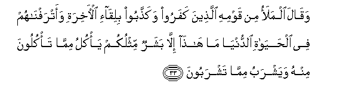
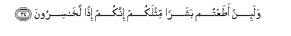
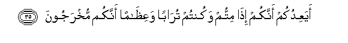
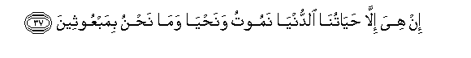
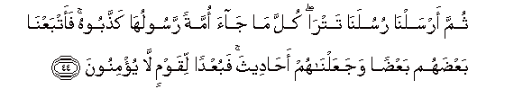
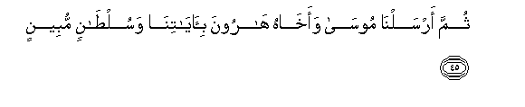
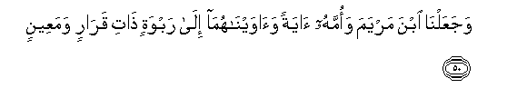

  
[Intangible Textual Heritage](../../index)  [Islam](../index) 
[Index](index)   
[Hypertext Qur'an](../htq/index)  [Unicode](../uq/023.htm#023_033) 
[Palmer](../sbe09/023)  [Pickthall](../pick/023.htm#023_033)  [Yusuf Ali
English](../yaq/yaq023)  [Rodwell](../qr/023)   
  
[Sūra XXIII.: Mu-minūn, or The Believers. Index](023)  
  [Previous](02302)  [Next](02304) 

------------------------------------------------------------------------

  
*The Holy Quran*, tr. by Yusuf Ali, \[1934\], at Intangible Textual
Heritage

------------------------------------------------------------------------

# Sūra XXIII.: Mu-minūn, or The Believers.

### Section 3

------------------------------------------------------------------------

33. Waq<u>a</u>la almalao min qawmihi alla<u>th</u>eena kafaroo
waka<u>thth</u>aboo biliq<u>a</u>-i al-<u>a</u>khirati
waatrafn<u>a</u>hum fee al<u>h</u>ay<u>a</u>ti a**l**dduny<u>a</u>
m<u>a</u> h<u>atha</u> ill<u>a</u> basharun mithlukum ya/kulu
mimm<u>a</u> ta/kuloona minhu wayashrabu mimm<u>a</u> tashraboon**a**

33\. And the chiefs  
Of his people, who disbelieved  
And denied the Meeting  
In the Hereafter, and on whom  
We had bestowed the good things  
Of this life, said: "He is  
No more than a man  
Like yourselves: he eats  
Of that of which ye eat,  
And drinks of what ye drink.

------------------------------------------------------------------------

34. Wala-in a<u>t</u>aAAtum basharan mithlakum innakum i<u>th</u>an
lakh<u>a</u>siroon**a**

34\. "If ye obey a man  
Like yourselves, behold,  
It is certain ye will be lost.

------------------------------------------------------------------------

35. AyaAAidukum annakum i<u>tha</u> mittum wakuntum tur<u>a</u>ban
waAAi*<u>th</u>*<u>a</u>man annakum mukhrajoon**a**

35\. "Does he promise that  
When ye die and become dust  
And bones, ye shall be  
Brought forth (again)?

------------------------------------------------------------------------

36. Hayh<u>a</u>ta hayh<u>a</u>ta lim<u>a</u> tooAAadoon**a**

36\. "Far, very far is that  
Which ye are promised!

------------------------------------------------------------------------

37. In hiya ill<u>a</u> <u>h</u>ay<u>a</u>tun<u>a</u>
a**l**dduny<u>a</u> namootu wana<u>h</u>y<u>a</u> wam<u>a</u>
na<u>h</u>nu bimabAAootheen**a**

37\. "There is nothing but  
Our life in this world!  
We shall die and we live!  
But we shall never  
Be raised up again!

------------------------------------------------------------------------

38. In huwa ill<u>a</u> rajulun iftar<u>a</u> AAal<u>a</u> All<u>a</u>hi
ka<u>th</u>iban wam<u>a</u> na<u>h</u>nu lahu bimu/mineen**a**

38\. "He is only a man  
Who invents a lie  
Against God, but we  
Are not the ones  
To believe in him!"

------------------------------------------------------------------------

39. Q<u>a</u>la rabbi on<u>s</u>urnee bim<u>a</u>
ka<u>thth</u>aboon**i**

39\. (The prophet) said:  
"O my Lord! help me:  
For that they accuse me  
Of falsehood."

------------------------------------------------------------------------

40. Q<u>a</u>la AAamm<u>a</u> qaleelin layu<u>s</u>bi<u>h</u>unna
n<u>a</u>dimeen**a**

40\. (God) said: "In but  
A little while, they  
Are sure to be sorry!"

------------------------------------------------------------------------

41. Faakha<u>th</u>at-humu a**l**<u>ss</u>ay<u>h</u>atu
bi**a**l<u>h</u>aqqi fajaAAaln<u>a</u>hum ghuth<u>a</u>an fabuAAdan
lilqawmi a**l***<u>thth</u>*<u>a</u>limeen**a**

41\. Then the Blast overtook them  
With justice, and We made them  
As rubbish of dead leaves  
(Floating on the stream of Time)!  
So away with the people  
Who do wrong!

------------------------------------------------------------------------

42. Thumma ansha/n<u>a</u> min baAAdihim quroonan <u>a</u>khareen**a**

42\. Then We raised after them  
Other generations.

------------------------------------------------------------------------

43. M<u>a</u> tasbiqu min ommatin ajalah<u>a</u> wam<u>a</u>
yasta/khiroon**a**

43\. No people can hasten  
Their term, nor can they  
Delay (it).

------------------------------------------------------------------------

44. Thumma arsaln<u>a</u> rusulan<u>a</u> tatr<u>a</u> kulla m<u>a</u>
j<u>a</u>a ommatan rasooluh<u>a</u> ka<u>thth</u>aboohu
faatbaAAn<u>a</u> baAA<u>d</u>ahum baAA<u>d</u>an wajaAAaln<u>a</u>hum
a<u>ha</u>deetha fabuAAdan liqawmin l<u>a</u> yu/minoon**a**

44\. Then sent We Our apostles  
In succession: every time  
There came to a people  
Their apostle, they accused him  
Of falsehood: so We made  
Them follow each other  
(In punishment): We made them  
As a tale (that is told):  
So away with a people  
That will not believe!

------------------------------------------------------------------------

45. Thumma arsaln<u>a</u> moos<u>a</u> waakh<u>a</u>hu h<u>a</u>roona
bi-<u>a</u>y<u>a</u>tin<u>a</u> wasul<u>ta</u>nin mubeen**in**

45\. When We sent Moses  
And his brother Aaron,  
With Our Signs and  
Authority manifest,

------------------------------------------------------------------------

46. Il<u>a</u> firAAawna wamala-ihi fa**i**stakbaroo wak<u>a</u>noo
qawman AA<u>a</u>leen**a**

46\. To Pharaoh and his Chiefs:  
But these behaved insolently:  
They were an arrogant people.

------------------------------------------------------------------------

47. Faq<u>a</u>loo anu/minu libasharayni mithlin<u>a</u>
waqawmuhum<u>a</u> lan<u>a</u> AA<u>a</u>bidoon**a**

47\. They said: "Shall we believe  
In two men like ourselves?  
And their people are subject  
To us!"

------------------------------------------------------------------------

48. Faka<u>thth</u>aboohum<u>a</u> fak<u>a</u>noo mina almuhlakeen**a**

48\. So they accused them  
Of falsehood, and they became  
Of those who were destroyed.

------------------------------------------------------------------------

49. Walaqad <u>a</u>tayn<u>a</u> moos<u>a</u> alkit<u>a</u>ba
laAAallahum yahtadoon**a**

49\. And We gave Moses  
The Book, in order that  
They might receive guidance.

------------------------------------------------------------------------

50. WajaAAaln<u>a</u> ibna maryama waommahu <u>a</u>yatan
wa<u>a</u>wayn<u>a</u>hum<u>a</u> il<u>a</u> rabwatin <u>tha</u>ti
qar<u>a</u>rin wamaAAeen**in**

50\. And We made  
The son of Mary  
And his mother  
As a Sign:  
We gave them both  
Shelter on high ground,  
Affording rest and security  
And furnished with springs.

------------------------------------------------------------------------

[Next: Section 4 (51-77)](02304)

