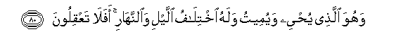
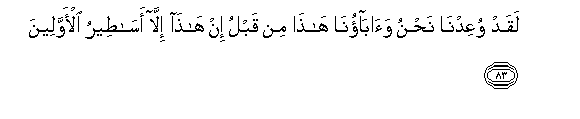
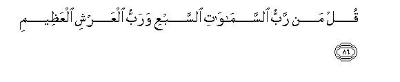
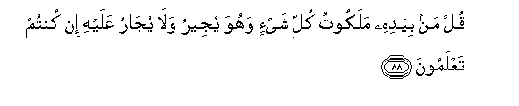
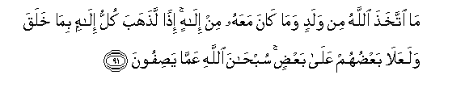

  
[Intangible Textual Heritage](../../index)  [Islam](../index.md) 
[Index](index.md)   
[Hypertext Qur'an](../htq/index)  [Unicode](../uq/023.htm#023_078.md) 
[Palmer](../sbe09/023)  [Pickthall](../pick/023.htm#023_078.md)  [Yusuf Ali
English](../yaq/yaq023)  [Rodwell](../qr/023.md)   
  
[Sūra XXIII.: Mu-minūn, or The Believers. Index](023.md)  
  [Previous](02304)  [Next](02306.md) 

------------------------------------------------------------------------

  
*The Holy Quran*, tr. by Yusuf Ali, \[1934\], at Intangible Textual
Heritage

------------------------------------------------------------------------

# Sūra XXIII.: Mu-minūn, or The Believers.

### Section 5

------------------------------------------------------------------------

78. Wahuwa alla<u>th</u>ee anshaa lakumu a**l**ssamAAa
wa**a**l-ab<u>sa</u>ra wa**a**l-af-idata qaleelan m<u>a</u>
tashkuroon**a**

78\. It is He Who has created  
For you (the faculties of)  
Hearing, sight, feeling  
And understanding: little thanks  
It is ye give!

------------------------------------------------------------------------

79. Wahuwa alla<u>th</u>ee <u>th</u>araakum fee al-ar<u>d</u>i wa-ilayhi
tu<u>h</u>sharoon**a**

79\. And He Has multiplied you  
Through the earth, and to Him  
Shall ye be gathered back.

------------------------------------------------------------------------

80. Wahuwa alla<u>th</u>ee yu<u>h</u>yee wayumeetu walahu
ikhtil<u>a</u>fu allayli wa**al**nnah<u>a</u>ri afal<u>a</u>
taAAqiloon**a**

80\. It is He Who gives  
Life and death, and to Him  
(Is due) the alternation  
Of Night and Day:  
Will ye not then understand?

------------------------------------------------------------------------

81. Bal q<u>a</u>loo mithla m<u>a</u> q<u>a</u>la al-awwaloon**a**

81\. On the contrary they say  
Things similar to what  
The ancients said.

------------------------------------------------------------------------

82. Q<u>a</u>loo a-i<u>tha</u> mitn<u>a</u> wakunn<u>a</u>
tur<u>a</u>ban waAAi*<u>th</u>*<u>a</u>man a-inn<u>a</u>
lamabAAoothoon**a**

82\. They say: "What! When we  
Die and become dust and bones,  
Could we really be  
Raised up again?

------------------------------------------------------------------------

83. Laqad wuAAidn<u>a</u> na<u>h</u>nu wa<u>a</u>b<u>a</u>on<u>a</u>
h<u>atha</u> min qablu in h<u>atha</u> ill<u>a</u> as<u>at</u>eeru
al-awwaleen**a**

83\. "Such things have been promised  
To us and to our fathers  
Before! They are nothing  
But tales of the ancients!"

------------------------------------------------------------------------

84. Qul limani al-ar<u>d</u>u waman feeh<u>a</u> in kuntum
taAAlamoon**a**

84\. Say: "To whom belong  
The earth and all beings therein?  
(Say) if ye know!"

------------------------------------------------------------------------

85. Sayaqooloona lill<u>a</u>hi qul afal<u>a</u>
ta<u>th</u>akkaroon**a**

85\. They will say, "To God!"  
Say: "Yet will ye not  
Receive admonition?"

------------------------------------------------------------------------

86. Qul man rabbu a**l**ssam<u>a</u>w<u>a</u>ti a**l**ssabAAi warabbu
alAAarshi alAAa*<u>th</u>*eem**i**

86\. Say: "Who is the Lord  
Of the seven heavens,  
And the Lord of the Throne  
(Of Glory) Supreme?"

------------------------------------------------------------------------

87. Sayaqooloona lill<u>a</u>hi qul afal<u>a</u> tattaqoon**a**

87\. They will say, "(They belong)  
To God." Say: "Will ye not  
Then be filled with awe?"

------------------------------------------------------------------------

88. Qul man biyadihi malakootu kulli shay-in wahuwa yujeeru wal<u>a</u>
yuj<u>a</u>ru AAalayhi in kuntum taAAlamoon**a**

88\. Say: "Who is it in whose  
Hands is the governance  
Of all things,—who protects  
(All), but is not protected  
(Of any)? (Say) if ye know."

------------------------------------------------------------------------

89. Sayaqooloona lill<u>a</u>hi qul faann<u>a</u> tus<u>h</u>aroon**a**

89\. They will say, "(It belongs)  
To God." Say: "Then how  
Are ye deluded?"

------------------------------------------------------------------------

90. Bal atayn<u>a</u>hum bi**a**l<u>h</u>aqqi wa-innahum
lak<u>ath</u>iboon**a**

90\. We have sent them the Truth:  
But they indeed practise Falsehood!

------------------------------------------------------------------------

91. M<u>a</u> ittakha<u>th</u>a All<u>a</u>hu min waladin wam<u>a</u>
k<u>a</u>na maAAahu min il<u>a</u>hin i<u>th</u>an la<u>th</u>ahaba
kullu il<u>a</u>hin bim<u>a</u> khalaqa walaAAal<u>a</u>
baAA<u>d</u>uhum AAal<u>a</u> baAA<u>d</u>in sub<u>ha</u>na
All<u>a</u>hi AAamm<u>a</u> ya<u>s</u>ifoon**a**

91\. No son did God beget,  
Nor is there any god  
Along with Him: (if there were  
Many gods), behold, each god  
Would have taken away  
What he had created,  
And some would have  
Lorded it over others!  
Glory to God! (He is free)  
From the (sort of) things  
They attribute to Him!

------------------------------------------------------------------------

92. AA<u>a</u>limi alghaybi wa**al**shshah<u>a</u>dati
fataAA<u>a</u>l<u>a</u> AAamm<u>a</u> yushrikoon**a**

92\. He knows what is hidden  
And what is open: too high  
Is He for the partners  
They attribute to Him!

------------------------------------------------------------------------

[Next: Section 6 (93-118)](02306.md)

