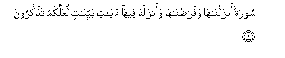
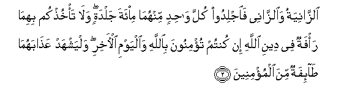
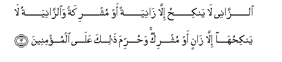
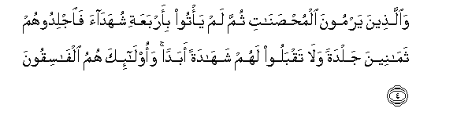
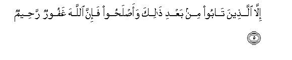
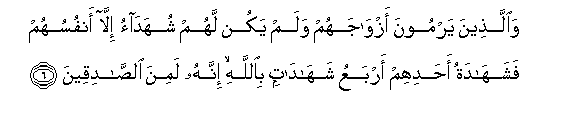
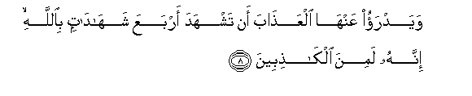

  
[Intangible Textual Heritage](../../index)  [Islam](../index.md) 
[Index](index.md)   
[Hypertext Qur'an](../htq/index)  [Unicode](../uq/024.htm#024_001.md) 
[Palmer](../sbe09/024)  [Pickthall](../pick/024.htm#024_001.md)  [Yusuf Ali
English](../yaq/yaq024)  [Rodwell](../qr/024.md)   
  
[Sūra XXIV.: Nūr, or Light. Index](024.md)  
  [Previous](02306)  [Next](02402.md) 

------------------------------------------------------------------------

  
*The Holy Quran*, tr. by Yusuf Ali, \[1934\], at Intangible Textual
Heritage

------------------------------------------------------------------------

# Sūra XXIV.: Nūr, or Light.

### Section 1

1. Sooratun anzaln<u>a</u>h<u>a</u> wafara<u>d</u>n<u>a</u>h<u>a</u>
waanzaln<u>a</u> feeh<u>a</u> <u>a</u>y<u>a</u>tin bayyin<u>a</u>tin
laAAallakum ta<u>th</u>akkaroon**a**

1\. A Sūra which We  
Have sent down and  
Which We have ordained:  
In it have We sent down  
Clear Signs, in order that  
Ye may receive admonition.

------------------------------------------------------------------------

2. A**l**zz<u>a</u>niyatu wa**al**zz<u>a</u>nee fa**i**jlidoo kulla
w<u>ah</u>idin minhum<u>a</u> mi-ata jaldatin wal<u>a</u>
ta/khu<u>th</u>kum bihim<u>a</u> ra/fatun fee deeni All<u>a</u>hi in
kuntum tu/minoona bi**A**ll<u>a</u>hi wa**a**lyawmi al-<u>a</u>khiri
walyashhad AAa<u>tha</u>bahum<u>a</u> <u>ta</u>-ifatun mina
almu/mineen**a**

2\. The woman and the man  
Guilty of adultery or fornication,—  
Flog each of them  
With a hundred stripes:  
Let not compassion move you  
In their case, in a matter  
Prescribed by God, if ye believe  
In God and the Last Day:  
And let a party  
Of the Believers  
Witness their punishment.

------------------------------------------------------------------------

3. A**l**zz<u>a</u>nee l<u>a</u> yanki<u>h</u>u ill<u>a</u>
z<u>a</u>niyatan aw mushrikatan wa**al**zz<u>a</u>niyatu l<u>a</u>
yanki<u>h</u>uh<u>a</u> ill<u>a</u> z<u>a</u>nin aw mushrikun
wa<u>h</u>urrima <u>tha</u>lika AAal<u>a</u> almu/mineen**a**

3\. Let no man guilty of  
Adultery or fornication marry  
Any but a woman  
Similarly guilty, or an Unbeliever:  
Nor let any but such a man  
Or an Unbeliever  
Marry such a woman:  
To the Believers such a thing  
Is forbidden.

------------------------------------------------------------------------

4. Wa**a**lla<u>th</u>eena yarmoona almu<u>hs</u>an<u>a</u>ti thumma lam
ya/too bi-arbaAAati shuhad<u>a</u>a fa**i**jlidoohum tham<u>a</u>neena
jaldatan wal<u>a</u> taqbaloo lahum shah<u>a</u>datan abadan
waol<u>a</u>-ika humu alf<u>a</u>siqoon**a**

4\. And those who launch  
A charge against chaste women,  
And produce not four witnesses  
(To support their allegations),—  
Flog them with eighty stripes;  
And reject their evidence  
Ever after: for such men  
Are wicked transgressors;—

------------------------------------------------------------------------

5. Ill<u>a</u> alla<u>th</u>eena t<u>a</u>boo min baAAdi <u>tha</u>lika
waa<u>s</u>la<u>h</u>oo fa-inna All<u>a</u>ha ghafoorun
ra<u>h</u>eem**un**

5\. Unless they repent thereafter  
And mend (their conduct);  
For God is Oft-Forgiving,  
Most Merciful.

------------------------------------------------------------------------

6. Wa**a**lla<u>th</u>eena yarmoona azw<u>a</u>jahum walam yakun lahum
shuhad<u>a</u>o ill<u>a</u> anfusuhum fashah<u>a</u>datu a<u>h</u>adihim
arbaAAu shah<u>a</u>d<u>a</u>tin bi**A**ll<u>a</u>hi innahu lamina
a**l**<u>ssa</u>diqeen**a**

6\. And for those who launch  
A charge against their spouses,  
And have (in support)  
No evidence but their own,—  
Their solitary evidence  
(Can be received) if they  
Bear witness four times  
(With an oath) by God  
That they are solemnly  
Telling the truth;

------------------------------------------------------------------------

7. Wa**a**lkh<u>a</u>misatu anna laAAnata All<u>a</u>hi AAalayhi in
k<u>a</u>na mina alk<u>ath</u>ibeen**a**

7\. And the fifth (oath)  
(Should be) that they solemnly  
Invoke the curse of God  
On themselves if they  
Tell a lie.

------------------------------------------------------------------------

8. Wayadrao AAanh<u>a</u> alAAa<u>tha</u>ba an tashhada arbaAAa
shah<u>a</u>d<u>a</u>tin bi**A**ll<u>a</u>hi innahu lamina
alk<u>ath</u>ibeen**a**

8\. But it would avert  
The punishment from the wife,  
If she bears witness  
Four times (with an oath)  
By God, that (her husband)  
Is telling a lie;

------------------------------------------------------------------------

9. Wa**a**lkh<u>a</u>misata anna gha<u>d</u>aba All<u>a</u>hi
AAalayh<u>a</u> in k<u>a</u>na mina a**l**<u>ssa</u>diqeen**a**

9\. And the fifth (oath)  
Should be that she solemnly  
Invokes the wrath of God  
On herself if (her accuser)  
Is telling the truth.

------------------------------------------------------------------------

10. Walawl<u>a</u> fa<u>d</u>lu All<u>a</u>hi AAalaykum
wara<u>h</u>matuhu waanna All<u>a</u>ha taww<u>a</u>bun
<u>h</u>akeem**un**

10\. If it were not  
For God's grace and mercy  
On you, and that God  
Is Oft-Returning,  
Full of wisdom,  
(Ye would be ruined indeed).

------------------------------------------------------------------------

[Next: Section 2 (11-20)](02402.md)

