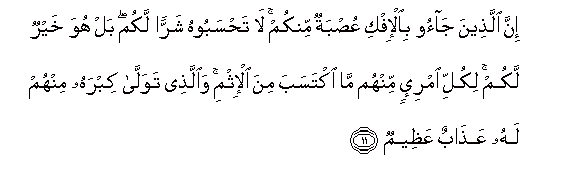
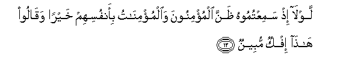
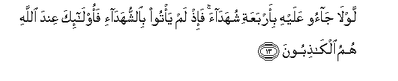
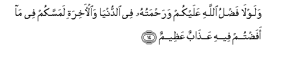
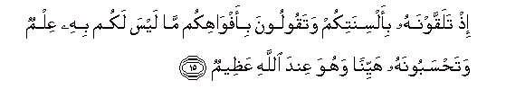
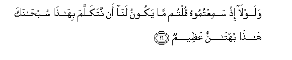
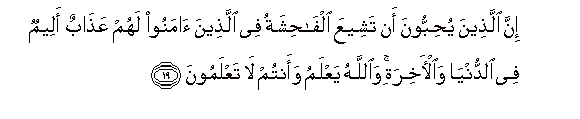

  
[Intangible Textual Heritage](../../index)  [Islam](../index.md) 
[Index](index.md)   
[Hypertext Qur'an](../htq/index)  [Unicode](../uq/024.htm#024_011.md) 
[Palmer](../sbe09/024)  [Pickthall](../pick/024.htm#024_011.md)  [Yusuf Ali
English](../yaq/yaq024)  [Rodwell](../qr/024.md)   
  
[Sūra XXIV.: Nūr, or Light. Index](024.md)  
  [Previous](02401)  [Next](02403.md) 

------------------------------------------------------------------------

  
*The Holy Quran*, tr. by Yusuf Ali, \[1934\], at Intangible Textual
Heritage

------------------------------------------------------------------------

# Sūra XXIV.: Nūr, or Light.

### Section 2

------------------------------------------------------------------------

11. Inna alla<u>th</u>eena j<u>a</u>oo bi**a**l-ifki AAu<u>s</u>batun
minkum l<u>a</u> ta<u>h</u>saboohu sharran lakum bal huwa khayrun lakum
likulli imri-in minhum m<u>a</u> iktasaba mina al-ithmi
wa**a**lla<u>th</u>ee tawall<u>a</u> kibrahu minhum lahu
AAa<u>tha</u>bun AAa*<u>th</u>*eem**un**

11\. Those who brought forward  
The lie are a body  
Among yourselves: think it not  
To be an evil to you;  
On the contrary it is good  
For you: to every man  
Among them (will come  
The punishment) of the sin  
That he earned, and to him  
Who took on himself the lead  
Among them, will be  
A Penalty grievous.

------------------------------------------------------------------------

12. Lawl<u>a</u> i<u>th</u> samiAAtumoohu *<u>th</u>*anna almu/minoona
wa**a**lmu/min<u>a</u>tu bi-anfusihim khayran waq<u>a</u>loo
h<u>atha</u> ifkun mubeen**un**

12\. Why did not the Believers  
Men and women—when ye  
Heard of the affair,—put  
The best construction on it  
In their own minds  
And say, "This (charge)  
Is an obvious lie"?

------------------------------------------------------------------------

13. Lawl<u>a</u> j<u>a</u>oo AAalayhi bi-arbaAAati shuhad<u>a</u>a
fa-i<u>th</u> lam ya/too bi**al**shshuhad<u>a</u>-i faol<u>a</u>-ika
AAinda All<u>a</u>hi humu alk<u>ath</u>iboon**a**

13\. Why did they not bring  
Four witnesses to prove it?  
When they have not brought  
The witnesses, such men,  
In the sight of God,  
(Stand forth) themselves as liars!

------------------------------------------------------------------------

14. Walawl<u>a</u> fa<u>d</u>lu All<u>a</u>hi AAalaykum
wara<u>h</u>matuhu fee a**l**dduny<u>a</u> wa**a**l-<u>a</u>khirati
lamassakum fee m<u>a</u> afa<u>d</u>tum feehi AAa<u>tha</u>bun
AAa*<u>th</u>*eem**un**

14\. Were it not for the grace  
And mercy of God on you,  
In this world and the Hereafter,  
A grievous penalty would have  
Seized you in that ye rushed  
Glibly into this affair.

------------------------------------------------------------------------

15. I<u>th</u> talaqqawnahu bi-alsinatikum wataqooloona
bi-afw<u>a</u>hikum m<u>a</u> laysa lakum bihi AAilmun
wata<u>h</u>saboonahu hayyinan wahuwa AAinda All<u>a</u>hi
AAa*<u>th</u>*eem**un**

15\. Behold, ye received it  
On your tongues,  
And said out of your mouths  
Things of which ye had  
No knowledge; and ye thought  
It to be a light matter,  
While it was most serious  
In the sight of God.

------------------------------------------------------------------------

16. Walawl<u>a</u> i<u>th</u> samiAAtumoohu qultum m<u>a</u> yakoonu
lan<u>a</u> an natakallama bih<u>atha</u> sub<u>ha</u>naka h<u>atha</u>
buht<u>a</u>nun AAa*<u>th</u>*eem**un**

16\. And why did ye not,  
When ye heard it, say?—  
"It is not right of us  
To speak of this:  
Glory to God! this is  
A most serious slander!"

------------------------------------------------------------------------

17. YaAAi*<u>th</u>*ukumu All<u>a</u>hu an taAAoodoo limithlihi abadan
in kuntum mu/mineen**a**

17\. God doth admonish you,  
That ye may never repeat  
Such (conduct), if ye  
Are (true) Believers.

------------------------------------------------------------------------

18. Wayubayyinu All<u>a</u>hu lakumu al-<u>a</u>y<u>a</u>ti
wa**A**ll<u>a</u>hu AAaleemun <u>h</u>akeem**un**

18\. And God makes the Signs  
Plain to you: for God  
Is full of knowledge and wisdom.

------------------------------------------------------------------------

19. Inna alla<u>th</u>eena yu<u>h</u>ibboona an tasheeAAa
alf<u>ah</u>ishatu fee alla<u>th</u>eena <u>a</u>manoo lahum
AAa<u>tha</u>bun aleemun fee a**l**dduny<u>a</u>
wa**a**l-<u>a</u>khirati wa**A**ll<u>a</u>hu yaAAlamu waantum l<u>a</u>
taAAlamoon**a**

19\. Those who love (to see)  
Scandal published broadcast  
Among the Believers, will have  
A grievous Penalty in this life  
And in the Hereafter: God  
Knows, and ye know not.

------------------------------------------------------------------------

20. Walawl<u>a</u> fa<u>d</u>lu All<u>a</u>hi AAalaykum
wara<u>h</u>matuhu waanna All<u>a</u>ha raoofun ra<u>h</u>eem**un**

20\. Were it not for the grace  
And mercy of God on you,  
And that God is  
Full of kindness and mercy,  
(Ye would be ruined indeed).

------------------------------------------------------------------------

[Next: Section 3 (21-26)](02403.md)

