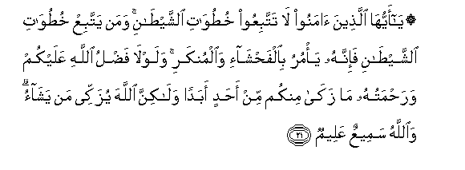
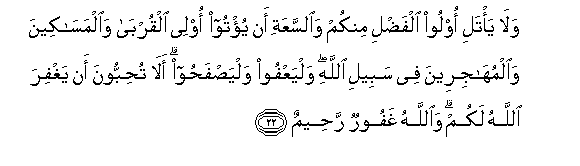
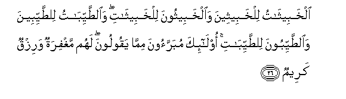

  
[Intangible Textual Heritage](../../index)  [Islam](../index) 
[Index](index)   
[Hypertext Qur'an](../htq/index)  [Unicode](../uq/024.htm#024_021) 
[Palmer](../sbe09/024)  [Pickthall](../pick/024.htm#024_021)  [Yusuf Ali
English](../yaq/yaq024)  [Rodwell](../qr/024)   
  
[Sūra XXIV.: Nūr, or Light. Index](024)  
  [Previous](02402)  [Next](02404) 

------------------------------------------------------------------------

  
*The Holy Quran*, tr. by Yusuf Ali, \[1934\], at Intangible Textual
Heritage

------------------------------------------------------------------------

# Sūra XXIV.: Nūr, or Light.

### Section 3

------------------------------------------------------------------------

21. Y<u>a</u> ayyuh<u>a</u> alla<u>th</u>eena <u>a</u>manoo l<u>a</u>
tattabiAAoo khu<u>t</u>uw<u>a</u>ti a**l**shshay<u>ta</u>ni waman
yattabiAA khu<u>t</u>uw<u>a</u>ti a**l**shshay<u>ta</u>ni fa-innahu
ya/muru bi**a**lfa<u>h</u>sh<u>a</u>-i wa**a**lmunkari walawl<u>a</u>
fa<u>d</u>lu All<u>a</u>hi AAalaykum wara<u>h</u>matuhu m<u>a</u>
zak<u>a</u> minkum min a<u>h</u>adin abadan wal<u>a</u>kinna
All<u>a</u>ha yuzakkee man yash<u>a</u>o wa**A**ll<u>a</u>hu sameeAAun
AAaleem**un**

21\. O ye who believe!  
Follow not Satan's footsteps:  
If any will follow the footsteps  
Of Satan, he will (but) command  
What is shameful and wrong:  
And were it not for the grace  
And mercy of God on you.  
Not one of you would ever  
Have been pure: but God  
Doth purify whom He pleases:  
And God is One Who  
Hears and knows (all things).

------------------------------------------------------------------------

22. Wal<u>a</u> ya/tali oloo alfa<u>d</u>li minkum wa**al**ssaAAati an
yu/too olee alqurb<u>a</u> wa**a**lmas<u>a</u>keena
wa**a**lmuh<u>a</u>jireena fee sabeeli All<u>a</u>hi walyaAAfoo
walya<u>s</u>fa<u>h</u>oo al<u>a</u> tu<u>h</u>ibboona an yaghfira
All<u>a</u>hu lakum wa**A**ll<u>a</u>hu ghafoorun ra<u>h</u>eem**un**

22\. Let not those among you  
Who are endued with grace  
And amplitude of means  
Resolve by oath against helping  
Their kinsmen, those in want,  
And those who have left  
Their homes in God's cause:  
Let them forgive and overlook,  
Do you not wish  
That God should forgive you?  
For God is Oft-Forgiving,  
Most Merciful.

------------------------------------------------------------------------

23. Inna alla<u>th</u>eena yarmoona almu<u>hs</u>an<u>a</u>ti
algh<u>a</u>fil<u>a</u>ti almu/min<u>a</u>ti luAAinoo fee
a**l**dduny<u>a</u> wa**a**l-<u>a</u>khirati walahum AAa<u>tha</u>bun
AAa*<u>th</u>*eem**un**

23\. Those who slander chaste women,  
Indiscreet but believing,  
Are cursed in this life  
And in the Hereafter:  
For them is a grievous Penalty,—

------------------------------------------------------------------------

24. Yawma tashhadu AAalayhim alsinatuhum waaydeehim waarjuluhum
bim<u>a</u> k<u>a</u>noo yaAAmaloon**a**

24\. On the Day when their tongues,  
Their hands, and their feet  
Will bear witness against them  
As to their actions.

------------------------------------------------------------------------

25. Yawma-i<u>th</u>in yuwaffeehimu All<u>a</u>hu deenahumu
al<u>h</u>aqqa wayaAAlamoona anna All<u>a</u>ha huwa al<u>h</u>aqqu
almubeen**u**

25\. On that Day God  
Will pay them back  
(All) their just dues,  
And they will realise  
That God is  
The (very) Truth,  
That makes all things manifest.

------------------------------------------------------------------------

26. Alkhabeeth<u>a</u>tu lilkhabeetheena wa**a**lkhabeethoona
lilkhabeeth<u>a</u>ti wa**al**<u>tt</u>ayyib<u>a</u>tu
li**l**<u>tt</u>ayyibeena wa**al**<u>tt</u>ayyiboona
li**l**<u>tt</u>ayyib<u>a</u>ti ol<u>a</u>-ika mubarraoona mimm<u>a</u>
yaqooloona lahum maghfiratun warizqun kareem**un**

26\. Women impure are for men impure  
And men impure for women impure  
And women of purity  
Are for men of purity,  
And men of purity  
Are for women of purity:  
These are not affected  
By what people say:  
For them there is forgiveness,  
And a provision honourable.

------------------------------------------------------------------------

[Next: Section 4 (27-34)](02404)

