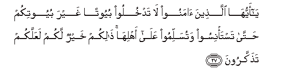
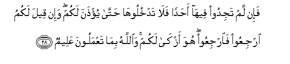
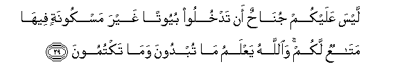
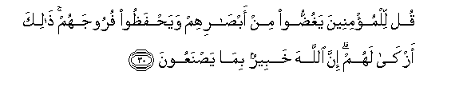
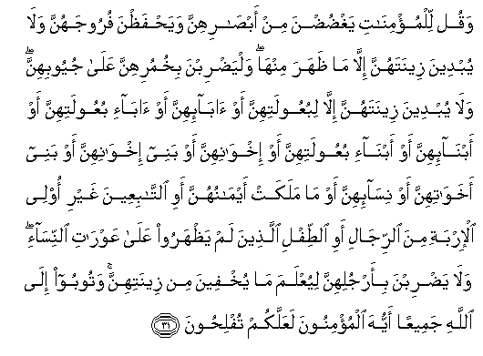
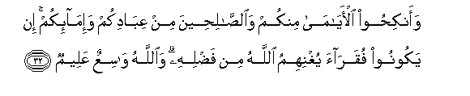
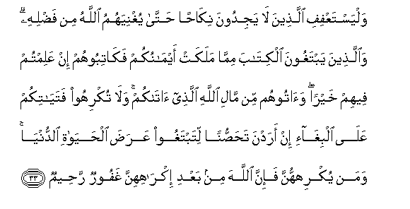
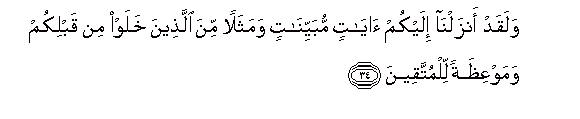

  
[Intangible Textual Heritage](../../index)  [Islam](../index) 
[Index](index)   
[Hypertext Qur'an](../htq/index)  [Unicode](../uq/024.htm#024_027) 
[Palmer](../sbe09/024)  [Pickthall](../pick/024.htm#024_027)  [Yusuf Ali
English](../yaq/yaq024)  [Rodwell](../qr/024)   
  
[Sūra XXIV.: Nūr, or Light. Index](024)  
  [Previous](02403)  [Next](02405) 

------------------------------------------------------------------------

  
*The Holy Quran*, tr. by Yusuf Ali, \[1934\], at Intangible Textual
Heritage

------------------------------------------------------------------------

# Sūra XXIV.: Nūr, or Light.

### Section 4

------------------------------------------------------------------------

27. Y<u>a</u> ayyuh<u>a</u> alla<u>th</u>eena <u>a</u>manoo l<u>a</u>
tadkhuloo buyootan ghayra buyootikum <u>h</u>att<u>a</u> tasta/nisoo
watusallimoo AAal<u>a</u> ahlih<u>a</u> <u>tha</u>likum khayrun lakum
laAAallakum ta<u>th</u>akkaroon**a**

27\. O ye who believe!  
Enter not houses other than  
Your own, until ye have  
Asked permission and saluted  
Those in them: that is  
Best for you, in order that  
Ye may heed (what is seemly).

------------------------------------------------------------------------

28. Fa-in lam tajidoo feeh<u>a</u> a<u>h</u>adan fal<u>a</u>
tadkhulooh<u>a</u> <u>h</u>att<u>a</u> yu/<u>th</u>ana lakum wa-in qeela
lakumu irjiAAoo fa**i**rjiAAoo huwa azk<u>a</u> lakum
wa**A**ll<u>a</u>hu bim<u>a</u> taAAmaloona AAaleem**un**

28\. If ye find no one  
In the house, enter not  
Until permission is given  
To you: if ye are asked  
To go back, go back:  
That makes for greater purity  
For yourselves: and God  
Knows well all that ye do.

------------------------------------------------------------------------

29. Laysa AAalaykum jun<u>ah</u>un an tadkhuloo buyootan ghayra
maskoonatin feeh<u>a</u> mat<u>a</u>AAun lakum wa**A**ll<u>a</u>hu
yaAAlamu m<u>a</u> tubdoona wam<u>a</u> taktumoon**a**

29\. It is no fault on your part  
To enter houses not used  
For living in, which serve  
Some (other) use for you:  
And God has knowledge  
Of what ye reveal  
And what ye conceal.

------------------------------------------------------------------------

30. Qul lilmu/mineena yaghu<u>dd</u>oo min ab<u>sa</u>rihum
waya<u>h</u>fa*<u>th</u>*oo furoojahum <u>tha</u>lika azk<u>a</u> lahum
inna All<u>a</u>ha khabeerun bim<u>a</u> ya<u>s</u>naAAoon**a**

30\. Say to the believing men  
That they should lower  
Their gaze and guard  
Their modesty: that will make  
For greater purity for them:  
And God is well acquainted  
With all that they do.

------------------------------------------------------------------------

31. Waqul lilmu/min<u>a</u>ti yagh<u>d</u>u<u>d</u>na min
ab<u>sa</u>rihinna waya<u>h</u>fa*<u>th</u>*na furoojahunna wal<u>a</u>
yubdeena zeenatahunna ill<u>a</u> m<u>a</u> *<u>th</u>*ahara
minh<u>a</u> walya<u>d</u>ribna bikhumurihinna AAal<u>a</u> juyoobihinna
wal<u>a</u> yubdeena zeenatahunna ill<u>a</u> libuAAoolatihinna aw
<u>a</u>b<u>a</u>-ihinna aw <u>a</u>b<u>a</u>-i buAAoolatihinna aw
abn<u>a</u>-ihinna aw abn<u>a</u>-i buAAoolatihinna aw
ikhw<u>a</u>nihinna aw banee ikhw<u>a</u>nihinna aw banee
akhaw<u>a</u>tihinna aw nis<u>a</u>-ihinna aw m<u>a</u> malakat
aym<u>a</u>nuhunna awi a**l**tt<u>a</u>biAAeena ghayri olee al-irbati
mina a**l**rrij<u>a</u>li awi a**l**<u>tt</u>ifli alla<u>th</u>eena lam
ya*<u>th</u>*haroo AAal<u>a</u> AAawr<u>a</u>ti a**l**nnis<u>a</u>-i
wal<u>a</u> ya<u>d</u>ribna bi-arjulihinna liyuAAlama m<u>a</u>
yukhfeena min zeenatihinna watooboo il<u>a</u> All<u>a</u>hi jameeAAan
ayyuh<u>a</u> almu/minoona laAAallakum tufli<u>h</u>oon**a**

31\. And say to the believing women  
That they should lower  
Their gaze and guard  
Their modesty; that they  
Should not display their  
Beauty and ornaments except  
What (must ordinarily) appear  
Thereof; that they should  
Draw their veils over  
Their bosoms and not display  
Their beauty except  
To their husbands, their fathers,  
Their husbands’ fathers, their sons,  
Their husbands’ sons,  
Their brothers or their brothers’ sons,  
Or their sisters’ sons,  
Or their women, or the slaves  
Whom their right hands  
Possess, or male servants  
Free of physical needs,  
Or small children who  
Have no sense of the shame  
Of sex; and that they  
Should not strike their feet  
In order to draw attention  
To their hidden ornaments.  
And O ye Believers!  
Turn ye all together  
Towards God, that ye  
May attain Bliss.

------------------------------------------------------------------------

32. Waanki<u>h</u>oo al-ay<u>a</u>m<u>a</u> minkum
wa**al**<u>ssa</u>li<u>h</u>eena min AAib<u>a</u>dikum
wa-im<u>a</u>-ikum in yakoonoo fuqar<u>a</u>a yughnihimu All<u>a</u>hu
min fa<u>d</u>lihi wa**A**ll<u>a</u>hu w<u>a</u>siAAun AAaleem**un**

32\. Marry those among you  
Who are single, or  
The virtuous ones among  
Your slaves, male or female:  
If they are in poverty,  
God will give them  
Means out of His grace:  
For God encompasseth all,  
And He knoweth all things.

------------------------------------------------------------------------

33. WalyastaAAfifi alla<u>th</u>eena l<u>a</u> yajidoona nik<u>ah</u>an
<u>h</u>att<u>a</u> yughniyahumu All<u>a</u>hu min fa<u>d</u>lihi
wa**a**lla<u>th</u>eena yabtaghoona alkit<u>a</u>ba mimm<u>a</u> malakat
aym<u>a</u>nukum fak<u>a</u>tiboohum in AAalimtum feehim khayran
wa<u>a</u>toohum min m<u>a</u>li All<u>a</u>hi alla<u>th</u>ee
<u>a</u>t<u>a</u>kum wal<u>a</u> tukrihoo fatay<u>a</u>tikum
AAal<u>a</u> albigh<u>a</u>-i in aradna ta<u>h</u>a<u>ss</u>unan
litabtaghoo AAara<u>d</u>a al<u>h</u>ay<u>a</u>ti a**l**dduny<u>a</u>
waman yukrihhunna fa-inna All<u>a</u>ha min baAAdi ikr<u>a</u>hihinna
ghafoorun ra<u>h</u>eem**un**

33\. Let those who find not  
The wherewithal for marriage  
Keep themselves chaste, until  
God gives them means  
Out of His grace.  
And if any of your slaves  
Ask for a deed in writing  
(To enable them to earn  
Their freedom for a certain sum),  
Give them such a deed  
If ye know any good  
In them; yea, give them  
Something yourselves  
Out of the means which  
God has given to you.  
But force not your maids  
To prostitution when they desire  
Chastity, in order that ye  
May make a gain  
In the goods of this life.  
But if anyone compels them,  
Yet, after such compulsion,  
Is God Oft-Forgiving,  
Most Merciful (to them).

------------------------------------------------------------------------

34. Walaqad anzaln<u>a</u> ilaykum <u>a</u>y<u>a</u>tin
mubayyin<u>a</u>tin wamathalan mina alla<u>th</u>eena khalaw min
qablikum wamawAAi*<u>th</u>*atan lilmuttaqeen**a**

34\. We have already sent down  
To you verses making things  
Clear, an illustration from (the story  
Of) people who passed away  
Before you, and an admonition  
For those who fear (God).

------------------------------------------------------------------------

[Next: Section 5 (35-40)](02405)

