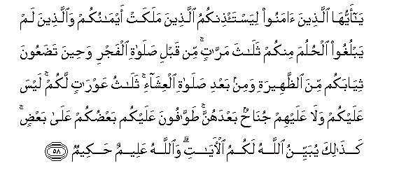
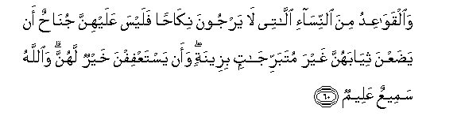
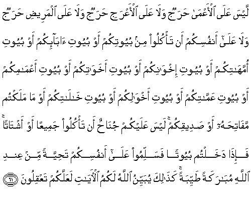

  
[Intangible Textual Heritage](../../index)  [Islam](../index.md) 
[Index](index.md)   
[Hypertext Qur'an](../htq/index)  [Unicode](../uq/024.htm#024_058.md) 
[Palmer](../sbe09/024)  [Pickthall](../pick/024.htm#024_058.md)  [Yusuf Ali
English](../yaq/yaq024)  [Rodwell](../qr/024.md)   
  
[Sūra XXIV.: Nūr, or Light. Index](024.md)  
  [Previous](02407)  [Next](02409.md) 

------------------------------------------------------------------------

  
*The Holy Quran*, tr. by Yusuf Ali, \[1934\], at Intangible Textual
Heritage

------------------------------------------------------------------------

# Sūra XXIV.: Nūr, or Light.

### Section 8

------------------------------------------------------------------------

58. Y<u>a</u> ayyuh<u>a</u> alla<u>th</u>eena <u>a</u>manoo
liyasta/<u>th</u>inkumu alla<u>th</u>eena malakat aym<u>a</u>nukum
wa**a**lla<u>th</u>eena lam yablughoo al<u>h</u>uluma minkum
thal<u>a</u>tha marr<u>a</u>tin min qabli <u>s</u>al<u>a</u>ti alfajri
wa<u>h</u>eena ta<u>d</u>aAAoona thiy<u>a</u>bakum mina
a**l***<u>thth</u>*aheerati wamin baAAdi <u>s</u>al<u>a</u>ti
alAAish<u>a</u>-i thal<u>a</u>thu AAawr<u>a</u>tin lakum laysa AAalaykum
wal<u>a</u> AAalayhim jun<u>ah</u>un baAAdahunna
<u>t</u>aww<u>a</u>foona AAalaykum baAA<u>d</u>ukum AAal<u>a</u>
baAA<u>d</u>in ka<u>tha</u>lika yubayyinu All<u>a</u>hu lakumu
al-<u>a</u>y<u>a</u>ti wa**A**ll<u>a</u>hu AAaleemun <u>h</u>akeem**un**

58\. O ye who believe!  
Let those whom your right hands  
Possess, and the (children) among you  
Who have not come of age  
Ask your permission (before  
They come to your presence),  
On three occasions: before  
Morning prayer; the while  
Ye doff your clothes  
For the noonday heat;  
And after the late-night prayer:  
These are your three times  
Of undress: outside those times  
It is not wrong for you  
Or for them to move about  
Attending to each other:  
Thus does God make clear  
The Signs to you: for God  
Is full of knowledge and wisdom.

------------------------------------------------------------------------

59. Wa-i<u>tha</u> balagha al-a<u>t</u>f<u>a</u>lu minkumu
al<u>h</u>uluma falyasta/<u>th</u>inoo kam<u>a</u> ista/<u>th</u>ana
alla<u>th</u>eena min qablihim ka<u>tha</u>lika yubayyinu All<u>a</u>hu
lakum <u>a</u>y<u>a</u>tihi wa**A**ll<u>a</u>hu AAaleemun
<u>h</u>akeem**un**

59\. But when the children among you  
Come of age, let them (also)  
Ask for permission, as do those  
Senior to them (in age):  
Thus does God make clear  
His Signs to you: for God  
Is full of knowledge and wisdom.

------------------------------------------------------------------------

60. Wa**a**lqaw<u>a</u>AAidu mina a**l**nnis<u>a</u>-i all<u>a</u>tee
l<u>a</u> yarjoona nik<u>ah</u>an falaysa AAalayhinna jun<u>ah</u>un an
ya<u>d</u>aAAna thiy<u>a</u>bahunna ghayra mutabarrij<u>a</u>tin
bizeenatin waan yastaAAfifna khayrun lahunna wa**A**ll<u>a</u>hu
sameeAAun AAaleem**un**

60\. Such elderly women as are  
Past the prospect of marriage,—  
There is no blame on them  
If they lay aside  
Their (outer) garments, provided  
They make not a wanton display  
Of their beauty: but  
It is best for them  
To be modest: and God  
Is One Who sees and knows  
All things.

------------------------------------------------------------------------

61. Laysa AAal<u>a</u> al-aAAm<u>a</u> <u>h</u>arajun wal<u>a</u>
AAal<u>a</u> al-aAAraji <u>h</u>arajun wal<u>a</u> AAal<u>a</u>
almaree<u>d</u>i <u>h</u>arajun wal<u>a</u> AAal<u>a</u> anfusikum an
ta/kuloo min buyootikum aw buyooti <u>a</u>b<u>a</u>-ikum aw buyooti
ommah<u>a</u>tikum aw buyooti ikhw<u>a</u>nikum aw buyooti
akhaw<u>a</u>tikum aw buyooti aAAm<u>a</u>mikum aw buyooti
AAamm<u>a</u>tikum aw buyooti akhw<u>a</u>likum aw buyooti
kh<u>a</u>l<u>a</u>tikum aw m<u>a</u> malaktum maf<u>a</u>ti<u>h</u>ahu
aw <u>s</u>adeeqikum laysa AAalaykum jun<u>ah</u>un an ta/kuloo
jameeAAan aw asht<u>a</u>tan fa-i<u>tha</u> dakhaltum buyootan
fasallimoo AAal<u>a</u> anfusikum ta<u>h</u>iyyatan min AAindi
All<u>a</u>hi mub<u>a</u>rakatan <u>t</u>ayyibatan ka<u>tha</u>lika
yubayyinu All<u>a</u>hu lakumu al-<u>a</u>y<u>a</u>ti laAAallakum
taAAqiloon**a**

61\. It is no fault in the blind  
Nor in one born lame, nor  
In one afflicted with illness,  
Nor in yourselves, that ye  
Should eat in your own houses,  
Or those of your fathers,  
Or your mothers, or your brothers,  
Or your sisters, or your father's brothers  
Or your father's sisters,  
Or your mother's brothers,  
Or your mother's sisters,  
Or in houses of which  
The keys are in your possession,  
Or in the house of a sincere  
Friend of yours: there is  
No blame on you, whether  
Ye eat in company or  
Separately. But if ye  
Enter houses, salute each other—  
A greeting of blessing  
And purity as from God.  
Thus does God make clear  
The Signs to you: that ye  
May understand.

------------------------------------------------------------------------

[Next: Section 9 (62-64)](02409.md)

