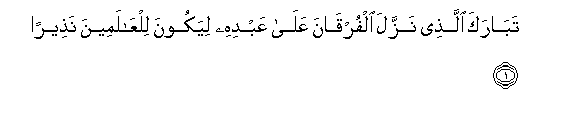
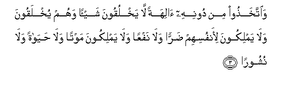
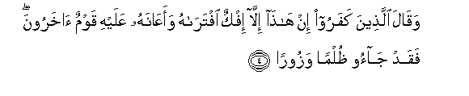
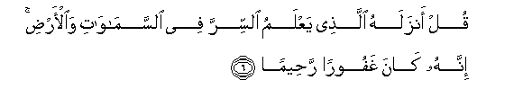
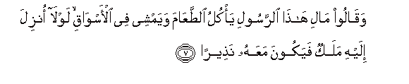
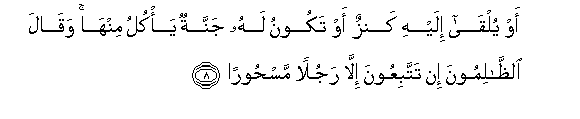
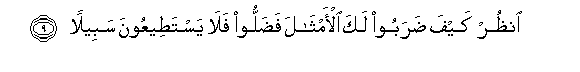

  
[Intangible Textual Heritage](../../index)  [Islam](../index.md) 
[Index](index.md)   
[Hypertext Qur'an](../htq/index)  [Unicode](../uq/025.htm#025_001.md) 
[Palmer](../sbe09/025)  [Pickthall](../pick/025.htm#025_001.md)  [Yusuf Ali
English](../yaq/yaq025)  [Rodwell](../qr/025.md)   
  
[Sūra XXV.: Furqān, or The Criterion. Index](025.md)  
  [Previous](02409)  [Next](02502.md) 

------------------------------------------------------------------------

  
*The Holy Quran*, tr. by Yusuf Ali, \[1934\], at Intangible Textual
Heritage

------------------------------------------------------------------------

# Sūra XXV.: Furqān, or The Criterion.

### Section 1

1. Tab<u>a</u>raka alla<u>th</u>ee nazzala alfurq<u>a</u>na AAal<u>a</u>
AAabdihi liyakoona lilAA<u>a</u>lameena na<u>th</u>eer<u>a</u>**n**

1\. Blessed is He Who  
Sent down the Criterion  
To His Servant, that  
May be an admonition  
To all creatures;—

------------------------------------------------------------------------

2. Alla<u>th</u>ee lahu mulku a**l**ssam<u>a</u>w<u>a</u>ti
wa**a**l-ar<u>d</u>i walam yattakhi<u>th</u> waladan walam yakun lahu
shareekun fee almulki wakhalaqa kulla shay-in faqaddarahu
taqdeer<u>a</u>**n**

2\. He to Whom belongs  
The dominion of the heavens  
And the earth: no son  
Has He begotten, nor has He  
A partner in His dominion:  
It is He Who created  
All things, and ordered them  
In due proportions.

------------------------------------------------------------------------

3. Wa**i**ttakha<u>th</u>oo min doonihi <u>a</u>lihatan l<u>a</u>
yakhluqoona shay-an wahum yukhlaqoona wal<u>a</u> yamlikoona
li-anfusihim <u>d</u>arran wal<u>a</u> nafAAan wal<u>a</u> yamlikoona
mawtan wal<u>a</u> <u>h</u>ay<u>a</u>tan wal<u>a</u>
nushoor<u>a</u>**n**

3\. Yet have they taken,  
Besides Him, gods that can  
Create nothing but are themselves  
Created; that have no control  
Of hurt or good to themselves;  
Nor can they control Death  
Nor Life nor Resurrection.

------------------------------------------------------------------------

4. Waq<u>a</u>la alla<u>th</u>eena kafaroo in h<u>atha</u> ill<u>a</u>
ifkun iftar<u>a</u>hu waaAA<u>a</u>nahu AAalayhi qawmun <u>a</u>kharoona
faqad j<u>a</u>oo *<u>th</u>*ulman wazoor<u>a</u>**n**

4\. But the Misbelievers say:  
"Naught is this but a lie  
Which he has forged,  
And others have helped him  
At it." In truth it is they  
Who have put forward  
An iniquity and a falsehood.

------------------------------------------------------------------------

5. Waq<u>a</u>loo as<u>at</u>eeru al-awwaleena iktatabah<u>a</u> fahiya
tuml<u>a</u> AAalayhi bukratan waa<u>s</u>eel<u>a</u>**n**

5\. And they say: "Tales of  
The ancients, which he has caused  
To be written: and they  
Are dictated before him  
Morning and evening."

------------------------------------------------------------------------

6. Qul anzalahu alla<u>th</u>ee yaAAlamu a**l**ssirra fee
a**l**ssam<u>a</u>w<u>a</u>ti wa**a**l-ar<u>d</u>i innahu k<u>a</u>na
ghafooran ra<u>h</u>eem<u>a</u>**n**

6\. Say: "The (Qur-ān) was sent down  
By Him Who knows  
The Mystery (that is) in the heavens  
And the earth: verily He  
Is Oft-Forgiving, Most Merciful."

------------------------------------------------------------------------

7. Waq<u>a</u>loo m<u>a</u>li h<u>atha</u> a**l**rrasooli ya/kulu
a**l**<u>tt</u>aAA<u>a</u>ma wayamshee fee al-asw<u>a</u>qi lawl<u>a</u>
onzila ilayhi malakun fayakoona maAAahu na<u>th</u>eer<u>a</u>**n**

7\. find they say: "What sort  
Of an apostle is this,  
Who eats food, and walks  
Through the streets? Why  
Has not an angel  
Been sent down to him  
To give admonition with him?

------------------------------------------------------------------------

8. Aw yulq<u>a</u> ilayhi kanzun aw takoonu lahu jannatun ya/kulu
minh<u>a</u> waq<u>a</u>la a**l***<u>thth</u>*<u>a</u>limoona in
tattabiAAoona ill<u>a</u> rajulan mas<u>h</u>oor<u>a</u>**n**

8\. "Or (why) has not a treasure  
Been bestowed on him, or  
Why has he (not) a garden  
For enjoyment?" The wicked  
Say: "Ye follow none other  
Than a man bewitched."

------------------------------------------------------------------------

9. On*<u>th</u>*ur kayfa <u>d</u>araboo laka al-amth<u>a</u>la
fa<u>d</u>alloo fal<u>a</u> yasta<u>t</u>eeAAoona sabeel<u>a</u>**n**

9\. See what kinds of comparisons  
They make for thee!  
But they have gone astray,  
And never a way will they  
Be able to find!

------------------------------------------------------------------------

[Next: Section 2 (10-20)](02502.md)

