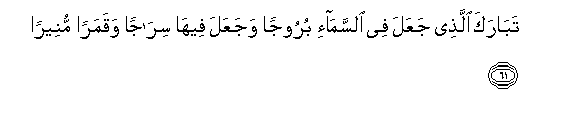
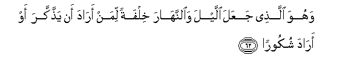
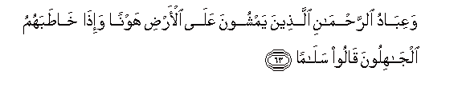
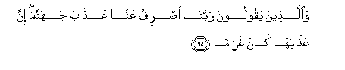
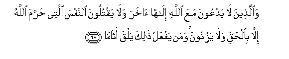
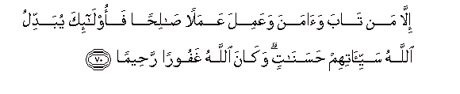
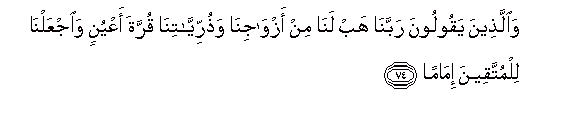
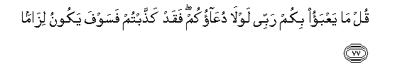

  
[Intangible Textual Heritage](../../index)  [Islam](../index) 
[Index](index)   
[Hypertext Qur'an](../htq/index)  [Unicode](../uq/025.htm#025_061) 
[Palmer](../sbe09/025)  [Pickthall](../pick/025.htm#025_061)  [Yusuf Ali
English](../yaq/yaq025)  [Rodwell](../qr/025)   
  
[Sūra XXV.: Furqān, or The Criterion. Index](025)  
  [Previous](02505)  [Next](02601) 

------------------------------------------------------------------------

  
*The Holy Quran*, tr. by Yusuf Ali, \[1934\], at Intangible Textual
Heritage

------------------------------------------------------------------------

# Sūra XXV.: Furqān, or The Criterion.

### Section 6

------------------------------------------------------------------------

61. Tab<u>a</u>raka alla<u>th</u>ee jaAAala fee a**l**ssam<u>a</u>-i
buroojan wajaAAala feeh<u>a</u> sir<u>a</u>jan waqamaran
muneer<u>a</u>**n**

61\. Blessed is He Who made  
Constellations in the skies,  
And placed therein a Lamp  
And a Moon giving light;

------------------------------------------------------------------------

62. Wahuwa alla<u>th</u>ee jaAAala allayla wa**al**nnah<u>a</u>ra
khilfatan liman ar<u>a</u>da an ya<u>thth</u>akkara aw ar<u>a</u>da
shukoor<u>a</u>**n**

62\. And it is He Who made  
The Night and the Day  
To follow each other:  
For such as have the will  
To celebrate His praises  
Or to show their gratitude.

------------------------------------------------------------------------

63. WaAAib<u>a</u>du a**l**rra<u>h</u>m<u>a</u>ni alla<u>th</u>eena
yamshoona AAal<u>a</u> al-ar<u>d</u>i hawnan wa-i<u>tha</u>
kh<u>at</u>abahumu alj<u>a</u>hiloona q<u>a</u>loo
sal<u>a</u>m<u>a</u>**n**

63\. And the servants of (God)  
Most Gracious are those  
Who walk on the earth  
In humility, and when the ignorant  
Address them, they say,  
"Peace!";

------------------------------------------------------------------------

64. Wa**a**lla<u>th</u>eena yabeetoona lirabbihim sujjadan
waqiy<u>a</u>m<u>a</u>**n**

64\. Those who spend the night  
In adoration of their Lord  
Prostrate and standing;

------------------------------------------------------------------------

65. Wa**a**lla<u>th</u>eena yaqooloona rabban<u>a</u> i<u>s</u>rif
AAann<u>a</u> AAa<u>tha</u>ba jahannama inna AAa<u>tha</u>bah<u>a</u>
k<u>a</u>na ghar<u>a</u>m<u>a</u>**n**

65\. Those who say, "Our Lord!  
Avert from us the Wrath  
Of Hell, for its Wrath  
Is indeed an affliction grievous,—

------------------------------------------------------------------------

66. Innah<u>a</u> s<u>a</u>at mustaqarran wamuq<u>a</u>m<u>a</u>**n**

66\. "Evil indeed is it  
As an abode, and as  
A place to rest in";

------------------------------------------------------------------------

67. Wa**a**lla<u>th</u>eena i<u>tha</u> anfaqoo lam yusrifoo walam
yaqturoo wak<u>a</u>na bayna <u>tha</u>lika qaw<u>a</u>m<u>a</u>**n**

67\. Those who, when they spend,  
Are not extravagant and not  
Niggardly, but hold a just (balance)  
Between those (extremes);

------------------------------------------------------------------------

68. Wa**a**lla<u>th</u>eena l<u>a</u> yadAAoona maAA<u>a</u>
All<u>a</u>hi il<u>a</u>han <u>a</u>khara wal<u>a</u> yaqtuloona
a**l**nnafsa allatee <u>h</u>arrama All<u>a</u>hu ill<u>a</u>
bi**a**l<u>h</u>aqqi wal<u>a</u> yaznoona waman yafAAal <u>tha</u>lika
yalqa ath<u>a</u>m<u>a</u>**n**

68\. Those who invoke not,  
With God, any other god,  
Nor slay such life as God  
Has made sacred, except  
For just cause, nor commit  
Fornication;—and any that does  
This (not only) meets punishment

------------------------------------------------------------------------

69. Yu<u>da</u>AAaf lahu alAAa<u>tha</u>bu yawma alqiy<u>a</u>mati
wayakhlud feehi muh<u>a</u>n<u>a</u>**n**

69\. (But) the Penalty on the Day  
Of Judgment will be doubled  
To him, and he will dwell  
Therein in ignominy,—

------------------------------------------------------------------------

70. Ill<u>a</u> man t<u>a</u>ba wa<u>a</u>mana waAAamila AAamalan
<u>sa</u>li<u>h</u>an faol<u>a</u>-ika yubaddilu All<u>a</u>hu
sayyi-<u>a</u>tihim <u>h</u>asan<u>a</u>tin wak<u>a</u>na All<u>a</u>hu
ghafooran ra<u>h</u>eem<u>a</u>**n**

70\. Unless he repents, believes,  
And works righteous deeds,  
For God will change  
The evil of such persons  
Into good, and God is  
Oft-Forgiving, Most Merciful,

------------------------------------------------------------------------

71. Waman t<u>a</u>ba waAAamila <u>sa</u>li<u>h</u>an fa-innahu yatoobu
il<u>a</u> All<u>a</u>hi mat<u>a</u>b<u>a</u>**n**

71\. And whoever repents and does good  
Has truly turned to God  
With an (acceptable) conversion;—

------------------------------------------------------------------------

72. Wa**a**lla<u>th</u>eena l<u>a</u> yashhadoona a**l**zzoora
wa-i<u>tha</u> marroo bi**a**llaghwi marroo kir<u>a</u>m<u>a</u>**n**

72\. Those who witness no falsehood;  
And, if they pass by futility,  
They pass by it  
With honourable (avoidance);

------------------------------------------------------------------------

73. Wa**a**lla<u>th</u>eena i<u>tha</u> <u>th</u>ukkiroo
bi-<u>a</u>y<u>a</u>ti rabbihim lam yakhirroo AAalayh<u>a</u>
<u>s</u>umman waAAumy<u>a</u>n<u>a</u>**n**

73\. Those who, when they are  
Admonished with the Signs  
Of their Lord, droop not down  
At them as if they were  
Deaf or blind;

------------------------------------------------------------------------

74. Wa**a**lla<u>th</u>eena yaqooloona rabban<u>a</u> hab lan<u>a</u>
min azw<u>a</u>jin<u>a</u> wa<u>th</u>urriyy<u>a</u>tin<u>a</u> qurrata
aAAyunin wa**i**jAAaln<u>a</u> lilmuttaqeena im<u>a</u>m<u>a</u>**n**

74\. And these who pray,  
"Our Lord! Grant unto us  
Wives and offspring who will be  
The comfort of our eyes,  
And give us (the grace)  
To lead the righteous."

------------------------------------------------------------------------

75. Ol<u>a</u>-ika yujzawna alghurfata bim<u>a</u> <u>s</u>abaroo
wayulaqqawna feeh<u>a</u> ta<u>h</u>iyyatan wasal<u>a</u>m<u>a</u>**n**

75\. Those are the ones who  
Will be rewarded with  
The highest place in heaven,  
Because of their patient constancy:  
Therein shall they be met  
With salutations and peace,

------------------------------------------------------------------------

76. Kh<u>a</u>lideena feeh<u>a</u> <u>h</u>asunat mustaqarran
wamuq<u>a</u>m<u>a</u>**n**

76\. Dwelling therein;—how beautiful  
An abode and place of rest!

------------------------------------------------------------------------

77. Qul m<u>a</u> yaAAbao bikum rabbee lawl<u>a</u> duAA<u>a</u>okum
faqad ka<u>thth</u>abtum fasawfa yakoonu liz<u>a</u>m<u>a</u>**n**

77\. Say (to the Rejecters):  
"My Lord is not uneasy  
Because of you if ye call not on Him  
But ye have indeed rejected  
(Him), and soon will come  
The inevitable (punishment)!"

------------------------------------------------------------------------

[Next: Section 1 (1-9)](02601)

