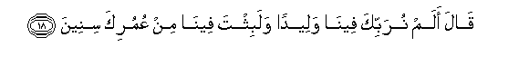
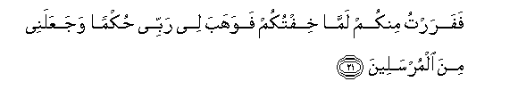

  
[Intangible Textual Heritage](../../index)  [Islam](../index.md) 
[Index](index.md)   
[Hypertext Qur'an](../htq/index)  [Unicode](../uq/026.htm#026_010.md) 
[Palmer](../sbe09/026)  [Pickthall](../pick/026.htm#026_010.md)  [Yusuf Ali
English](../yaq/yaq026)  [Rodwell](../qr/026.md)   
  
[Sūra XXVI.: Shu‘arāa, or The Poets. Index](026.md)  
  [Previous](02601)  [Next](02603.md) 

------------------------------------------------------------------------

  
*The Holy Quran*, tr. by Yusuf Ali, \[1934\], at Intangible Textual
Heritage

------------------------------------------------------------------------

# Sūra XXVI.: Shu‘arāa, or The Poets.

### Section 2

------------------------------------------------------------------------

10. Wa-i<u>th</u> n<u>a</u>d<u>a</u> rabbuka moos<u>a</u> ani i/ti
alqawma a**l***<u>thth</u>*<u>a</u>limeen**a**

10\. Behold, thy Lord called  
Moses: "Go to the people  
Of iniquity,—

------------------------------------------------------------------------

11. Qawma firAAawna al<u>a</u> yattaqoon**a**

11\. "The people of Pharaoh:  
Will they not fear God?"

------------------------------------------------------------------------

12. Q<u>a</u>la rabbi innee akh<u>a</u>fu an yuka<u>thth</u>iboon**i**

12\. He said: "O my Lord!  
I do fear that they  
Will charge me with falsehood:

------------------------------------------------------------------------

13. Waya<u>d</u>eequ <u>s</u>adree wal<u>a</u> yan<u>t</u>aliqu
lis<u>a</u>nee faarsil il<u>a</u> h<u>a</u>roon**a**

13\. "My breast will be straitened?'  
And my speech may not go  
(Smoothly): so send unto Aaron.

------------------------------------------------------------------------

14. Walahum AAalayya <u>th</u>anbun faakh<u>a</u>fu an yaqtuloon**i**

14\. "And (further), they have  
A charge of crime against me;  
And I fear they may  
Slay me."

------------------------------------------------------------------------

15. Q<u>a</u>la kall<u>a</u> fa**i**<u>th</u>hab<u>a</u>
bi-<u>a</u>y<u>a</u>tin<u>a</u> inn<u>a</u> maAAakum mustamiAAoon**a**

15\. God said: "By no means!  
Proceed then, both of you,  
With Our Signs; We  
Are with you, and will  
Listen (to your call).

------------------------------------------------------------------------

16. Fa/tiy<u>a</u> firAAawna faqool<u>a</u> inn<u>a</u> rasoolu rabbi
alAA<u>a</u>lameen**a**

16\. "So go forth, both of you,  
To Pharaoh, and say:  
'We have been sent  
By the Lord and Cherisher  
Of the Worlds;

------------------------------------------------------------------------

17. An arsil maAAan<u>a</u> banee isr<u>a</u>-eel**a**

17\. "'Send thou with us  
The Children of Israel.'"

------------------------------------------------------------------------

18. Q<u>a</u>la alam nurabbika feen<u>a</u> waleedan walabithta
feen<u>a</u> min AAumurika sineen**a**

18\. (Pharaoh) said: "Did we not  
Cherish thee as a child  
Among us, and didst thou not  
Stay in our midst  
Many years of thy life?

------------------------------------------------------------------------

19. WafaAAalta faAAlataka allatee faAAalta waanta mina
alk<u>a</u>fireen**a**

19\. "And thou didst a deed  
Of thine which (thou knowest)  
Thou didst, and thou art  
An ungrateful (wretch)!"

------------------------------------------------------------------------

20. Q<u>a</u>la faAAaltuh<u>a</u> i<u>th</u>an waan<u>a</u> mina
a**l**<u>dda</u>lleen**a**

20\. Moses said: "I did it  
Then, when I was  
In error.

------------------------------------------------------------------------

21. Fafarartu minkum lamm<u>a</u> khiftukum fawahaba lee rabbee
<u>h</u>ukman wajaAAalanee mina almursaleen**a**

21\. "So I fled from you (all)  
When I feared you;  
But my Lord has (since)  
Invested me with judgment  
(And wisdom) and appointed me  
As one of the apostles.

------------------------------------------------------------------------

22. Watilka niAAmatun tamunnuh<u>a</u> AAalayya an AAabbadta banee
isr<u>a</u>-eel**a**

22\. "And this is the favour  
With which thou dost  
Reproach me,—that thou  
Hast enslaved the Children  
Of Israel!"

------------------------------------------------------------------------

23. Q<u>a</u>la firAAawnu wam<u>a</u> rabbu alAA<u>a</u>lameen**a**

23\. Pharaoh said: "And what  
Is the 'Lord and Cherisher  
Of the Worlds'?

------------------------------------------------------------------------

24. Q<u>a</u>la rabbu a**l**ssam<u>a</u>w<u>a</u>ti wa**a**l-ar<u>d</u>i
wam<u>a</u> baynahum<u>a</u> in kuntum mooqineen**a**

24\. (Moses) said: "The Lord  
And Cherisher of the heavens  
And the earth, and all between,  
If ye want to be  
Quite sure."

------------------------------------------------------------------------

25. Q<u>a</u>la liman <u>h</u>awlahu al<u>a</u> tastamiAAoon**a**

25\. (Pharaoh) said to those  
Around: "Do ye not listen  
(To what he says)?

------------------------------------------------------------------------

26. Q<u>a</u>la rabbukum warabbu <u>a</u>b<u>a</u>-ikumu
al-awwaleen**a**

26\. (Moses) said: "Your Lord  
And the Lord of your fathers  
From the beginning!"

------------------------------------------------------------------------

27. Q<u>a</u>la inna rasoolakumu alla<u>th</u>ee orsila ilaykum
lamajnoon**un**

27\. (Pharaoh) said: "Truly  
Your apostle who has been  
Sent to you is  
A veritable madman!"

------------------------------------------------------------------------

28. Q<u>a</u>la rabbu almashriqi wa**a**lmaghribi wam<u>a</u>
baynahum<u>a</u> in kuntum taAAqiloon**a**

28\. (Moses) said: "Lord of the East  
And the West, and all between!  
If ye only had sense!"

------------------------------------------------------------------------

29. Q<u>a</u>la la-ini ittakha<u>th</u>ta il<u>a</u>han ghayree
laajAAalannaka mina almasjooneen**a**

29\. (Pharaoh) said: "If thou  
Dost put forward any god  
Other than me, I will  
Certainly put thee in prison!"

------------------------------------------------------------------------

30. Q<u>a</u>la awa law ji/tuka bishay-in mubeen**in**

30\. (Moses) said: "Even if I  
Showed you something  
Clear (and) convincing?"

------------------------------------------------------------------------

31. Q<u>a</u>la fa/ti bihi in kunta mina a**l**<u>ssa</u>diqeen**a**

31\. (Pharaoh) said: "Show it then,  
If thou tellest the truth!"

------------------------------------------------------------------------

32. Faalq<u>a</u> AAa<u>sa</u>hu fa-i<u>tha</u> hiya thuAAb<u>a</u>nun
mubeen**un**

32\. So (Moses) threw his rod,  
And behold, it was  
A serpent, plain (for all to see)!

------------------------------------------------------------------------

33. WanazaAAa yadahu fa-i<u>tha</u> hiya bay<u>da</u>o
li**l**nn<u>a</u>*<u>th</u>*ireen**a**

33\. And he drew out his hand,  
And behold, it was white  
To all beholders!

------------------------------------------------------------------------

[Next: Section 3 (34-52)](02603.md)

