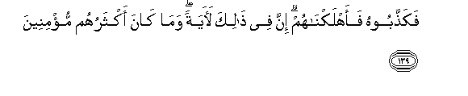

  
[Intangible Textual Heritage](../../index)  [Islam](../index.md) 
[Index](index.md)   
[Hypertext Qur'an](../htq/index)  [Unicode](../uq/026.htm#026_123.md) 
[Palmer](../sbe09/026)  [Pickthall](../pick/026.htm#026_123.md)  [Yusuf Ali
English](../yaq/yaq026)  [Rodwell](../qr/026.md)   
  
[Sūra XXVI.: Shu‘arāa, or The Poets. Index](026.md)  
  [Previous](02606)  [Next](02608.md) 

------------------------------------------------------------------------

  
*The Holy Quran*, tr. by Yusuf Ali, \[1934\], at Intangible Textual
Heritage

------------------------------------------------------------------------

# Sūra XXVI.: Shu‘arāa, or The Poets.

### Section 7

------------------------------------------------------------------------

123. Ka<u>thth</u>abat AA<u>a</u>dun almursaleen**a**

123\. The ’Ad (people) rejected'  
The apostles.

------------------------------------------------------------------------

124. I<u>th</u> q<u>a</u>la lahum akhoohum hoodun al<u>a</u>
tattaqoon**a**

124\. Behold, their brother Hūd  
Said to them: "Will ye not  
Fear (God)?

------------------------------------------------------------------------

125. Innee lakum rasoolun ameen**un**

125\. "I am to you an apostle  
Worthy of all trust:

------------------------------------------------------------------------

126. Fa**i**ttaqoo All<u>a</u>ha waa<u>t</u>eeAAoon**i**

126\. "So fear God and obey me.

------------------------------------------------------------------------

127. Wam<u>a</u> as-alukum AAalayhi min ajrin in ajriya ill<u>a</u>
AAal<u>a</u> rabbi alAA<u>a</u>lameen**a**

127\. "No reward do I ask  
Of you for it my reward  
Is only from the Lord  
Of the Worlds.

------------------------------------------------------------------------

128. Atabnoona bikulli reeAAin <u>a</u>yatan taAAbathoon**a**

128\. "Do ye build a landmark  
On every high place  
To amuse yourselves?

------------------------------------------------------------------------

129. Watattakhi<u>th</u>oona ma<u>sa</u>niAAa laAAallakum
takhludoon**a**

129\. "And do ye get for yourselves  
Fine buildings in the hope  
Of living therein (for ever)?

------------------------------------------------------------------------

130. Wa-i<u>tha</u> ba<u>t</u>ashtum ba<u>t</u>ashtum
jabb<u>a</u>reen**a**

130\. "And when ye exert  
Your strong hand,  
Do ye do it like men  
Of absolute power?

------------------------------------------------------------------------

131. Fa**i**ttaqoo All<u>a</u>ha waa<u>t</u>eeAAoon**i**

131\. "Now fear God, and obey me.

------------------------------------------------------------------------

132. Wa**i**ttaqoo alla<u>th</u>ee amaddakum bim<u>a</u> taAAlamoon**a**

132\. "Yea, fear Him Who  
Has bestowed on you  
Freely all that ye know.

------------------------------------------------------------------------

133. Amaddakum bi-anAA<u>a</u>min wabaneen**a**

133\. "Freely has He bestowed  
On you cattle and sons,—

------------------------------------------------------------------------

134. Wajann<u>a</u>tin waAAuyoon**in**

134\. "And Gardens and Springs.

------------------------------------------------------------------------

135. Innee akh<u>a</u>fu AAalaykum AAa<u>tha</u>ba yawmin
AAa*<u>th</u>*eem**in**

135\. "Truly I fear for you  
The Penalty of a Great Day."

------------------------------------------------------------------------

136. Q<u>a</u>loo saw<u>a</u>on AAalayn<u>a</u> awaAAa*<u>th</u>*ta am
lam takun mina alw<u>a</u>AAi*<u>th</u>*een**a**

136\. They said: "It is the same  
To us whether thou  
Admonish us or be not  
Among (our) admonishers!

------------------------------------------------------------------------

137. In h<u>atha</u> ill<u>a</u> khuluqu al-awwaleen**a**

137\. "This is no other than  
A customary device  
Of the ancients,

------------------------------------------------------------------------

138. Wam<u>a</u> na<u>h</u>nu bimuAAa<u>thth</u>abeen**a**

138\. "And we are not the ones  
To receive Pains and Penalties!"

------------------------------------------------------------------------

139. Faka<u>thth</u>aboohu faahlakn<u>a</u>hum inna fee <u>tha</u>lika
la<u>a</u>yatan wam<u>a</u> k<u>a</u>na aktharuhum mu/mineen**a**

139\. So they rejected him,  
And We destroyed them.  
Verily in this is a Sign:  
But most of them  
Do not believe.

------------------------------------------------------------------------

140. Wa-inna rabbaka lahuwa alAAazeezu a**l**rra<u>h</u>eem**u**

140\. And verily thy Lord  
Is He, the Exalted in Might,  
Most Merciful.

------------------------------------------------------------------------

[Next: Section 8 (141-159)](02608.md)

