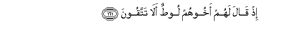
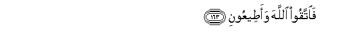
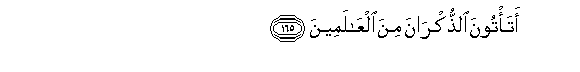
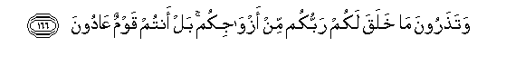
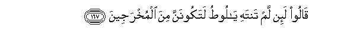
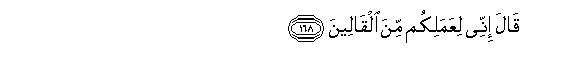
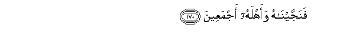
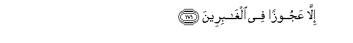
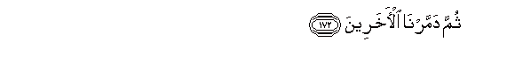
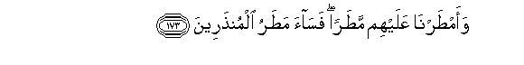

  
[Intangible Textual Heritage](../../index)  [Islam](../index.md) 
[Index](index.md)   
[Hypertext Qur'an](../htq/index)  [Unicode](../uq/026.htm#026_160.md) 
[Palmer](../sbe09/026)  [Pickthall](../pick/026.htm#026_160.md)  [Yusuf Ali
English](../yaq/yaq026)  [Rodwell](../qr/026.md)   
  
[Sūra XXVI.: Shu‘arāa, or The Poets. Index](026.md)  
  [Previous](02608)  [Next](02610.md) 

------------------------------------------------------------------------

  
*The Holy Quran*, tr. by Yusuf Ali, \[1934\], at Intangible Textual
Heritage

------------------------------------------------------------------------

# Sūra XXVI.: Shu‘arāa, or The Poets.

### Section 9

------------------------------------------------------------------------

160. Ka<u>thth</u>abat qawmu loo<u>t</u>in almursaleen**a**

160\. The people of Lūt rejected'  
The apostles.

------------------------------------------------------------------------

161. I<u>th</u> q<u>a</u>la lahum akhoohum loo<u>t</u>un al<u>a</u>
tattaqoon**a**

161\. Behold, their brother Lūt  
Said to them: "Will ye not  
Fear (God)?

------------------------------------------------------------------------

162. Innee lakum rasoolun ameen**un**

162\. "I am to you an apostle  
Worthy of all trust.

------------------------------------------------------------------------

163. Fa**i**ttaqoo All<u>a</u>ha waa<u>t</u>eeAAoon**i**

163\. "So fear God and obey me.

------------------------------------------------------------------------

164. Wam<u>a</u> as-alukum AAalayhi min ajrin in ajriya ill<u>a</u>
AAal<u>a</u> rabbi alAA<u>a</u>lameen**a**

164\. "No reward do I ask  
Of you for it my reward  
Is only from the Lord  
Of the Worlds.

------------------------------------------------------------------------

165. Ata/toona a**l**<u>thth</u>ukr<u>a</u>na mina
alAA<u>a</u>lameen**a**

165\. "Of all the creatures  
In the world, will ye  
Approach males,

------------------------------------------------------------------------

166. Wata<u>th</u>aroona m<u>a</u> khalaqa lakum rabbukum min
azw<u>a</u>jikum bal antum qawmun AA<u>a</u>doon**a**

166\. "And leave those whom God  
Has created for you  
To be your mates?  
Nay, ye are a people  
Transgressing (all limits)!"

------------------------------------------------------------------------

167. Q<u>a</u>loo la-in lam tantahi y<u>a</u> loo<u>t</u>u latakoonanna
mina almukhrajeen**a**

167\. Whey said: "If thou desist not,  
O Lūt! thou wilt assuredly  
Be cast out!"

------------------------------------------------------------------------

168. Q<u>a</u>la innee liAAamalikum mina alq<u>a</u>leen**a**

168\. He said: "I do detest  
Your doings:"

------------------------------------------------------------------------

169. Rabbi najjinee waahlee mimm<u>a</u> yaAAmaloon**a**

169\. "O my Lord! deliver me  
And my family from  
Such things as they do!"

------------------------------------------------------------------------

170. Fanajjayn<u>a</u>hu waahlahu ajmaAAeen**a**

170\. So We delivered him  
And his family,—all

------------------------------------------------------------------------

171. Ill<u>a</u> AAajoozan fee algh<u>a</u>bireen**a**

171\. Except an old woman  
Who lingered behind.

------------------------------------------------------------------------

172. Thumma dammarn<u>a</u> al-<u>a</u>khareen**a**

172\. But the rest We destroyed Utterly.

------------------------------------------------------------------------

173. Waam<u>t</u>arn<u>a</u> AAalayhim ma<u>t</u>aran fas<u>a</u>a
ma<u>t</u>aru almun<u>th</u>areen**a**

173\. We rained down on them  
A shower (of brimstone):  
And evil was the shower  
On those who were admonished  
(But heeded not)!

------------------------------------------------------------------------

174. Inna fee <u>tha</u>lika la<u>a</u>yatan wam<u>a</u> k<u>a</u>na
aktharuhum mu/mineen**a**

174\. Verily in this is a Sign  
But most of them  
Do not believe.

------------------------------------------------------------------------

175. Wa-inna rabbaka lahuwa alAAazeezu a**l**rra<u>h</u>eem**u**

175\. And verily thy Lord  
Is He, the Exalted in Might  
Most Merciful.

------------------------------------------------------------------------

[Next: Section 10 (176-191)](02610.md)

