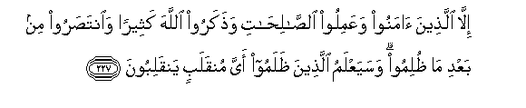

  
[Intangible Textual Heritage](../../index)  [Islam](../index) 
[Index](index)   
[Hypertext Qur'an](../htq/index)  [Unicode](../uq/026.htm#026_192) 
[Palmer](../sbe09/026)  [Pickthall](../pick/026.htm#026_192)  [Yusuf Ali
English](../yaq/yaq026)  [Rodwell](../qr/026)   
  
[Sūra XXVI.: Shu‘arāa, or The Poets. Index](026)  
  [Previous](02610)  [Next](02701) 

------------------------------------------------------------------------

  
*The Holy Quran*, tr. by Yusuf Ali, \[1934\], at Intangible Textual
Heritage

------------------------------------------------------------------------

# Sūra XXVI.: Shu‘arāa, or The Poets.

### Section 11

------------------------------------------------------------------------

192. Wa-innahu latanzeelu rabbi alAA<u>a</u>lameen**a**

192\. Verily this is a Revelation  
From the Lord of the Worlds:

------------------------------------------------------------------------

193. Nazala bihi a**l**rroo<u>h</u>u al-ameen**u**

193\. With it came down  
The Spirit of Faith and Truth—

------------------------------------------------------------------------

194. AAal<u>a</u> qalbika litakoona mina almun<u>th</u>ireen**a**

194\. To thy heart and mind,  
That thou mayest admonish

------------------------------------------------------------------------

195. Bilis<u>a</u>nin AAarabiyyin mubeen**in**

195\. In the perspicuous  
Arabic tongue.

------------------------------------------------------------------------

196. Wa-innahu lafee zuburi al-awwaleen**a**

196\. Without doubt it is (announced)  
In the mystic Book  
Of former peoples.

------------------------------------------------------------------------

197. Awa lam yakun lahum <u>a</u>yatan an yaAAlamahu AAulam<u>a</u>o
banee isr<u>a</u>-eel**a**

197\. Is it not a Sign  
To them that the Learned  
Of the Children of Israel  
Knew it (as true)?

------------------------------------------------------------------------

198. Walaw nazzaln<u>a</u>hu AAal<u>a</u> baAA<u>d</u>i
al-aAAjameen**a**

198\. Had We revealed it  
To any of the non Arabs,

------------------------------------------------------------------------

199. Faqaraahu AAalayhim m<u>a</u> k<u>a</u>noo bihi mu/mineen**a**

199\. And had he recited it  
To them, they would not  
Have believed in it.

------------------------------------------------------------------------

200. Ka<u>tha</u>lika salakn<u>a</u>hu fee quloobi almujrimeen**a**

200\. Thus have We caused it  
To enter the hearts  
Of the Sinners.

------------------------------------------------------------------------

201. L<u>a</u> yu/minoona bihi <u>h</u>att<u>a</u> yarawoo
alAAa<u>tha</u>ba al-aleem**a**

201\. They will not believe  
In it until they see  
The grievous Penalty;

------------------------------------------------------------------------

202. Faya/tiyahum baghtatan wahum l<u>a</u> yashAAuroon**a**

202\. But the (Penalty) will come  
To them of a sudden,  
While they preceive it not;

------------------------------------------------------------------------

203. Fayaqooloo hal na<u>h</u>nu mun*<u>th</u>*aroon**a**

203\. Then they will say:  
"Shall we be respited?"

------------------------------------------------------------------------

204. AfabiAAa<u>tha</u>bin<u>a</u> yastaAAjiloon**a**

204\. Do they then ask  
For Our Penalty to be  
Hastened on?

------------------------------------------------------------------------

205. Afaraayta in mattaAAn<u>a</u>hum sineen**a**

205\. Seest thou? If We do  
Let them enjoy (this life)  
For a few years,

------------------------------------------------------------------------

206. Thumma j<u>a</u>ahum m<u>a</u> k<u>a</u>noo yooAAadoon**a**

206\. Yet there comes to them  
At length the (Punishment)  
Which they were promised!

------------------------------------------------------------------------

207. M<u>a</u> aghn<u>a</u> AAanhum m<u>a</u> k<u>a</u>noo
yumattaAAoon**a**

207\. It will profit them not  
That they enjoyed (this life)!

------------------------------------------------------------------------

208. Wam<u>a</u> ahlakn<u>a</u> min qaryatin ill<u>a</u> lah<u>a</u>
mun<u>th</u>iroon**a**

208\. Never did We destroy  
A population, but had  
Its warners—

------------------------------------------------------------------------

209. <u>Th</u>ikr<u>a</u> wam<u>a</u> kunn<u>a</u>
*<u>th</u>*<u>a</u>limeen**a**

209\. By way of reminder;  
And We never are unjust.

------------------------------------------------------------------------

210. Wam<u>a</u> tanazzalat bihi a**l**shshay<u>at</u>een**u**

210\. No evil ones have brought  
Down this (Revelation):

------------------------------------------------------------------------

211. Wam<u>a</u> yanbaghee lahum wam<u>a</u> yasta<u>t</u>eeAAoon**a**

211\. It would neither suit them  
Nor would they be able  
(To produce it).

------------------------------------------------------------------------

212. Innahum AAani a**l**ssamAAi lamaAAzooloona

212\. Indeed they have been removed  
Far from even (a chance of)  
Hearing it.

------------------------------------------------------------------------

213. Fal<u>a</u> tadAAu maAAa All<u>a</u>hi il<u>a</u>han <u>a</u>khara
fatakoona mina almuAAa<u>thth</u>abeen**a**

213\. So call not on any  
Other god with God,  
Or thou wilt be among  
Those under the Penalty.

------------------------------------------------------------------------

214. Waan<u>th</u>ir AAasheerataka al-aqrabeen**a**

214\. And admonish thy nearest  
Kinsmen,

------------------------------------------------------------------------

215. Wa**i**khfi<u>d</u> jan<u>ah</u>aka limani ittabaAAaka mina
almu/mineen**a**

215\. And lower thy wing  
To the Believers who  
Follow thee.

------------------------------------------------------------------------

216. Fa-in AAa<u>s</u>awka faqul innee baree-on mimm<u>a</u>
taAAmaloon**a**

216\. Then if they disobey thee,  
Say: "I am free (of responsibility)  
For what ye do!"

------------------------------------------------------------------------

217. Watawakkal AAal<u>a</u> alAAazeezi a**l**rra<u>h</u>eem**i**

217\. And put thy trust  
On the Exalted in Might,  
The Merciful,—

------------------------------------------------------------------------

218. Alla<u>th</u>ee yar<u>a</u>ka <u>h</u>eena taqoom**u**

218\. Who seeth thee standing  
Forth (in prayer),

------------------------------------------------------------------------

219. Wataqallubaka fee a**l**ss<u>a</u>jideen**a**

219\. And thy movements among  
Those who prostrate themselves.

------------------------------------------------------------------------

220. Innahu huwa a**l**ssameeAAu alAAaleem**u**

220\. For it is He  
Who heareth and knoweth  
All things.

------------------------------------------------------------------------

221. Hal onabbi-okum AAal<u>a</u> man tanazzalu
a**l**shshay<u>at</u>een**u**

221\. Shall I inform you.  
(O people!), on whom it is  
That the evil ones descend?

------------------------------------------------------------------------

222. Tanazzalu AAal<u>a</u> kulli aff<u>a</u>kin atheem**in**

222\. They descend on every  
Lying, wicked person,

------------------------------------------------------------------------

223. Yulqoona a**l**ssamAAa waaktharuhum k<u>ath</u>iboon**a**

223\. (Into whose ears) they pour  
Hearsay vanities, and most  
Of them are liars.

------------------------------------------------------------------------

224. Wa**al**shshuAAar<u>a</u>o yattabiAAuhumu algh<u>a</u>woon**a**

224\. And the Poets,—  
It is those straying in Evil,  
Who follow them:

------------------------------------------------------------------------

225. Alam tara annahum fee kulli w<u>a</u>din yaheemoon**a**

225\. Seest thou not that they  
Wander distracted in every  
Valley?—

------------------------------------------------------------------------

226. Waannahum yaqooloona m<u>a</u> l<u>a</u> yafAAaloon**a**

226\. And that they say  
What they practise not?—

------------------------------------------------------------------------

227. Ill<u>a</u> alla<u>th</u>eena <u>a</u>manoo waAAamiloo
a**l**<u>ssa</u>li<u>ha</u>ti wa<u>th</u>akaroo All<u>a</u>ha katheeran
wa**i**nta<u>s</u>aroo min baAAdi m<u>a</u> *<u>th</u>*ulimoo
wasayaAAlamu alla<u>th</u>eena *<u>th</u>*alamoo ayya munqalabin
yanqaliboon**a**

227\. Except those who believe,  
Work righteousness, engage much  
In the remembrance of God,  
And defend themselves only after  
They are unjustly attacked.  
And soon will the unjust'  
Assailants know what vicissitudes  
Their affairs will take!

------------------------------------------------------------------------

[Next: Section 1 (1-14)](02701)

