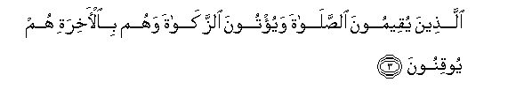
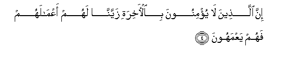
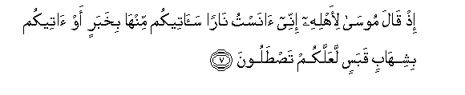
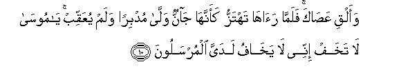
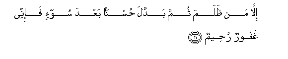
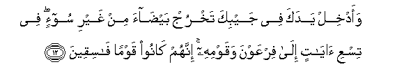
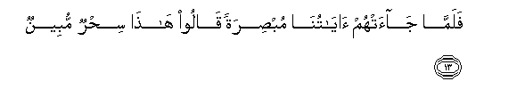
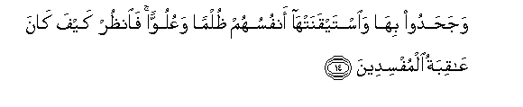

  
[Intangible Textual Heritage](../../index)  [Islam](../index) 
[Index](index)   
[Hypertext Qur'an](../htq/index)  [Unicode](../uq/027.htm#027_001) 
[Palmer](../sbe09/027)  [Pickthall](../pick/027.htm#027_001)  [Yusuf Ali
English](../yaq/yaq027)  [Rodwell](../qr/027)   
  
[Sūra XXVII.: Naml, or the Ants. Index](027)  
  [Previous](02611)  [Next](02702) 

------------------------------------------------------------------------

  
*The Holy Quran*, tr. by Yusuf Ali, \[1934\], at Intangible Textual
Heritage

------------------------------------------------------------------------

# Sūra XXVII.: Naml, or the Ants.

### Section 1

1. <u>Ta</u>-seen tilka <u>a</u>y<u>a</u>tu alqur-<u>a</u>ni
wakit<u>a</u>bin mubeen**in**

1\. Tā. Sīn.  
These are verses  
Of the Qur-ān,—a Book  
That makes (things) clear;

------------------------------------------------------------------------

2. Hudan wabushr<u>a</u> lilmu/mineen**a**

2\. A Guide; and Glad Tidings  
For the Relievers,—

------------------------------------------------------------------------

3. Alla<u>th</u>eena yuqeemoona a**l**<u>ss</u>al<u>a</u>ta wayu/toona
a**l**zzak<u>a</u>ta wahum bi**a**l-<u>a</u>khirati hum yooqinoon**a**

3\. Those who establish regular prayers  
And give in regular charity,  
And also have (full) assurance  
Of the Hereafter.

------------------------------------------------------------------------

4. Inna alla<u>th</u>eena l<u>a</u> yu/minoona bi**a**l-<u>a</u>khirati
zayyann<u>a</u> lahum aAAm<u>a</u>lahum fahum yaAAmahoon**a**

4\. As to those who believe not  
In the Hereafter, We have  
Made their deeds pleasing  
In their eyes; and so they  
Wander about in distraction.

------------------------------------------------------------------------

5. Ol<u>a</u>-ika alla<u>th</u>eena lahum soo-o alAAa<u>tha</u>bi wahum
fee al-<u>a</u>khirati humu al-akhsaroon**a**

5\. Such are they for whom  
A grievous Penalty is (waiting):  
And in the Hereafter theirs  
Will be the greatest loss.

------------------------------------------------------------------------

6. Wa-innaka latulaqq<u>a</u> alqur-<u>a</u>na min ladun <u>h</u>akeemin
AAaleem**in**

6\. As to thee, the Qur-ān  
Is bestowed upon thee  
From the presence of One  
Who is Wise and All-Knowing.

------------------------------------------------------------------------

7. I<u>th</u> q<u>a</u>la moos<u>a</u> li-ahlihi innee <u>a</u>nastu
n<u>a</u>ran sa<u>a</u>teekum minh<u>a</u> bikhabarin aw <u>a</u>teekum
bishih<u>a</u>bin qabasin laAAallakum ta<u>st</u>aloon**a**

7\. Behold! Moses said  
To his family "I perceive  
A fire; soon will I bring you  
From there some information,  
Or I will bring you  
A burning brand to light  
Our fuel, that ye may  
Warm yourselves.

------------------------------------------------------------------------

8. Falamm<u>a</u> j<u>a</u>ah<u>a</u> noodiya an boorika man fee
a**l**nn<u>a</u>ri waman <u>h</u>awlah<u>a</u> wasub<u>ha</u>na
All<u>a</u>hi rabbi alAA<u>a</u>lameen**a**

8\. But when he came  
To the (Fire), a voice  
Was heard: "Blessed are those  
In the Fire and those around:  
And Glory to God,  
The Lord of the Worlds.

------------------------------------------------------------------------

9. Y<u>a</u> moos<u>a</u> innahu an<u>a</u> All<u>a</u>hu alAAazeezu
al<u>h</u>akeem**u**

9\. "O Moses! Verily,  
I am God, the Exalted  
In Might, the Wise!...

------------------------------------------------------------------------

10. Waalqi AAa<u>sa</u>ka falamm<u>a</u> ra<u>a</u>h<u>a</u> tahtazzu
kaannah<u>a</u> j<u>a</u>nnun wall<u>a</u> mudbiran walam yuAAaqqib
y<u>a</u> moos<u>a</u> l<u>a</u> takhaf innee l<u>a</u> yakh<u>a</u>fu
ladayya almursaloon**a**

10\. "Now do thou throw thy rod!"  
But when he saw it  
Moving (of its own accord)  
As if it had been a snake,  
He turned back in retreat,  
And retraced not his steps:  
"O Moses!" (it was said),  
"Fear not: truly, in My presence,  
Those called as apostles  
Have no fear,—

------------------------------------------------------------------------

11. Ill<u>a</u> man *<u>th</u>*alama thumma baddala <u>h</u>usnan baAAda
soo-in fa-innee ghafoorun ra<u>h</u>eem**un**

11\. "But if any have done wrong  
And have thereafter substituted  
Good to take the place of evil,  
Truly, I am Oft-Forgiving,  
Most Merciful.

------------------------------------------------------------------------

12. Waadkhil yadaka fee jaybika takhruj bay<u>da</u>a min ghayri soo-in
fee tisAAi <u>a</u>y<u>a</u>tin il<u>a</u> firAAawna waqawmihi innahum
k<u>a</u>noo qawman f<u>a</u>siqeen**a**

12\. "Now put thy hand into  
Thy bosom, and it will  
Come forth white without stain  
(Or harm): (these are) among  
The nine Signs (thou wilt take)  
To Pharaoh and his people:  
For they are a people  
Rebellious in transgression."

------------------------------------------------------------------------

13. Falamm<u>a</u> j<u>a</u>at-hum <u>a</u>y<u>a</u>tun<u>a</u>
mub<u>s</u>iratan q<u>a</u>loo h<u>atha</u> si<u>h</u>run mubeen**un**

13\. But when Our Signs came  
To them, that should have""  
Opened their eyes, they said:  
"This is sorcery manifest!"

------------------------------------------------------------------------

14. Waja<u>h</u>adoo bih<u>a</u> wa**i**stayqanat-h<u>a</u> anfusuhum
*<u>th</u>*ulman waAAuluwwan fa**o**n*<u>th</u>*ur kayfa k<u>a</u>na
AA<u>a</u>qibatu almufsideen**a**

14\. And they rejected those Signs  
In iniquity and arrogance,  
Though their souls were convinced  
Thereof: so see what was  
The end of those  
Who acted corruptly!

------------------------------------------------------------------------

[Next: Section 2 (15-31)](02702)

