

  
[Intangible Textual Heritage](../../index)  [Islam](../index.md) 
[Index](index.md)   
[Hypertext Qur'an](../htq/index)  [Unicode](../uq/027.htm#027_015.md) 
[Palmer](../sbe09/027)  [Pickthall](../pick/027.htm#027_015.md)  [Yusuf Ali
English](../yaq/yaq027)  [Rodwell](../qr/027.md)   
  
[Sūra XXVII.: Naml, or the Ants. Index](027.md)  
  [Previous](02701)  [Next](02703.md) 

------------------------------------------------------------------------

  
*The Holy Quran*, tr. by Yusuf Ali, \[1934\], at Intangible Textual
Heritage

------------------------------------------------------------------------

# Sūra XXVII.: Naml, or the Ants.

### Section 2

------------------------------------------------------------------------

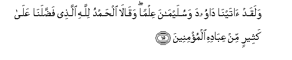

15. Walaqad <u>a</u>tayn<u>a</u> d<u>a</u>wooda wasulaym<u>a</u>na
AAilman waq<u>a</u>l<u>a</u> al<u>h</u>amdu lill<u>a</u>hi
alla<u>th</u>ee fa<u>dd</u>alan<u>a</u> AAal<u>a</u> katheerin min
AAib<u>a</u>dihi almu/mineen**a**

15\. We gave (in the past)  
Knowledge to David and Solomon  
And they both said:  
"Praise be to God, Who  
Has favoured us above many  
Of His servants who believe!

------------------------------------------------------------------------

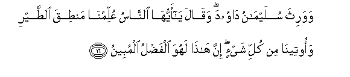

16. Wawaritha sulaym<u>a</u>nu d<u>a</u>wooda waq<u>a</u>la y<u>a</u>
ayyuh<u>a</u> a**l**nn<u>a</u>su AAullimn<u>a</u> man<u>t</u>iqa
a**l**<u>tt</u>ayri waooteen<u>a</u> min kulli shay-in inna h<u>atha</u>
lahuwa alfa<u>d</u>lu almubeen**u**

16\. And Solomon was David's heir.  
He said: "O ye people!  
We have been taught the speech"  
Of Birds, and on us  
Has been bestowed (a little)  
Of all things: this is  
Indeed Grace manifest (from God.)"

------------------------------------------------------------------------

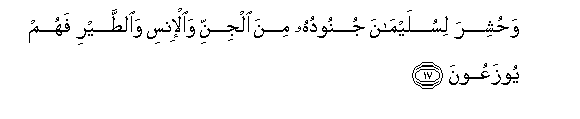

17. Wa<u>h</u>ushira lisulaym<u>a</u>na junooduhu mina aljinni
wa**a**l-insi wa**al**<u>tt</u>ayri fahum yoozaAAoon**a**

17\. And before Solomon were marshalled  
His hosts,—of Jinns and men  
And birds, and they were all  
Kept in order and ranks.

------------------------------------------------------------------------

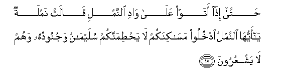

18. <u>H</u>att<u>a</u> i<u>tha</u> ataw AAal<u>a</u> w<u>a</u>di
a**l**nnamli q<u>a</u>lat namlatun y<u>a</u> ayyuh<u>a</u> a**l**nnamlu
odkhuloo mas<u>a</u>kinakum l<u>a</u> ya<u>ht</u>imannakum
sulaym<u>a</u>nu wajunooduhu wahum l<u>a</u> yashAAuroon**a**

18\. At length, when they came  
To a (lowly) valley of ants,  
One of the ants said:  
"O ye ants, get into  
Your habitations, lest Solomon  
And his hosts crush you  
(Under foot) without knowing it."

------------------------------------------------------------------------

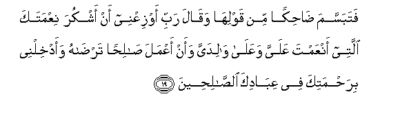

19. Fatabassama <u>dah</u>ikan min qawlih<u>a</u> waq<u>a</u>la rabbi
awziAAnee an ashkura niAAmataka allatee anAAamta AAalayya waAAal<u>a</u>
w<u>a</u>lidayya waan aAAmala <u>sa</u>li<u>h</u>an tar<u>da</u>hu
waadkhilnee bira<u>h</u>matika fee AAib<u>a</u>dika
a**l**<u>ssa</u>li<u>h</u>een**a**

19\. So he smiled, amused  
At her speech; and he said:  
"O my Lord! so order me  
That I may be grateful  
For Thy favours, which Thou  
Hast bestowed on me and  
On my parents, and that  
I may work the righteousness  
That will please Thee:  
And admit me, by Thy Grace,  
To the ranks of Thy  
Righteous Servants."

------------------------------------------------------------------------

20. Watafaqqada a**l**<u>tt</u>ayra faq<u>a</u>la m<u>a</u> liya
l<u>a</u> ar<u>a</u> alhudhuda am k<u>a</u>na mina
algh<u>a</u>-ibeen**a**

20\. And he took a muster  
Of the Birds; and he said:  
"Why is it I see not  
The Hoopoe? Or is he  
Among the absentees?"

------------------------------------------------------------------------

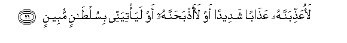

21. LaoAAa<u>thth</u>ibannahu AAa<u>tha</u>ban shadeedan aw
laa<u>th</u>ba<u>h</u>annahu aw laya/tiyannee bisul<u>ta</u>nin
mubeen**in**

21\. "I will certainly punish him  
With a severe penalty,  
Or execute him, unless he  
Bring me a clear reason  
(For absence)."

------------------------------------------------------------------------

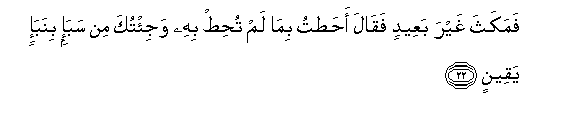

22. Famakatha ghayra baAAeedin faq<u>a</u>la a<u>hat</u>tu bim<u>a</u>
lam tu<u>h</u>i<u>t</u> bihi waji/tuka min saba-in binaba-in
yaqeen**in**

22\. But the Hoopoe tarried not  
Far: he (came up and) said:  
"I have compassed (territory)  
Which thou hast not compassed,  
And I have come to thee  
From Saba with tidings true.

------------------------------------------------------------------------

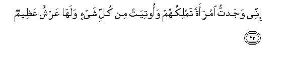

23. Innee wajadtu imraatan tamlikuhum waootiyat min kulli shay-in
walah<u>a</u> AAarshun AAa*<u>th</u>*eem**un**

23\. "I found (there) a woman  
Ruling over them and provided  
With every requisite; and she  
Has a magnificent throne.

------------------------------------------------------------------------

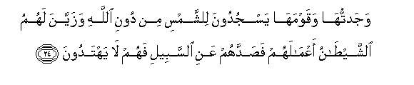

24. Wajadtuh<u>a</u> waqawmah<u>a</u> yasjudoona li**l**shshamsi min
dooni All<u>a</u>hi wazayyana lahumu a**l**shshay<u>ta</u>nu
aAAm<u>a</u>lahum fa<u>s</u>addahum AAani a**l**ssabeeli fahum l<u>a</u>
yahtadoon**a**

24\. "I found her and her people  
Worshipping the sun besides God:  
Satan has made their deeds  
Seem pleasing in their eyes,  
And has kept them away  
From the Path,—so  
They receive no guidance,—

------------------------------------------------------------------------

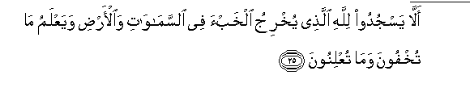

25. All<u>a</u> yasjudoo lill<u>a</u>hi alla<u>th</u>ee yukhriju
alkhabaa fee a**l**ssam<u>a</u>w<u>a</u>ti wa**a**l-ar<u>d</u>i
wayaAAlamu m<u>a</u> tukhfoona wam<u>a</u> tuAAlinoon**a**

25\. "(Kept them away from the Path),  
That they should not worship  
God, Who brings to light  
What is hidden in the heavens  
And the earth, and knows  
What ye hide and what  
Ye reveal.

------------------------------------------------------------------------

26. All<u>a</u>hu l<u>a</u> il<u>a</u>ha ill<u>a</u> huwa rabbu
alAAarshi alAAa*<u>th</u>*eem**i**

26\. "God!—there is no god  
But He!—Lord of the Throne's  
Supreme!"

------------------------------------------------------------------------

27. Q<u>a</u>la sanan*<u>th</u>*uru a<u>s</u>adaqta am kunta mina
alk<u>ath</u>ibeen**a**

27\. (Solomon) said: "Soon shall we  
See whether thou hast told  
The truth or lied!

------------------------------------------------------------------------

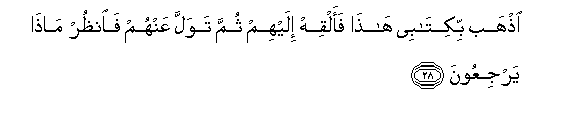

28. I<u>th</u>hab bikit<u>a</u>bee h<u>atha</u> faalqih ilayhim thumma
tawalla AAanhum fa**o**n*<u>th</u>*ur m<u>atha</u> yarjiAAoon**a**

28\. "Go thou, with this letter  
Of mine, and deliver it  
To them: then draw back  
From them, and (wait to) see  
What answer they return"...

------------------------------------------------------------------------

29. Q<u>a</u>lat y<u>a</u> ayyuh<u>a</u> almalao innee olqiya ilayya
kit<u>a</u>bun kareem**un**

29\. (The Queen) said: "Ye chiefs!  
Here is—delivered to me—  
A letter worthy of respect.

------------------------------------------------------------------------

30. Innahu min sulaym<u>a</u>na wa-innahu bismi All<u>a</u>hi
a**l**rra<u>h</u>m<u>a</u>ni a**l**rra<u>h</u>eem**i**

30\. "It is from Solomon, and is  
(As follows), 'In the name  
Of God, Most Gracious,  
Most Merciful:

------------------------------------------------------------------------

31. All<u>a</u> taAAloo AAalayya wa/toonee muslimeen**a**

31\. "'Be ye not arrogant  
Against me, but come  
To me in submission  
(To the true Religion).'"

------------------------------------------------------------------------

[Next: Section 3 (32-44)](02703.md)

