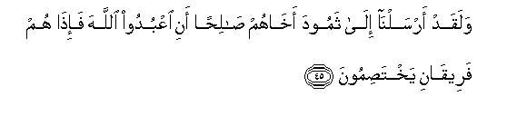
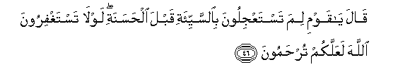
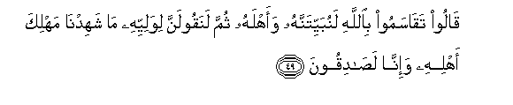
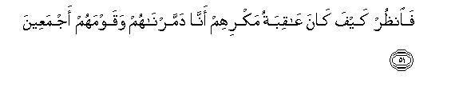
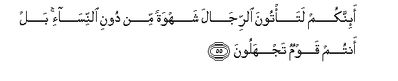
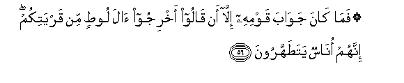

  
[Intangible Textual Heritage](../../index)  [Islam](../index) 
[Index](index)   
[Hypertext Qur'an](../htq/index)  [Unicode](../uq/027.htm#027_045) 
[Palmer](../sbe09/027)  [Pickthall](../pick/027.htm#027_045)  [Yusuf Ali
English](../yaq/yaq027)  [Rodwell](../qr/027)   
  
[Sūra XXVII.: Naml, or the Ants. Index](027)  
  [Previous](02703)  [Next](02705) 

------------------------------------------------------------------------

  
*The Holy Quran*, tr. by Yusuf Ali, \[1934\], at Intangible Textual
Heritage

------------------------------------------------------------------------

# Sūra XXVII.: Naml, or the Ants.

### Section 4

------------------------------------------------------------------------

45. Walaqad arsaln<u>a</u> il<u>a</u> thamooda akh<u>a</u>hum
<u>sa</u>li<u>h</u>an ani oAAbudoo All<u>a</u>ha fa-i<u>tha</u> hum
fareeq<u>a</u>ni yakhta<u>s</u>imoon**a**

45\. We sent (aforetime),  
To the <u>Th</u>amūd, their brother  
Ṣaliḥ, saying, "Serve God":  
But behold, they became  
Two factions quarrelling  
With each other.

------------------------------------------------------------------------

46. Q<u>a</u>la y<u>a</u> qawmi lima tastaAAjiloona bi**al**ssayyi-ati
qabla al<u>h</u>asanati lawl<u>a</u> tastaghfiroona All<u>a</u>ha
laAAallakum tur<u>h</u>amoon**a**

46\. He said: "O my people!  
Why ask ye to hasten on  
The evil in preference to the good?  
If only ye ask God for forgiveness,  
Ye may hope to receive mercy.

------------------------------------------------------------------------

47. Q<u>a</u>loo i<u>tt</u>ayyarn<u>a</u> bika wabiman maAAaka
q<u>a</u>la <u>ta</u>-irukum AAinda All<u>a</u>hi bal antum qawmun
tuftanoon**a**

47\. They said: "Ill omen  
Do we augur from thee  
And those that are with thee".  
He said: "Your ill omen  
Is with God; yea, ye are  
A people under trial."

------------------------------------------------------------------------

48. Wak<u>a</u>na fee almadeenati tisAAatu rah<u>t</u>in yufsidoona fee
al-ar<u>d</u>i wal<u>a</u> yu<u>s</u>li<u>h</u>oon**a**

48\. There were in the City  
Nine men of a family,  
Who made mischief in the land,  
And would not reform.

------------------------------------------------------------------------

49. Q<u>a</u>loo taq<u>a</u>samoo bi**A**ll<u>a</u>hi lanubayyitannahu
waahlahu thumma lanaqoolanna liwaliyyihi m<u>a</u> shahidn<u>a</u>
mahlika ahlihi wa-inn<u>a</u> la<u>sa</u>diqoon**a**

49\. They said: "Swear  
A mutual oath by God  
That we shall make  
A secret night attack  
On him and his people,  
And that we shall then  
Say to his heir (when he  
Seeks vengeance), 'We were not  
Present at the slaughter  
Of his people, and we are  
Positively telling the truth'."

------------------------------------------------------------------------

50. Wamakaroo makran wamakarn<u>a</u> makran wahum l<u>a</u>
yashAAuroon**a**

50\. They plotted and planned,  
But We too planned,  
Even while they perceived it not.

------------------------------------------------------------------------

51. Fa**o**n*<u>th</u>*ur kayfa k<u>a</u>na AA<u>a</u>qibatu makrihim
ann<u>a</u> dammarn<u>a</u>hum waqawmahum ajmaAAeen**a**

51\. Then see what was the end  
Of their plot!—this,  
That We destroyed them  
And their people, all (of them).

------------------------------------------------------------------------

52. Fatilka buyootuhum kh<u>a</u>wiyatan bim<u>a</u> *<u>th</u>*alamoo
inna fee <u>tha</u>lika la<u>a</u>yatan liqawmin yaAAlamoon**a**

52\. Now such were their houses,—  
In utter ruin,—because  
They practised wrong-doing.  
Verily in this is a Sign  
For people of knowledge.

------------------------------------------------------------------------

53. Waanjayn<u>a</u> alla<u>th</u>eena <u>a</u>manoo wak<u>a</u>noo
yattaqoon**a**

53\. And We saved those  
Who believed and practised  
Righteousness.

------------------------------------------------------------------------

54. Waloo<u>t</u>an i<u>th</u> q<u>a</u>la liqawmihi ata/toona
alf<u>ah</u>ishata waantum tub<u>s</u>iroon**a**

54\. (We also sent) Lūt  
(As an apostle): behold,  
He said to his people,  
"Do ye do what is shameful  
Though ye see (its iniquity)?

------------------------------------------------------------------------

55. A-innakum lata/toona a**l**rrij<u>a</u>la shahwatan min dooni
a**l**nnis<u>a</u>-i bal antum qawmun tajhaloon**a**

55\. Would ye really approach men  
In your lusts rather than  
Women? Nay, ye are  
A people (grossly) ignorant!

------------------------------------------------------------------------

56. Fam<u>a</u> k<u>a</u>na jaw<u>a</u>ba qawmihi ill<u>a</u> an
q<u>a</u>loo akhrijoo <u>a</u>la loo<u>t</u>in min qaryatikum innahum
on<u>a</u>sun yata<u>t</u>ahharoon**a**

56\. But his people gave  
No other answer but this:  
They said, "Drive out  
The followers of Lūt from  
Your city: these are  
Indeed men who want  
To be clean and pure!"

------------------------------------------------------------------------

57. Faanjayn<u>a</u>hu waahlahu ill<u>a</u> imraatahu
qaddarn<u>a</u>h<u>a</u> mina algh<u>a</u>bireen**a**

57\. But We saved him  
And his family, except  
His wife: her We destined  
To be of those  
Who lagged behind.

------------------------------------------------------------------------

58. Waam<u>t</u>arn<u>a</u> AAalayhim ma<u>t</u>aran fas<u>a</u>a
ma<u>t</u>aru almun<u>th</u>areen**a**

58\. And We rained down on them  
A shower (of brimstone):  
And evil was the shower  
On those who were admonished  
(But heeded not)!

------------------------------------------------------------------------

[Next: Section 5 (59-66)](02705)

