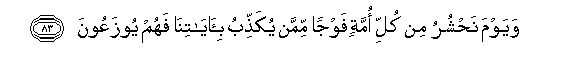
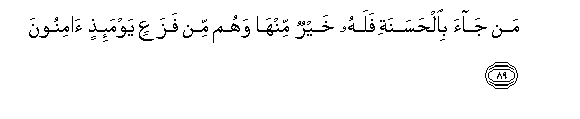
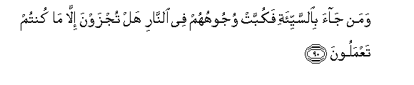
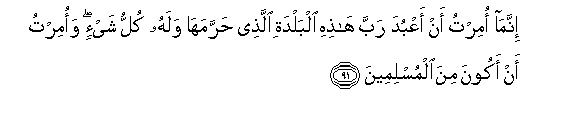

  
[Intangible Textual Heritage](../../index)  [Islam](../index) 
[Index](index)   
[Hypertext Qur'an](../htq/index)  [Unicode](../uq/027.htm#027_083) 
[Palmer](../sbe09/027)  [Pickthall](../pick/027.htm#027_083)  [Yusuf Ali
English](../yaq/yaq027)  [Rodwell](../qr/027)   
  
[Sūra XXVII.: Naml, or the Ants. Index](027)  
  [Previous](02706)  [Next](02801) 

------------------------------------------------------------------------

  
*The Holy Quran*, tr. by Yusuf Ali, \[1934\], at Intangible Textual
Heritage

------------------------------------------------------------------------

# Sūra XXVII.: Naml, or the Ants.

### Section 7

------------------------------------------------------------------------

83. Wayawma na<u>h</u>shuru min kulli ommatin fawjan mimman
yuka<u>thth</u>ibu bi-<u>a</u>y<u>a</u>tin<u>a</u> fahum yoozaAAoon**a**

83\. One Day We shall gather  
Together from every people  
A troop of those who reject  
Our Signs, and they shall  
Be kept in ranks,—

------------------------------------------------------------------------

84. <u>H</u>att<u>a</u> i<u>tha</u> j<u>a</u>oo q<u>a</u>la
aka<u>thth</u>abtum bi-<u>a</u>y<u>a</u>tee walam tu<u>h</u>ee<u>t</u>oo
bih<u>a</u> AAilman amm<u>atha</u> kuntum taAAmaloon**a**

84\. Until, when they come  
(Before the Judgment-seat),  
(God) will say: "Did ye  
Reject My Signs, though ye  
Comprehended them not  
In knowledge, or what  
Was it ye did?"

------------------------------------------------------------------------

85. WawaqaAAa alqawlu AAalayhim bim<u>a</u> *<u>th</u>*alamoo fahum
l<u>a</u> yan<u>t</u>iqoon**a**

85\. And the Word will be  
Fulfilled against them, because  
Of their wrong-doing, and they  
Will be unable to speak  
(In plea).

------------------------------------------------------------------------

86. Alam yaraw ann<u>a</u> jaAAaln<u>a</u> allayla liyaskunoo feehi
wa**al**nnah<u>a</u>ra mub<u>s</u>iran inna fee <u>tha</u>lika
la<u>a</u>y<u>a</u>tin liqawmin yu/minoon**a**

86\. See they not that We  
Have made the Night  
For them to rest in  
And the Day to give  
Them light? Verily in this  
Are Signs for any people  
That believe!

------------------------------------------------------------------------

87. Wayawma yunfakhu fee a**l**<u>ss</u>oori fafaziAAa man fee
a**l**ssam<u>a</u>w<u>a</u>ti waman fee al-ar<u>d</u>i ill<u>a</u> man
sh<u>a</u>a All<u>a</u>hu wakullun atawhu d<u>a</u>khireen**a**

87\. And the Day that the Trumpet  
Will be sounded—then will be  
Smitten with terror those  
Who are in the heavens,  
And those who are on earth,  
Except such as God will please  
(To exempt): and all shall come  
To His (Presence) as beings  
Conscious of their lowliness.

------------------------------------------------------------------------

88. Watar<u>a</u> aljib<u>a</u>la ta<u>h</u>sabuh<u>a</u>
j<u>a</u>midatan wahiya tamurru marra a**l**ssa<u>ha</u>bi <u>s</u>unAAa
All<u>a</u>hi alla<u>th</u>ee atqana kulla shay-in innahu khabeerun
bim<u>a</u> tafAAaloon**a**

88\. Thou seest the mountains  
And thinkest them firmly fixed:  
But they shall pass away  
As the clouds pass away:  
(Such is) the artistry of God,  
Who disposes of all things  
In perfect order: for He is  
Well acquainted with all that ye do.

------------------------------------------------------------------------

89. Man j<u>a</u>a bi**a**l<u>h</u>asanati falahu khayrun minh<u>a</u>
wahum min fazaAAin yawma-i<u>th</u>in <u>a</u>minoon**a**

89\. If any do good, good will  
(Accrue) to them therefrom;  
And they will be secure  
From terror that Day.

------------------------------------------------------------------------

90. Waman j<u>a</u>a bi**al**ssayyi-ati fakubbat wujoohuhum fee
a**l**nn<u>a</u>ri hal tujzawna ill<u>a</u> m<u>a</u> kuntum
taAAmaloon**a**

90\. And if any do evil,  
Their faces will be thrown  
Headlong into the Fire:  
"Do ye receive a reward  
Other than that which ye  
Have earned by your deeds?"

------------------------------------------------------------------------

91. Innam<u>a</u> omirtu an aAAbuda rabba h<u>ath</u>ihi albaldati
alla<u>th</u>ee <u>h</u>arramah<u>a</u> walahu kullu shay-in waomirtu an
akoona mina almuslimeen**a**

91\. For me, I have been  
Commanded to serve the Lord  
Of this City, Him Who has  
Sanctified it and to Whom  
(Belong) all things:  
And I am commanded  
To be of those who bow  
In Islam to God's Will,—

------------------------------------------------------------------------

92. Waan atluwa alqur-<u>a</u>na famani ihtad<u>a</u> fa-innam<u>a</u>
yahtadee linafsihi waman <u>d</u>alla faqul innam<u>a</u> an<u>a</u>
mina almun<u>th</u>ireen**a**

92\. And to rehearse the Qur-ān:  
And if any accept guidance,  
They do it for the good  
Of their own souls,  
And if any stray, say:  
"I am only a Warner".

------------------------------------------------------------------------

93. Waquli al<u>h</u>amdu lill<u>a</u>hi sayureekum
<u>a</u>y<u>a</u>tihi fataAArifoonah<u>a</u> wam<u>a</u> rabbuka
bigh<u>a</u>filin AAamm<u>a</u> taAAmaloon**a**

93\. And say: "Praise be to God,  
Who will soon show you  
His Signs, so that ye  
Shall know them"; and thy Lord  
Is not unmindful  
Of all that ye do.

------------------------------------------------------------------------

[Next: Section 1 (1-13)](02801)

