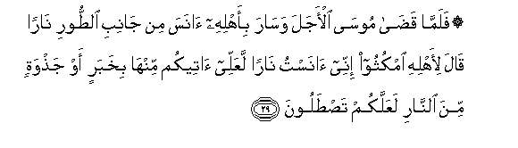
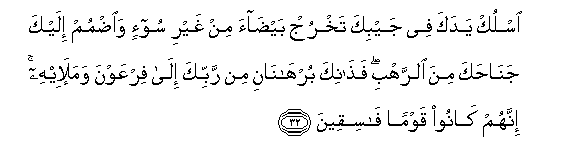
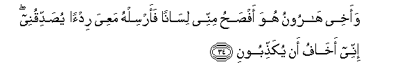
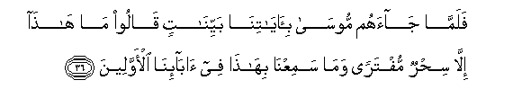
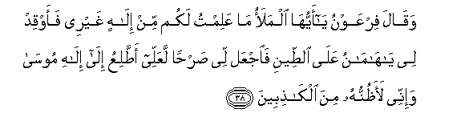

  
[Intangible Textual Heritage](../../index)  [Islam](../index) 
[Index](index)   
[Hypertext Qur'an](../htq/index)  [Unicode](../uq/028.htm#028_029) 
[Palmer](../sbe09/028)  [Pickthall](../pick/028.htm#028_029)  [Yusuf Ali
English](../yaq/yaq028)  [Rodwell](../qr/028)   
  
[Sūra XXVIII.: Qaṣaṣ, or the Narration. Index](028)  
  [Previous](02803)  [Next](02805) 

------------------------------------------------------------------------

  
*The Holy Quran*, tr. by Yusuf Ali, \[1934\], at Intangible Textual
Heritage

------------------------------------------------------------------------

# Sūra XXVIII.: Qaṣaṣ, or the Narration.

### Section 4

------------------------------------------------------------------------

29. Falamm<u>a</u> qa<u>da</u> moos<u>a</u> al-ajala was<u>a</u>ra
bi-ahlihi <u>a</u>nasa min j<u>a</u>nibi a**l**<u>tt</u>oori
n<u>a</u>ran q<u>a</u>la li-ahlihi omkuthoo innee <u>a</u>nastu
n<u>a</u>ran laAAallee <u>a</u>teekum minh<u>a</u> bikhabarin aw
ja<u>th</u>watin mina a**l**nn<u>a</u>ri laAAallakum
ta<u>st</u>aloon**a**

29\. Now when Moses had fulfilled  
The term, and was travelling  
With his family, he perceived  
A fire in the direction  
Of Mount Ṭūr. He said  
To his family: "Tarry ye;  
I perceive a fire; I hope  
To bring you from there  
Some information, or a burning  
Firebrand, that ye may  
Warm yourselves."

------------------------------------------------------------------------

30. Falamm<u>a</u> at<u>a</u>h<u>a</u> noodiya min sh<u>at</u>i-i
alw<u>a</u>di al-aymani fee albuqAAati almub<u>a</u>rakati mina
a**l**shshajarati an y<u>a</u> moos<u>a</u> innee an<u>a</u>
All<u>a</u>hu rabbu alAA<u>a</u>lameen**a**

30\. But when he came  
To the (Fire), a voice  
Was heard from the right bank  
Of the valley, from a tree  
In hallowed ground:  
"O Moses! Verily  
I am God, the Lord  
Of the Worlds…

------------------------------------------------------------------------

31. Waan alqi AAa<u>sa</u>ka falamm<u>a</u> ra<u>a</u>h<u>a</u> tahtazzu
kaannah<u>a</u> j<u>a</u>nnun wall<u>a</u> mudbiran walam yuAAaqqib
y<u>a</u> moos<u>a</u> aqbil wal<u>a</u> takhaf innaka mina
al-<u>a</u>mineen**a**

31\. "Now do thou throw thy rod!"  
But when he saw it  
Moving (of its own accord)  
As if it had been a snake,  
He turned back in retreat,  
And retraced not his steps:  
"O Moses!" (it was said),  
"Draw near, and fear not:  
For thou art of those  
Who are secure.

------------------------------------------------------------------------

32. Osluk yadaka fee jaybika takhruj bay<u>da</u>a min ghayri soo-in
wa**o**<u>d</u>mum ilayka jan<u>ah</u>aka mina a**l**rrahbi
fa<u>tha</u>nika burh<u>a</u>n<u>a</u>ni min rabbika il<u>a</u>
firAAawna wamala-ihi innahum k<u>a</u>noo qawman f<u>a</u>siqeen**a**

32\. "Move thy hand into  
Thy bosom, and it will  
Come forth white without stain  
(Or harm), and draw thy hand  
Close to thy side  
(To guard) against fear.  
Those are the two credentials  
From thy Lord to Pharaoh  
And his Chiefs: for truly  
They are a people  
Rebellious and wicked."

------------------------------------------------------------------------

33. Q<u>a</u>la rabbi innee qataltu minhum nafsan faakh<u>a</u>fu an
yaqtuloon**i**

33\. He said: "O my Lord!  
I have slain a man  
Among them, and I fear  
Lest they slay me.

------------------------------------------------------------------------

34. Waakhee h<u>a</u>roonu huwa af<u>s</u>a<u>h</u>u minnee
lis<u>a</u>nan faarsilhu maAAiya rid-an yu<u>s</u>addiqunee innee
akh<u>a</u>fu an yuka<u>thth</u>iboon**i**

34\. "And my brother Aaron—  
He is more eloquent in speech  
Than I: so send him  
With me as a helper,  
To confirm (and strengthen) me:  
For I fear that they may  
Accuse me of falsehood."

------------------------------------------------------------------------

35. Q<u>a</u>la sanashuddu AAa<u>d</u>udaka bi-akheeka wanajAAalu
lakum<u>a</u> sul<u>ta</u>nan fal<u>a</u> ya<u>s</u>iloona
ilaykum<u>a</u> bi-<u>a</u>y<u>a</u>tin<u>a</u> antum<u>a</u> wamani
ittabaAAakum<u>a</u> algh<u>a</u>liboon**a**

35\. He said: "We will certainly  
Strengthen thy arm through  
Thy brother, and invest you both  
With authority, so they  
Shall not be able to  
Touch you: with Our Signs  
Shall ye triumph,—you two  
As well as those  
Who follow you."

------------------------------------------------------------------------

36. Falamm<u>a</u> j<u>a</u>ahum moos<u>a</u>
bi-<u>a</u>y<u>a</u>tin<u>a</u> bayyin<u>a</u>tin q<u>a</u>loo m<u>a</u>
h<u>atha</u> ill<u>a</u> si<u>h</u>run muftaran wam<u>a</u>
samiAAn<u>a</u> bih<u>atha</u> fee <u>a</u>b<u>a</u>-in<u>a</u>
al-awwaleen**a**

36\. When Moses came to them  
With Our Clear Signs, they said:  
"This is nothing but sorcery  
Faked up: never did we  
Hear the like among our fathers  
Of old!"

------------------------------------------------------------------------

37. Waq<u>a</u>la moos<u>a</u> rabbee aAAlamu biman j<u>a</u>a
bi**a**lhud<u>a</u> min AAindihi waman takoonu lahu AA<u>a</u>qibatu
a**l**dd<u>a</u>ri innahu l<u>a</u> yufli<u>h</u>u
a**l***<u>thth</u>*<u>a</u>limoon**a**

37\. Moses said: "My Lord  
Knows best who it is  
That comes with guidance  
From Him and whose End  
Will be best in the Hereafter:  
Certain it is that  
The wrong-doers will not prosper."

------------------------------------------------------------------------

38. Waq<u>a</u>la firAAawnu y<u>a</u> ayyuh<u>a</u> almalao m<u>a</u>
AAalimtu lakum min il<u>a</u>hin ghayree faawqid lee y<u>a</u>
h<u>a</u>m<u>a</u>nu AAal<u>a</u> a**l**<u>tt</u>eeni fa**i**jAAal lee
<u>s</u>ar<u>h</u>an laAAallee a<u>tt</u>aliAAu il<u>a</u> il<u>a</u>hi
moos<u>a</u> wa-innee laa*<u>th</u>*unnuhu mina alk<u>ath</u>ibeen**a**

38\. Pharaoh said: "O Chiefs!  
No god do I know for you  
But myself: therefore,  
O Haman! light me a (kiln  
To bake bricks) out of clay,  
And build me a lofty  
Palace, that I may mount up  
To the god of Moses:  
But as far as I am concerned,  
I think (Moses) is a liar!"

------------------------------------------------------------------------

39. Wa**i**stakbara huwa wajunooduhu fee al-ar<u>d</u>i bighayri
al<u>h</u>aqqi wa*<u>th</u>*annoo annahum ilayn<u>a</u> l<u>a</u>
yurjaAAoon**a**

39\. And he was arrogant and insolent  
In the land, beyond reason,—  
He and his hosts: they thought  
That they would not have  
To return to Us!"

------------------------------------------------------------------------

40. Faakha<u>th</u>n<u>a</u>hu wajunoodahu fanaba<u>th</u>n<u>a</u>hum
fee alyammi fa**o**n*<u>th</u>*ur kayfa k<u>a</u>na AA<u>a</u>qibatu
a**l***<u>thth</u>*<u>a</u>limeen**a**

40\. So We seized him  
And his hosts, and We  
Flung them into the sea:  
Now behold what was the End  
Of those who did wrong!

------------------------------------------------------------------------

41. WajaAAaln<u>a</u>hum a-immatan yadAAoona il<u>a</u>
a**l**nn<u>a</u>ri wayawma alqiy<u>a</u>mati l<u>a</u>
yun<u>s</u>aroon**a**

41\. And We made them (but)  
Leaders inviting to the Fire;  
And on the Day of Judgment  
No help shall they find.

------------------------------------------------------------------------

42. WaatbaAAn<u>a</u>hum fee h<u>ath</u>ihi a**l**dduny<u>a</u>
laAAnatan wayawma alqiy<u>a</u>mati hum mina almaqboo<u>h</u>een**a**

42\. In this world We made  
A Curse to follow them:  
And on the Day of Judgment  
They will be among  
The loathed (and despised).

------------------------------------------------------------------------

[Next: Section 5 (43-50)](02805)

